# 快速开关单链多用户 MIMO：完整实验报告

副标题：从实时链路、非理想性建模、损伤恢复，到 $M>N$ 端口选择与能效边界

版本日期：2026-07-20 实验范围：实时工程验证、Phase 0--3、独立审议 R1--R23、投稿补充 E1--E3 事实依据：冻结代码、正式 MAT/PNG、`EXPERT_REVIEW.md` 与 `REVIEW_VERDICTS.md`

---

## 0. 这份报告解决什么问题

现有 `TECHNICAL_MANUAL.md` 按论文的“背景—模型—理论—结论”组织，适合已经理解研究主线的读者；但它把许多连续发生的诊断实验合并成了大章节，容易让第一次接触项目的人产生三个疑问：

1. 某个模型为什么突然出现；
2. 某个算法为什么后来被放弃；
3. 当前结论究竟来自真实空口、离线仿真、解析计算，还是知道真值的理想上界。

本报告改用**实验审计顺序**。每个实验都回答同一组问题：

- 实验想回答什么；
- 为什么必须这样设计；
- 输入信号、信道、损伤和对照组分别是什么；
- 输出指标是什么意思；
- 实际得到什么数据；
- 数据为什么合理；
- 可以得出什么结论，又绝对不能外推成什么结论；
- 如何复现。

成功结果、失败结果、作废运行、被数据证伪的假设和没有达到预注册门槛的候选算法都保留。“失败”在本文中不是代码坏了，而是某个事先声明的科学假设或工程门槛没有被数据支持。

---

## 1. 阅读实验前必须知道的系统

### 1.1 我们到底在研究什么

传统四天线接收机通常为四根天线各配置一套射频链和模数转换器。本文研究另一种架构：

1. 高速开关周期性连接不同天线端口；
2. 只有一个高速标量信号进入物理接收链；
3. 模数转换器以四倍采样率记录该标量流；
4. 数字接收机按开关相位去交织，得到四条“虚拟接收链”；
5. 再用常规多输入多输出检测器分离四个用户。

它用更高的采样带宽和开关网络换取更少的射频链。它没有凭空创造四个同时存在的物理 ADC，也不能在软件中先产生四条并行数字流，再把它们称为“单链”。唯一合法的物理输出始终是

$$
y[n]=\sum_{m=1}^{M} S_{m,q(n)}r_m[n],
$$

其中 $r_m[n]$ 是第 $m$ 个天线端口的接收样点，$q(n)$ 是当前开关码相， $S$ 是端口到码相的二值连接矩阵，$y[n]$ 只有一列。


图中橙色路径是已经进入 C/MEX 的实时数据面；紫色部分是 MATLAB 控制、离线损伤模型和研究算法。

### 1.2 共同波形是什么

所有实验共享 `nr4_type1_reference.mat`，它不是一句抽象的“参考信号”，而是一份可逐位核对的真值包：

- 3.2 GHz 载频配置；
- 30 kHz 子载波间隔；
- 51 个资源块，即 612 个使用子载波；
- 1024 点快速傅里叶变换；
- 每条用户波形 30.72 MS/s；开关域/原始接收域 122.88 MS/s；
- 10 ms 帧、20 个 0.5 ms 时隙；
- 第 0 时隙为同步信号和广播信道；第 1--10 时隙为四层 QPSK 数据；第 11--19 时隙静默；
- Type-1 DM-RS 导频、数据资源位置、QPSK 符号和全部发送比特真值。

因此“C 和 MATLAB 等价”“理想和受损分支成对”“OTA 和离线使用相同比特”都有共同基准。

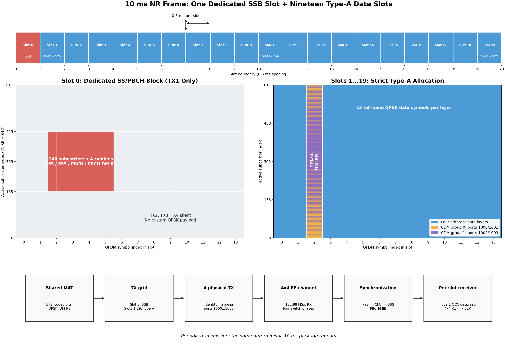

### 1.3 四类证据必须区分

| 标签 | 含义 | 能回答什么 | 不能回答什么 |
|---|---|---|---|
| OTA | 信号真正经过发射板、空间传播和接收板 | 真实射频、同步、DMA、实时性和实验室信道下能否工作 | 不能自动代表所有多径、所有 SNR 或 $M=8/12/16$ |
| OTA 回放注入 | 读取同一段真实 raw IQ，再在数字域分别注入理想/受损开关 | 对真实信道数据做严格成对归因 | 不是物理开关芯片实测 |
| 离线仿真 | reference 经可控 flat/TDL-A 信道、噪声和损伤模型 | 多 seed、真值诊断、参数扫描和反事实比较 | 不能替代真实板卡验证 |
| 解析/真值辅助 | 闭式公式，或直接使用真实 $H, \beta[n]$ 的 oracle/genie | 检查代码、给性能天花板和因果归因 | 不是可部署接收机 |

当前 OTA 硬件实际并行采集四路 RX IQ，单链高速开关行为在 raw122 数据上受控模拟。所以本文是“单链开关算法、模型和实时化平台”，不是已经制造完成的物理单 RF 链开关 PCB。

### 1.4 本报告反复使用的术语

| 名词 | 通俗解释 |
|---|---|
| reference | 本项目共同的“标准答案包”：包含实际发送波形、导频位置、数据位置、QPSK 符号和逐比特真值，不是泛指一篇参考文献。 |
| OFDM | 正交频分复用。把一个宽带信号拆到许多窄带子载波上并行传输；接收端用 FFT 把时域样点还原为各子载波。 |
| 子载波 | OFDM 中一个窄带频率格。本工程使用 612 个数据/导频相关子载波。 |
| FFT / IFFT | 快速傅里叶变换及其逆变换。IFFT 把频域资源网格变成发送时域波形，FFT 完成相反过程。 |
| CP | 循环前缀。把 OFDM 符号尾部复制到前面，用来容纳一定范围的多径和定时误差。 |
| RB / RE | 资源块 / 资源元素。一个 RB 含 12 个相邻子载波；一个 RE 是“某个符号、某个子载波”上的一个格点。 |
| slot / frame | 时隙 / 帧。本工程一个 slot 为 0.5 ms，一帧为 10 ms、包含 20 个 slot。 |
| QPSK | 四相相移键控。星座有四个理想点，每个复符号承载 2 bit；相位越过约 45° 判决边界就容易出错。 |
| layer | 一条并行空间数据流。本工程四层通常对应四个独立用户，不是软件协议栈的“第几层”。 |
| IQ | 同相 I 和正交 Q 两个实数合成的复基带样点，可同时表示信号幅度和相位。 |
| ADC | 模数转换器，把模拟接收波形变成数字 IQ 样点。 |
| RF chain | 射频链，从天线后的放大、滤波、混频到 ADC 的模拟/混合信号接收通道。 |
| virtual chain | 单个高速标量流按开关码相去交织得到的数字观测；它不是新增的物理 RF chain。 |
| M / N | $M$ 是候选物理天线端口数，$N$ 是同时要形成的虚拟观测/用户数；Phase 3 研究 $M>N=4$。 |
| MEX | MATLAB 可直接调用的编译 C 模块。本项目用它把持续数据热路径移出解释执行的 MATLAB。 |
| DMA | 直接存储器访问。板卡把采样块直接搬到主机内存，不要求 CPU 逐样点复制。 |
| ring | 环形缓冲区。生产者写入新 DMA block，消费者处理旧 block，写到尾部后循环回开头。 |
| raw122 | 四路 122.88 MS/s 原始 IQ 保存格式；“122”表示采样率量级，不表示文件只有 122 个样点。 |
| stitched122 | 按开关时序把多个候选端口合成为一列 122.88 MS/s 标量流，是模拟单物理链 ADC 所见信号。 |
| PSS | 主同步序列。接收机先在连续采样中寻找它，以确定候选帧头。 |
| PBCH | 广播信道。PSS 找到峰后继续解码 PBCH，可排除“看起来像峰、实际不是帧头”的假峰。 |
| NID2 | PSS 携带的三选一小区标识部分。峰位置对但 NID2 错，仍不能算获取成功。 |
| acquisition | 初始获取。接收机还不知道帧从哪里开始时进行的全范围搜索。 |
| tracking | 跟踪。已知大致帧位置后，只在附近小窗口更新同步。 |
| CFO | 载波频偏。收发本振频率不一致，使星座相位随时间转动。 |
| DM-RS | 解调参考信号。已知导频经过信道后发生的变化用于估计信道。 |
| $H$、$\hat H$ | 真实信道和估计信道。OTA 中通常只能得到 $\hat H$。 |
| RZF/LMMSE | 在抑制多用户串扰和避免噪声放大之间折中的线性检测器。 |
| BER | 错误比特数除以总判决比特数。有限样本 0 错不等于理论 BER 真为 0。 |
| EVM | 均衡后星座点到理想星座点的归一化距离；越小越好。 |
| EVM² | 归一化误差功率。比较新增损伤功率时应使用它，而不是事后改用开平方后的 RMS-EVM。 |
| SNR / SINR | 信号对噪声比 / 信号对干扰加噪声比。SINR 还把其他用户和开关残余算进分母。 |
| dB / dBc/Hz | 对功率比取对数的分贝 / 相对载波且归一到 1 Hz 的噪声谱密度。增加 3 dB 约等于功率翻倍。 |
| $\mathrm{cond}(\hat H)$ | 估计信道条件数。越大越病态，线性求逆越容易放大噪声；它也会包含估计器伪影。 |
| NMSE | 归一化均方误差。比较两个数组时，负 dB 越小越接近；-115 dB 表示差异极小。 |
| flat 信道 | 所有子载波近似经历相同矩阵的频率平坦信道，适合隔离机制和做回归。 |
| TDL-A | 3GPP 多抽头延迟线 A 模型，使不同子载波经历不同衰落，用于宽带多径压力测试。 |
| J0 空间相关 | 用零阶贝塞尔函数描述端口间距造成的空间相关；端口越近通常越相关，但会随距离振荡。 |
| 开关隔离度 | 未被选中的端口仍有多少信号泄漏到输出。dB 越大，泄漏通常越小。 |
| 开关建立时间 | 从切换发生到输出接近新稳态所需时间。过渡期间会混入上一状态。 |
| OU/AR(1) 抖动 | 有限相关时间的随机漂移；连续 OU 过程离散后可用一阶自回归 AR(1) 实现。 |
| ICI | 载波间干扰。一个子载波的能量泄漏到邻近或其他子载波。 |
| ICI-DF | 先判决数据，再估计 ICI 核、重建干扰并二次判决的判决反馈接收机。 |
| DDCE | 用初次判决的数据辅助重新估计信道。错误判决也可能污染重估。 |
| CPE | 每个 OFDM 符号共同的星座旋转，只需估一个相位参数。 |
| RX-LO/RX-PLL | 接收机本振及其锁相环；决定接收相位噪声的时间相关性。 |
| pending | C/MEX 环形缓冲中尚未处理的原始 DMA 数据块数；每块约 1 ms，不是时隙数。 |
| dropNew | 软件环形缓冲已满后被拒收的新数据块计数。 |
| oracle/genie | 读取现实接收机不知道的真值，用于上界或诊断，不能称为在线算法。 |
| on / off | 打开 / 关闭某个可选模型。off 表示把该模型参数设为不产生影响，不是另一种接收机或设备。 |
| baseline / 基准 | 事先固定输入、参数和预期输出的对照配置。后续变化都相对它解释。 |
| regression / 回归验证 | 修改代码后重复旧实验，确认旧功能和旧数字没有被意外改变；这里不是统计学回归拟合。 |
| invariant / 不变量 | 在某些输入条件下理论上必须保持的性质，例如损伤全关时必须等于理想开关。 |
| seed/realization | 随机种子及其产生的一次具体信道、噪声和损伤实现。 |
| paired | 两个方法共享相同波形、信道、噪声和 seed，只改变目标因素。 |
| outage | 该 realization 因同步或完整解码失败而没有有效 payload 结果；不能从 BER 分母中静默删除。 |
| falsePeak / miss / windowClip | 找到错误远端峰 / 没找到足够强的峰 / 找到的帧超出当前采样窗口，三类获取失败。 |
| lag-1 | 一个随机序列与其前一个样点的相关系数，用来判断扰动变化得快还是慢。 |
| beta (β) | 一阶开关建立递推中“本次向新稳态靠近多少”的系数；beta 越接近 1，单个样点建立得越充分。 |
| bank / drive | ICI 拟合使用的一组回归信号 / 真正激发开关动态误差的物理差分量。 |
| capture fraction | 某个真值模型能解释的残差功率比例；它是模型上限诊断，不等于 BER 降低比例。 |
| gap closure | 算法关闭“无补偿结果到 genie 地板”之间多少差距，避免地板不为零时误用普通相对降低。 |
| smoke/pilot/paper | 冒烟、有限规模和正式统计档。smoke 只证明代码能走通，不能承担论文结论。 |
| go/no-go | 看结果前冻结的通过门槛。未达到就必须按 no-go 记录，不能事后换指标。 |
| pp | 百分点。例如成功率 52% 到 76% 是增加 24 pp。 |
| CI / Wilson / bootstrap | 置信区间及两种构造方法。它们表达有限 seed 或有限成功次数下统计量有多不确定。 |
| McNemar 检验 | 比较同一批 seed 上两个方法“谁救回、谁损失”的成对二元检验，不把 paired 样本误当独立样本。 |
| AMC | 根据信道质量选择调制编码等级，使 SINR 增益能转化为更高频谱效率。 |
| MCS / CQI | 调制编码等级 / 信道质量索引。本文使用冻结的 CQI-style 门限抽象 AMC，而不是完整标准链路自适应协议。 |
| goodput | 扣除误码、同步失败和扫描时间后真正交付的有效吞吐量。 |
| DBF / HBF | 全数字波束成形 / 混合波束成形。DBF 通常每端口一条 RF 链；HBF 用模拟网络压缩到较少 RF 链。 |
| FAS | 流体天线系统，通过多个候选空间端口中选择更有利的位置/端口获得分集。 |

### 1.5 怎样理解“0 误码”和置信度

如果测试了 $N$ 个比特且没有错误，只能说“本次有限样本未见错误”。常用 95% 上界近似为

$$
\mathrm{BER}_{95\%}<\frac{-\ln(0.05)}{N}\approx\frac{3}{N}.
$$

例如 1020 万比特零错，对应上界约 $2.94\times10^{-7}$，不能写成真实 BER 等于 0。

---

## 2. 全部实验索引

| 编号 | 实验 | 类型 | 最终状态 |
|---:|---|---|---|
| 1 | reference、帧结构与真值包 | 离线代数/功能 | 通过 |
| 2 | C/MEX 资源映射、DM-RS、RZF 与逐帧等价 | 离线回放 | 通过，约 -115 dB NMSE |
| 3 | direct RX 60 s 实时性、队列和 BER | OTA 实时 | 数据面通过，尾段失锁另记 |
| 4 | 两阶段启动与 pending 曲线 | OTA 实时 | 冷启动积压显著下降 |
| 5 | 可视化星座图连续绘制 | OTA 实时界面 | 行为修正通过，非性能结论 |
| 6 | Phase 0 reference-to-BER 基线 | 离线 flat | 通过 |
| 7 | 开关损伤代数不变量 | 离线解析/回归 | 通过 |
| 8 | Phase 1 六条单变量和四张二维图 | 离线 flat | 静态项多为零 BER；含合法负结果 |
| 9 | 独立用户 CFO 压力与基础补偿 | 离线 flat | Layer 3 约 288 倍改善 |
| 10 | TDL-A、空间相关和相噪锚定 | 离线/解析 | 通过；纠正 3.01 dB 公式错误 |
| 11 | 单段 OTA ideal/impaired 配对 | OTA 回放注入 | 功能和趋势通过 |
| 12 | 时变建立、慢漂、快抖和边界位移 | 离线 flat | 找到 BER 敏感区；边界位移非主导 |
| 13 | DM-RS 残差空间白化 RZF | 离线 flat | no-go，理论原因明确 |
| 14 | OU 相关时间和 genie 求逆 | 离线 flat/真值 | 相关时间使 BER 约增 10 倍 |
| 15 | 首个逐符号 ICI-DF | 离线 flat | 正结果，Q=12 降约 50% |
| 16 | Q/迭代/SNR 论文级扫描 | 离线 flat | 正结果；高 SNR 地板约降 2.1 倍 |
| 17 | hard/soft 消融与器件包络 | 离线 flat | soft 更优；容限保证 >1.25× |
| 18 | R7 全栈 L0--L3 集成 | 离线 TDL | 预注册 no-go |
| 19 | 两段式逐用户定时修复 | 离线 TDL | 基线显著修复，但 DF 门仍 no-go |
| 20 | 真值四支分解与双 bank | 离线 TDL/真值 | 结构成立；无约束双 bank 反噬 |
| 21 | DDCE、约束核和组合接收机 | 离线 TDL | 约束核通过；DDCE/组合未过门 |
| 22 | received-drive 最后有界尝试 | 离线 TDL | 真值门过、接收机门差 1.22 pp，冻结 |
| 23 | PSS 四链合并、投票和 30×3 扩样 | 离线 TDL | 小样本改善，无显著性，不升默认 |
| 24 | 公共单 LO 与独立 4-LO | 离线 flat+TDL | 原假设被证伪，得到条件拓扑结论 |
| 25 | PSS 100-seed SNR、多帧累积 | 离线 TDL | waterfall、假峰平台和开关代价分离 |
| 26 | R14 开关 acquisition 代价归因 | 离线 TDL | 23 pp 几乎全来自模拟损伤 |
| 27 | R14 TDL 最终 ICI-DF 曲线 | 离线 TDL | 仅约 3.15% 改善，记录迁移边界 |
| 28 | R15 15 段 OTA 高 SNR 配对 | OTA 回放+离线对照 | 方向一致；EVM² 倍率 2.112，no-go |
| 29 | Phase 3 单链 $M>N$ 代数地基 | 离线解析/回归 | 六项通过 |
| 30 | M=8、2520 调度穷举 Gate 1 | 离线 TDL | +2.42 dB，中位正收益 |
| 31 | F1/F2、贪婪、松弛与关停 Gate 2 | 离线 TDL+flat | F1 通过；码叠加无稳定增值 |
| 32 | 带损伤固定 QPSK Gate 3 | 离线 TDL 全栈 | SINR 正、goodput 负 |
| 33 | AMC、扫描周期和 M=12/16 重测 | 离线 TDL 全栈 | +0.449/+0.614/+0.710 bit/s/Hz |
| 34 | 闭式 LMMSE SINR 与速率上下界 | 解析+离线 TDL | 与数值引擎闭合至 8.88e-15 dB |
| 35 | 统一能效和扫描能量 | 解析+离线 TDL | 模型能效正，非功率计实测 |
| 36 | E1 DM-RS 估计 CSI 在线选择 | 离线 TDL | 正收益保留，但大 M 优势被侵蚀 |
| 37 | E2 单用户 FAS 分集 | 离线 Monte Carlo | M16 得 10.60--12.58 dB |
| 38 | E3 扫描周期到移动速度 | 解析 | 100 ms 对应约 1.43 km/h |

---

## 3. 工程与实时链路实验

从本节开始，每个实验先给“实验介绍”，再给“实验目的”。前者解释事情为什么会发生以及它在整个项目中的位置；后者只说明本轮要回答的具体问题。读者不需要先记住术语表，可以从实验介绍顺着因果关系阅读。

## 实验 1：reference、帧结构与比特真值包

### 实验介绍

通信接收机最终要做的是：把收到的波形还原成发送端原来的比特。要判断“还原得对不对”，接收端必须知道发送端到底发送了什么、导频放在哪里、哪些资源网格承载数据。若 TX 使用一套帧结构，而 MATLAB 离线程序或 C 程序使用另一套索引，那么即使无线信道完全理想，也会把导频当数据、把用户 1 的比特与用户 2 比较，最后得到大量误码。此时问题不在无线算法，而在双方没有使用同一本“答案册”。

因此第一个实验不是比较性能，而是制作一份全工程唯一的答案册，即 reference 包。后续每一条实时、离线、理想、受损和 OTA 路径都只能读取这份包，不能各自重新猜测资源位置。

### 实验目的

建立所有后续实验共同的输入和答案。若 C、MATLAB、OTA、离线或不同算法使用不同的资源映射，即使输出差异很小，也无法知道差异来自算法还是输入不一致。

### 详细设计

`type1_generate_reference.m`/`type1_build_package.m` 生成 10 ms 四层波形，并保存：

- PSS、SSS、PBCH 所在位置；
- Type-1 DM-RS 的索引和复符号；
- 每层数据 RE 索引；
- QPSK 符号和编码前/后比特真值；
- 四层 30.72 MS/s 时域波形；
- 帧、FFT、循环前缀和采样率参数。

验证脚本检查资源位置没有越界、DM-RS/data 不重叠、比特数量与 QPSK 映射一致，并让 MEX 和 MATLAB 读取同一 package。

### 计算过程与量级判断

30.72 MS/s 采样率乘 10 ms 帧长得到每层每帧 307200 个复时域样点；四相交织到 122.88 MS/s 后，一帧对应 1228800 个 raw 样点。频域中每个 slot 有 14 个 OFDM 符号，20 个 slot 共 280 个符号；每个数据 slot、每层有 7956 个 QPSK 数据 RE，每个 QPSK RE 携带 2 bit，所以未编码模式下是 15912 bit/slot/layer。当前板卡部署使用 10 个 payload slot，因此一帧四层合计比较 15912×10×4=636480 bit。这个乘法同时是后续 BER 分母的来源；若 TX 用 10 个 payload slot，而分析端误用 19 个，BER 分母、真值索引和静默区都会同时错误。

### 输出和结果

正式真值文件为 `nr4_type1_reference.mat`，约 10 MB。实时 TX、实时 RX、离线仿真和 OTA 回放均使用它。帧结构和 DM-RS 映射图如下。

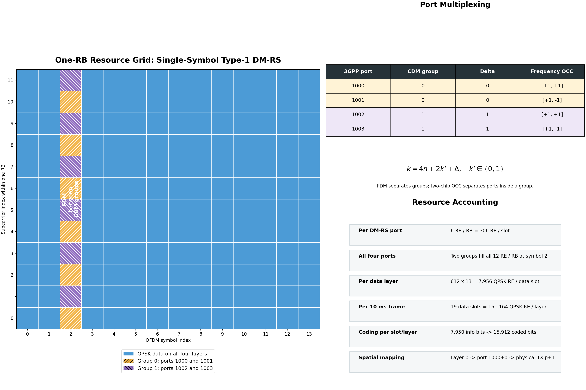

### 分析与结论

这个实验没有 BER“性能增益”，但它是所有逐位复现成立的前提。任何修改 payload slot、编码、 DM-RS 端口或 FFT 参数的工作，都必须重新生成并同时部署 reference；只改 TX 或只改 RX 会制造看似随机的 BER。

### 复现

运行 `type1_generate_reference`、`type1_validate_direct_phy_maps`；完整命令见 `RUN_COMMANDS.md`。

## 实验 2：C/MEX 资源映射、DM-RS、RZF 和逐帧 MATLAB 等价

### 实验介绍

MATLAB 版本是最容易逐行检查的标准实现，但持续实时运行速度不够，所以把耗时最大的处理搬进 C/MEX。问题是，C 代码要自行处理数组起点、复数存储、行列顺序和 0/1 起始下标；任何一个位置错一格，都可能仍然输出“看起来像星座”的结果，却和标准 MATLAB 算法不是同一个计算。

本实验把同一帧在多个中间位置截开比较：先比资源位置，再比 FFT 后的栅格，再比信道和最终比特。这样一旦不同，可以准确知道差异首先出现在哪一步，而不是只看到最终 BER 后盲目猜测。

### 实验目的

确认把热路径从 MATLAB 下放到 C 以后，没有为了速度损失索引、复数精度或检测精度。

### 详细设计

测试分三层进行：

1. 比较 C 和 MATLAB 保存/读取的 DM-RS、data、QPSK、bit maps；
2. 对同一段保存 raw122，从相同 CP-end、CFO 和开关相位生成频域栅格；
3. 对同一栅格比较信道估计、RZF、EVM 和 raw bit errors。

`type1_yunsdr_rx_mex.c` 中 `direct_make_grid` 完成四相抽取、连续 CFO 去旋、154×4 个 1024 点 FFT 和 612 子载波抽取；`type1_decode_frame_grid_mex.c` 完成 Type-1 DM-RS、 4×4 RZF、QPSK 硬判决、EVM 和 BER。

### 计算过程与量级判断

数值差异使用归一化均方误差 NMSE 计算，即 $\mathrm{NMSE}=10\log_{10}(\|x_C-x_M\|_2^2/\|x_M\|_2^2)$。栅格 NMSE=-115.63 dB 对应误差功率约为参考功率的 $2.74\times10^{-12}$，换成幅度均方根比例约为 $1.66\times10^{-6}$；信道 NMSE=-115.91 dB 的量级相同。无线链路本身的 EVM 是百分数级，也就是约 $10^{-2}$ 的幅度误差，因此 C/MATLAB 差异比实际链路误差低约四个数量级。逐阶段比较的必要性在于：最终 bit errors 相同只能证明判决落在同一象限，不能排除星座点已经产生较大但尚未越界的偏差；NMSE 和 EVM 对照补上了这一盲区。

### 实验结果

- native-ring C grid 相对 MATLAB CP-end grid：NMSE 约 `-115.63 dB`；
- C 与 MATLAB 信道估计：NMSE 约 `-115.91 dB`；
- 两者 raw bit errors 完全一致；
- 修复了早期 `noise` 第三个输出因 `ne/nc` 未累计而恒为 0 的死输出；
- CFO 相位采用连续绝对样点参考，不再在每个 slot 边界人为复位；
- 开关物理相位基准显式固定并记录，避免后续 $M>N$ 扩展时虚拟链编号漂移。

### 分析与结论

约 -115 dB 的差异已经接近单/双精度运算顺序和浮点舍入层面，远小于无线噪声和建模误差。因此后续实时化结果可以说“没有观察到以数值精度换时延”，但不能说 C 与 MATLAB 在数学实数域绝对相同。

### 复现

运行 `type1_validate_direct_phy_maps`、`type1_validate_native_ring_grid` 和 `type1_compare_direct_stages`。

## 实验 3：direct RX 60 秒实时处理、队列和连续 BER

### 实验介绍

逐帧离线运行正确，不代表连续空口能够运行。板卡每 10 ms 又送来一帧；如果平均处理一帧要 11 ms，那么每帧都会多欠 1 ms，缓冲区迟早填满。即使平均只要 9 ms，偶发同步搜索、操作系统调度或绘图也可能让消费者短时间落后。因此实时实验必须同时观察“算得对不对”和“来不来得及”。

这里把板卡看成持续生产数据的生产者，把 C/MEX 看成消费者。`pending` 是尚未被消费者取走的数据块数， `dropNew` 是队列满后被拒绝的新块数。只有处理时间、队列趋势、硬件溢出和 BER 同时正常，才能说实时链路成立。

### 实验目的

验证一帧 10 ms 的持续处理是否能在下一个 10 ms 帧到来前完成；同时检查板卡、DMA、软件 ring、同步控制和 BER，而不只测一个离线函数的执行时间。

### 详细设计

TX 循环发射共同 reference。RX 先由 MATLAB 完成 PSS/PBCH 初始获取，再启动 C 持久消费者。每帧记录：

- extract：raw block 到四条虚拟时域链的时间；
- FFT：所有 OFDM 符号变换和子载波抽取时间；
- PHY：DM-RS、RZF、判决、EVM、BER 时间；
- total：上述总时间；
- pending、dropNew、highWater；
- timestamp/sequence 连续性、硬件 overflow 和 timeout。

### 计算过程与量级判断

一帧预算是 10 ms，实测总处理时间 9.380 ms，所以平均余量只有 0.620 ms，即帧预算的 6.2%。按每个 pending block=1 ms 计算，517-block 高水位代表约 517 ms 尚未消费的输入，而不是某一帧运行了 517 ms。即使理想地把全部 0.620 ms 余量用于追赶，清掉 517 个 block 也约需 $517/0.620\times10$ ms=8.34 s，期间任何调度抖动都会继续延长追赶时间。每层每帧有 159120 bit，6041 帧约为 9.612×10⁸ bit/layer；冻结 BER 大致对应四层累计 16、29、1、19 个错误，所以这些极低 BER 不是把一个短样本的零错误直接写成零。

### 实验结果

旧启动方式的一次 60 s 有效运行：

| 指标 | 结果 |
|---|---:|
| 解码帧数 | 6041 |
| extract / FFT / PHY | 2.142 / 5.141 / 1.943 ms |
| 每帧 total | 9.380 ms |
| dropNew | 0 |
| final / peak pending | 10 / 517 个 1 ms block |
| 四层 BER | `[1.66e-8,3.02e-8,1.04e-9,1.98e-8]` |
| timestamp audit / overflow / invariant | 116 / 0 / 1 |

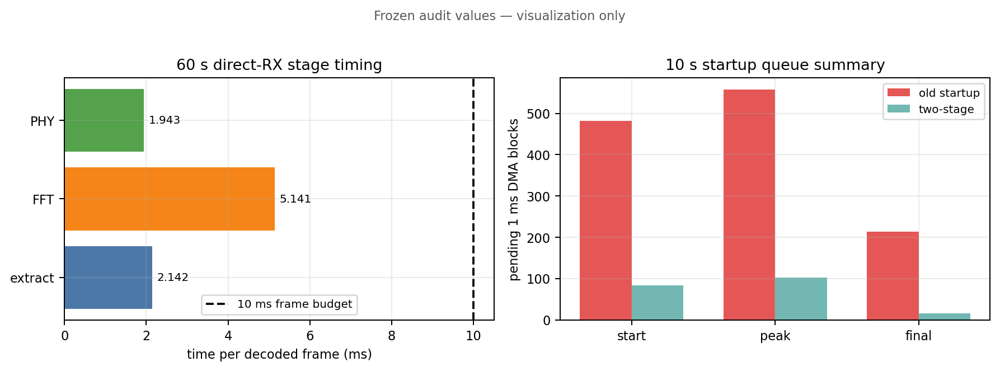

另一次 60 s 运行在约 59 s 出现 PSS 跟踪失败：pending 从约 20 升到 206，全程 BER 变为约 `7.1e-3`；失锁前 58.7 s 汇总约 `6.3e-8`。

### 分析与结论

`9.380 ms < 10 ms` 说明数据面平均能够实时处理，但余量只有约 0.62 ms，不能靠平均速度迅速追回数百毫秒历史积压。`highWater=517` 是启动期间积压了约 517 个 1 ms DMA block，不是某一帧解码耗时 517 ms。尾段反例说明“数据面实时”不等于“控制面永不失锁”；连续 BER 必须和同步事件共同报告，不能把失锁后的随机判决混入稳态 BER。

### 复现

按 `RUN_COMMANDS.md` 的“非可视化界面”先 TX 后 RX；需要 `sudo` 访问板卡。

## 实验 4：两阶段启动和 pending 随时间变化

### 实验介绍

接收机刚启动时还不知道帧头在哪里，必须让 MATLAB 在一段较长数据上搜索 PSS。搜索期间板卡不会停止采样，所以软件缓冲区已经积累了许多旧数据。旧架构在找到 PSS 后从这些旧数据的最前面开始解码，相当于让一个每 10 ms 只能处理一帧的消费者先补几百毫秒“历史作业”。由于实验 3 只剩约 0.62 ms/帧余量，这些历史几乎追不完。

但 PSS 之前的数据本来就没有可靠帧边界，也没有保留价值。因此解决办法不是冒险继续优化 0.1 ms 计算，而是改变启动协议：先完成同步，再明确丢掉已经过时的历史块，重新找一个最新帧头开始。

### 实验目的

解决 PSS 冷启动期间 ring 已经积累数百毫秒历史数据的问题。因为平均每帧约 9.38 ms，消费者几乎没有追赶 517 ms 历史的能力，最合理策略是丢弃冷启动历史并从新帧头重新开始。

### 详细设计

比较旧启动和 two-stage 启动：

1. 阶段一完成粗 PSS/CFO；
2. 清空软件 ring 中已经过时的数据；
3. 建立持久 maps 和窄窗 tracking；
4. 再次 flush，并从新的 PSS 对齐 timestamp arm C consumer；
5. 记录从 $t=0$ 开始的 pending 曲线。

注意 `directflush` 只能清软件 ring，驱动/DMA 描述符中尚未进入 ring 的块随后仍会到达，所以 flush 后 pending 不保证严格为 0。

### 计算过程与量级判断

两阶段启动把 start/peak/final pending 从约 482/558/214 降到 84/103/15，分别减少约 82.6%、81.5% 和 93.0%。flush 后仍有 84 block，不表示软件又保留了 84 ms 旧历史，而是 flush 只作用于当前软件 ring；已经由硬件排队、尚未交给软件的 DMA 描述符会随后到达，重新捕获也需要一个有限观测窗口。判断方案有效的标准因此不是“某一瞬间必须等于 0”，而是高水位不再达到 500 ms 级，并且同步完成后 pending 向稳定小值下降而不是持续上升。

### 实验结果

10 s 对比中：

| 指标 | 旧启动 | 两阶段启动 |
|---|---:|---:|
| 启动 pending | 约 482 | 约 84 |
| peak pending | 约 558 | 约 103 |
| final pending | 约 214 | 约 15 |
| dropNew | 0 | 0 |

现存本地诊断图为 `pending_startup_compare_20260713_164945.png` 和 `pending_startup_20260713_171338.png`；它们是启动审计资产，不属于论文主图。

### 分析与结论

两阶段策略没有“提高解码速度”，而是改变了历史数据的处置语义：同步前数据被明确视为无效历史，同步后从最新可靠帧头开始。启动仍有约 84 ms，是硬件描述符、重新捕获窗口和软件状态共同造成的，但它不再增长到 500 ms 级。`pending` 以 1 ms DMA block 为单位是因为 ring 的生产/消费对象就是 DMA block，不以 0.5 ms 时隙为单位。

## 实验 5：实时星座图连续绘制，不再显示“No Signal”

### 实验介绍

当前帧故意包含发送区和静默区，方便观察噪声及控制占空比。旧界面把能量低于门限直接解释为“No Signal”。当显示窗口正好落到静默半段时，即使接收机完全同步，也会显示无信号；下一次落到发送半段又恢复星座，造成“链路不断掉线”的视觉假象。

均衡输出本身始终存在：有信号时应聚集在 QPSK 四个点附近，静默时则表现为噪声散点。连续画出实际结果比用一个能量标签替代数据更诚实，而且绘图频率很低，不会进入每帧 C 热路径。

### 实验目的

当前波形每 0.5 ms 时隙中约 0.25 ms 有信号、0.25 ms 无信号。旧界面按能量门限在“No Signal”和星座图之间切换，容易让使用者误以为链路失锁。

### 详细设计与结果

界面改为无论能量门结果如何，都低频绘制当前均衡输出；信号存在性仍可作为诊断数据记录，但不再决定是否画星座。绘制频率远低于每帧处理频率，因而不进入实时 C 热路径。

### 计算过程与量级判断

配置中的界面刷新周期是 0.10 s，星座更新间隔是 10 帧，而物理帧周期是 10 ms；两者都约为每秒 10 次显示更新，不是对每个 OFDM 符号或每个采样点作图。每次最多绘制 3000 个星座点，并使用 `drawnow limitrate nocallbacks` 限制 GUI 刷新，因此图形线程不会被放进 9.38 ms 的 C 数据面预算。取消“No Signal”只改变可视化分支：静默半时隙会显示均衡噪声云，发送半时隙显示 QPSK 聚类，底层样点、EVM、判决和 BER 均不改变。

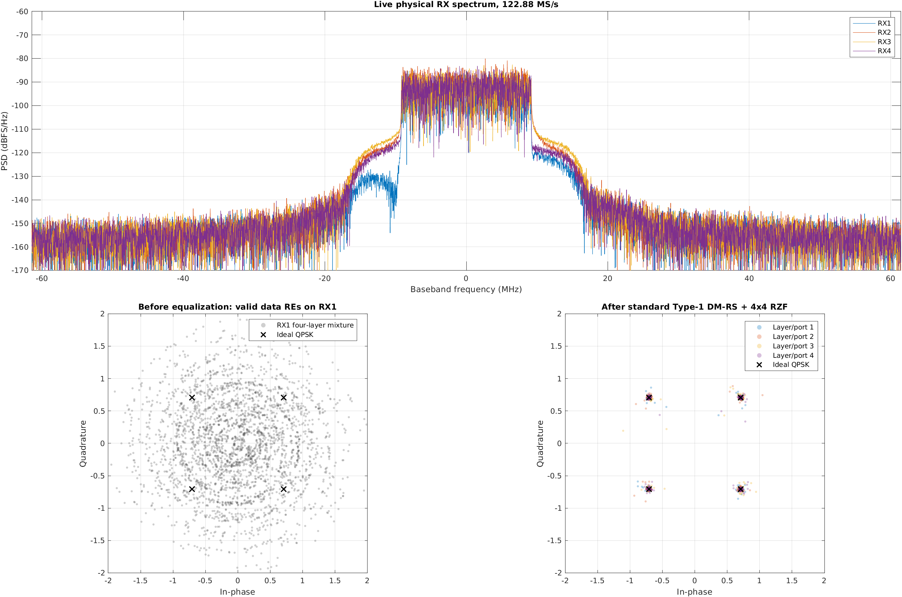

### 分析与结论

这是一项人机界面修正，不是 BER 或时延算法。它不会改变接收样点、均衡结果或判决，只避免显示逻辑制造“有信号/无信号反复跳变”的误读。

---

## 4. Phase 0--1：基线、静态损伤和多用户独立性

从实验 6 开始进入离线科研链。离线并不是“假装有一套通信系统”，而是把真实系统中一次只能观察到的变量拆开控制。每个实验都保留完整的 PSS、PBCH、DM-RS、RZF 和比特判决，只把信道或器件状态设为已知且可重复，从而判断误差到底在哪一环出现。

## 实验 6：Phase 0 无硬件 reference-to-BER 全链基线

### 实验介绍

从这一实验往后，我们会逐步加入很多因素，例如：四个用户各自的频偏和定时误差、多径 TDL-A 信道、开关泄漏、有限建立时间、随机抖动和接收本振相噪。这些后来加入的数学或软件模块，统称为“新增模型”。每个模型都有一个“不产生影响”的配置，例如泄漏设为零、建立时间设为 0、抖动幅度设为 0；代码里常把这种状态写成 `off`。`off` 只表示关闭该功能，不是一个设备或算法名称。

在研究新因素之前，必须先规定一个所有人都能重复得到的标准结果，这就是本实验的“基准”。这里的基准具体指：同一份 reference、固定 4×4 平坦信道、固定 32 dB SNR、850 Hz 共同频偏、理想开关和完整接收机得到的 BER、EVM 和 CFO 估计值。

“关闭模型后退化回基准”是说：以后加入某段新代码，即使功能关闭，输出也应与这份标准结果相同。例如新增抖动模块但抖动设为 0，不能让噪声样本、DM-RS 位置或最终比特发生变化。否则可能发生三类工程问题：

1. **随机数序列改变**：新模块虽然幅度为 0，却仍额外取走随机数，使后面的 AWGN 噪声换成另一组样本；
2. **资源索引改变**：数组拼接或下标转换让导频、数据或用户编号偏移一格；
3. **处理路径改变**：关闭功能后仍经过一次插值、缩放或复数转换，给信号引入额外误差。

前一版写的“随机流、索引或路径被污染”就是以上三种具体情况。本版不再用“污染”代替解释。

### 实验目的

建立一组明确、可重复的无新增损伤结果，作为后续实验的零点；并要求以后加入的任何模型在关闭状态下不改变噪声实现、资源位置、中间栅格和最终判决。

### 详细设计

- 使用 32 dB SNR。这个信噪比较高，目的是让随机热噪声不是主导因素，方便首先确认处理逻辑；
- 使用确定性满秩 4×4 flat 信道。“满秩”表示四个用户在空间上可分，不故意放入病态深衰；“确定性”表示每次运行是同一个矩阵；
- 加入 850 Hz 公共 CFO，确认同步和共同频偏估计仍然参与全链路，而不是使用完美频率真值；
- 使用理想四相开关，即每个采样时刻只取得计划中的端口，不加泄漏、建立过渡或抖动；
- 运行 3 帧，既覆盖重复帧处理，又保持回归计算量较小；
- 从时域波形开始完整运行 PSS、PBCH、DM-RS、RZF、QPSK 和 BER。若直接把正确频域栅格喂给 RZF，就无法发现同步、FFT 窗位置和资源抽取的问题。

### 计算过程与量级判断：CFO 和 14 Hz 偏差

共同 CFO 不是由配置真值直接交给接收机，而是利用 OFDM 循环前缀与同一符号尾部的重复性估计。对每个符号取循环前缀向量 $c$ 和相隔 $N_{FFT}=1024$ 个样点的符号尾部 $u$，跨全部符号和四条接收链累加 $R=\sum c^*u$，然后计算 $\hat f=\angle R\,F_s/(2\pi N_{FFT})$。这里 $F_s=30.72$ MS/s；850 Hz 会在相隔 1024 个样点的两段之间产生约 0.178 rad，也就是 10.2° 相位差。观测到 861--864 Hz，最坏误差约 14 Hz，对应相关相位误差约 0.00293 rad，也就是 0.168°。

14 Hz 相对 30 kHz 子载波间隔只有 0.0467%，相对该估计器 ±15 kHz 无模糊半区是 0.0933%，并低于看数据前规定的 25 Hz 回归门，所以作为同步估计误差是小的。但它不是“在任何时间尺度都可忽略”：若完全不再跟踪，14 Hz 在 10 ms 内仍会累计约 50.4° 公共相位。当前接收机先在时域去掉估计 CFO，再由每个 slot 的 DM-RS 吸收剩余共同相位，因此实际 EVM 仍约 2.7% 且三帧无误码。偏差来源不是一个固定 14 Hz 的量化步长，而是有限长度、有限 SNR、多链相干求和、四相抽取以及信道对 CP 相关的扰动；本实验只能证明偏差稳定落在冻结容差内，不能把它解释成估计器的普适精度。

### 实验结果

- 四层有限样本 BER 均为 0；
- 平均 EVM 为 `[2.718,2.775,2.714,2.738]%`；
- 公共 CFO 估计约 `861--864 Hz`，与设置 850 Hz 相差约 14 Hz，低于 25 Hz 回归阈值。

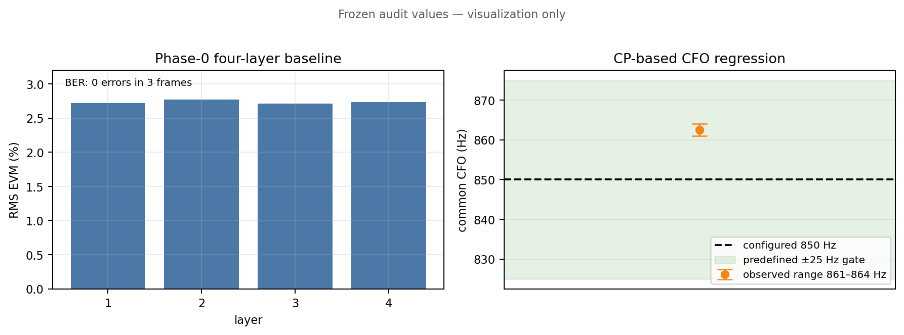

### 分析与结论

设置 CFO 是 850 Hz，而估计约 861--864 Hz，相差约 14 Hz。这个小差异来自有限观测窗口、四相重采样和估计器分辨率；它稳定落在预先设定的 25 Hz 容差内，因此不表示 CFO 模型错误。三帧无误码说明这套理想配置下的处理链能正确工作，但样本数有限，只能作为软件回归零点，不能宣称真实无线 BER 在无限时间内等于 0。

## 实验 7：开关损伤模型的代数不变量

### 实验介绍

实验 6 只证明理想开关能工作。下一步要模拟真实射频开关：未选端口会泄漏，切换后输出需要若干纳秒才能稳定，控制时刻也会抖动。若这些模型公式或数组实现本身写错，那么后面看到 BER 上升时无法判断究竟是物理损伤，还是程序错误。

因此本实验不急着跑复杂通信曲线，而是用一些答案可以手算的极端情况检查模型。例如把泄漏设为 0 dB 时，所有端口应按解析权重同时出现；把所有损伤设为零时，输出必须逐样点等于理想开关。这类“输入特殊时输出必然满足的性质”叫代数不变量。

### 实验目的

先证明损伤模型本身没有写错，再研究损伤对通信的影响。否则任何 BER 变化都可能只是实现错误。

### 详细设计

主要不变量包括：

1. 隔离度无穷、建立时间为 0、抖动为 0时，输出必须逐样点等于理想数字开关；
2. 0 dB 泄漏时，各端口权重退化符合解析矩阵；
3. 一阶建立递推的 $\beta=1-e^{-\Delta t/\tau}$ 与手算一致；
4. 10 ns 10--90% 建立时间的冻结点得到 `beta=0.832723`；
5. 边界抖动在 rise=0 时仍能产生非零但可重复的亚样点位移；
6. 所有随机模型 off 时不消耗或以冻结方式消耗随机流，保证成对分支一致。

第 6 条的意思是：理想和受损分支要比较同一组噪声。若关闭抖动时少取一个随机数、打开时多取一个，后续 AWGN 也会错位，最终差值便混入“噪声换了一次”的影响。实现通过独立随机流或固定消耗顺序避免这个问题。

### 计算过程与量级判断

一阶系统从 10% 上升到 90% 所需时间满足 $t_{10-90}=\tau\ln 9$。当配置 10 ns 建立时间时，时间常数是 $\tau=10/\ln 9=4.551$ ns；122.88 MS/s 的 raw 样点间隔是 $\Delta t=8.138$ ns，因此单样点递推系数应为 $\beta=1-e^{-8.138/4.551}=0.832723$，与冻结测试逐位一致。这个检查非常敏感：若误把 10--90% 时间直接当作 $\tau$，会得到 0.5567，而不是 0.8327，瞬态尾长和后续 ICI 都会被系统性高估。0 dB 隔离退化、零损伤恒等和固定随机流分别检查权重代数、状态递推和统计配对，三者不是重复测试。

### 实验结果与结论

所有代数门通过。该实验确认有限隔离、有限建立、OU 抖动和边界位移进入同一因果路径，后续曲线可解释为模型本身的作用，而不是数组拼接错误。

## 实验 8：Phase 1 六条单变量与四张二维热图

### 实验介绍

真实系统会同时存在频偏、定时、功率差、相噪、泄漏和建立过程。如果一次全部打开后 BER 变差，我们无法知道是哪一项造成，也无法知道两个看似无害的因素组合后是否互相放大。因此先采用控制变量法：每次只扫一个因素，其他条件固定；随后再挑最有物理可能耦合的两项组成二维网格。

二维热图不是为了“图多”，而是观察交互形状。例如隔离度和 CFO 若彼此独立，改变隔离度只会让整条 CFO 曲线整体不变或平移；若存在耦合，曲面会弯曲。早期 2×2 只有四个角点，无法判断曲面形状，所以 smoke 提高到至少 3×3、pilot 至少 5×5。

### 实验目的

回答各个非理想因素单独是否影响 BER，以及隔离度是否会和 CFO、定时、功率或建立时间产生交互。直接把全部损伤一起打开无法归因。

### 详细设计

单变量包括隔离度、固定建立时间、功率不平衡、分数定时、CFO、Wiener 相噪/抖动；二维扫描包括隔离度与 CFO、功率、定时、建立的组合。smoke 至少 3×3，只看形状和异常；pilot 至少 5×5。

这里 smoke 每点只跑一帧，用途是确认单位、轴方向和趋势没有明显错误；它不是正式 BER 统计。每个点仍经过完整同步和检测，而不是只对一个公式画图。二维图中的条件数明确记作 $\mathrm{cond}(\hat H)$，因为它来自 DM-RS 估计信道，不等于不可直接观测的真实信道条件数。

### 计算过程与量级判断：5×5 pilot 坐标与统计口径

本次补图在 RX 服务器使用当前脚本、3 帧/点重新运行。六条单变量的坐标分别是：隔离度 `[15,25,35,50,Inf] dB`，建立时间 `[0,1,3,5,10] ns`，逐用户 CFO/相噪/功率压力系数 `[0,0.25,0.5,0.75,1]`，建立边沿抖动 `[0,20,50,100,200] ps`。四张热图均为 5×5：隔离度×建立、CFO 系数×隔离度、功率系数×隔离度、定时系数×隔离度。每个点 3 帧、每帧 636480 bit，因此 BER 分母是 1909440 bit；零错误在对数图上画成 $1/N=5.237\times10^{-7}$，而不是画成数学上的 0。

pilot 的关键数值比原 smoke 结论更具体：隔离度从 15 dB 提高到理想时 EVM 从 3.569% 降到 2.644%、$\mathrm{cond}(\hat H)$ P95 从 2.779 降到 1.489，但仍全部零错；固定建立从 0 增至 10 ns 时 EVM 从 2.621% 增到 2.930%、条件数从 1.489 增到 1.936，也仍全部零错。相反，未做逐用户补偿的 CFO 压力系数达到 0.5/0.75/1.0 时 BER 为 0.0443/0.1025/0.1331。CFO×隔离度热图沿隔离度方向几乎不变，例如满 CFO 时 15--50 dB 隔离对应 BER 只在 0.1331--0.1333 内波动；这就是“CFO 是主效应、隔离度未形成可测交互”的数据含义。

### 实验结果

- 隔离度 15 dB 到理想、固定建立 0--10 ns、功率不平衡 0--±3 dB、100 ps 递推抖动和小幅 Wiener 相噪，在 smoke 有限样本中均未观察到 BER 改变；
- `cfoIsolation` 热图接近水平，说明在当前范围内隔离度没有显著放大 CFO 效应；这是合法负结果；
- `timingIsolation` 中即使隔离 50 dB，$\mathrm{cond}(\hat H)$ 仍约增 8%。纯定时是信道列相位，真实信道条件数理论上不变，因此该增长属于 `nrChannelEstimate` 插值伪影；
- 原 smoke 每点 1 帧共 636480 bit，绘图下限为 `1.57e-6`；本次补跑 pilot 每点 3 帧共 1909440 bit，绘图下限为 `5.237e-7`。两者都只是有限样本下限，不能称为理论 BER=0。

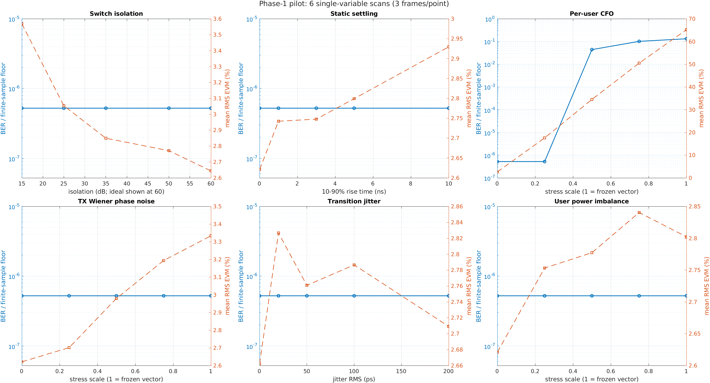

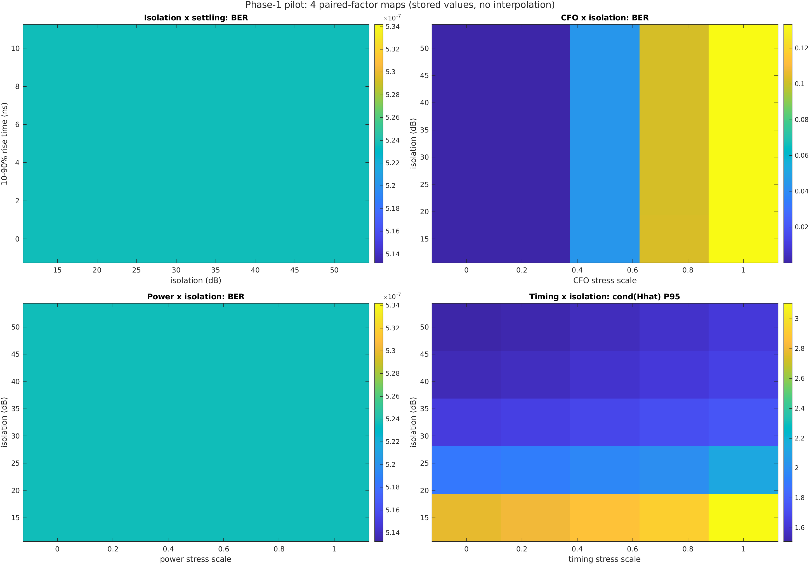

### 分析与结论

固定、周期性泄漏和建立在去交织后成为多相线性时不变变换，DM-RS 可把它估进等效信道，RZF 再对该等效信道求逆。因此“器件参数变差但 BER 不动”是物理上合理的，不是实验不敏感。真正危险的是 DM-RS 之后仍变化的帧内动态残余。

## 实验 9：四用户独立 CFO 压力与逐用户基础补偿

### 实验介绍

实验 6 只有所有用户共享的 850 Hz 频偏。共同频偏可以在四用户混合前统一去旋，因此相对容易；真实四个终端各有自己的振荡器，还会叠加不同残余频偏。此时不能对整个接收向量只乘一个共同相位，因为用户 1 可能向正方向旋转、用户 4 向负方向旋转。随着 OFDM 符号离导频越来越远，各用户相位误差持续累积，最终跨过 QPSK 约 45° 判决边界。

本实验先故意使用“只补共同 CFO”的不完整接收机，确认高 BER 是否能由相位累计定量解释；再利用两个时隙 DM-RS 之间的相位变化分别估计每个用户的残余 CFO。这样可以证明四用户分离失败不是 RZF 根本无效，而是缺少逐用户时间相位模型。

### 实验目的

证明四用户不是只能在共同频偏下分离，并建立“未补偿—基础补偿—高级损伤接收机”的合理基线。

### 详细设计

- 公共 CFO：850 Hz；
- 每用户额外 CFO：`[-350,125,620,-900] Hz`；
- 分数定时、`[-3,0,3,-1.5] dB` 功率不平衡和独立 TX Wiener 相噪；
- 3 帧、seed `20260713`、32 dB；
- 对照一：只补共同 CFO；
- 对照二：利用跨 slot DM-RS 相位差估计逐用户残余 CFO，并在 RZF 信道列上加入符号时间相位斜坡。

两组对照使用同一个 seed、同一信道、同一噪声和同一发送比特，唯一差异是接收机是否使用逐用户相位斜坡。因此 BER 差异可以归因于该补偿，而不是换了一次信道。

### 计算过程与量级判断：CFO 混叠范围和误码量级

逐用户残余 CFO 来自相邻两个 slot 的 DM-RS 信道列相位差：$\hat f_p=\angle\sum_k \hat H_{p,2}(k)\hat H_{p,1}^*(k)/(2\pi\Delta T)$，其中 $\Delta T=0.5$ ms。相位函数只返回 $[-\pi,\pi)$ 主值，所以无模糊范围是 $|f|<1/(2\Delta T)=1000$ Hz。估计的 792.9 Hz 已使用 79.3% 正半区，-737.5 Hz 使用 73.8% 负半区，因此 750 Hz 告警是“接近相位折返”的保护，不代表当前估计已经错误。估计值与配置的额外 CFO 不逐字相等，是因为共同 CFO 去旋仍有公共残差，DM-RS 相位还包含信道估计噪声；四层估计相对配置大致共享 +163 到 +179 Hz 偏移，符合共同残余叠加在各层上的结构。

对第 $l$ 个数据符号，漏补相位近似为 $\phi_{p,l}=2\pi\delta f_p\Delta t_l$。QPSK 最近判决边界距离理想点是 45°，所以越远离 DM-RS 的符号越先跨界。冻结压力点用该公式预测第 3/4 层各有 7 个远端数据符号跨界，无噪声 BER 约 0.2692，实测 0.2731/0.2587 与其相差不到约 4%，说明高 BER 的主因是可解释的相位累计，而不是 RZF 随机失效。

### 实验结果

估计残余 CFO 为 `[-171.4,300.9,792.9,-737.5] Hz`。仅共同补偿时 BER：

```text
[0, 0.0136501, 0.2730664, 0.2586895]
```

逐用户补偿后：

```text
[0, 5.8656e-5, 9.4897e-4, 0]
```

第 3 层约改善 288 倍。解析 318 Hz QPSK 判决门限预测第 3/4 层有 7 个远端数据符号跨过 45°，无噪声 BER 预测约 0.2692，与实测误差低于 4%。

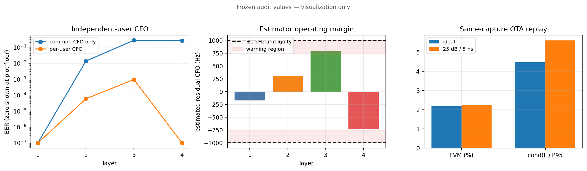

### 分析、结论与边界

0.5 ms 跨 slot 相位差的无模糊范围仅 ±1 kHz。792.9 Hz 已接近边界，所以代码加入告警，但告警不等于完成相位解缠；±2 kHz 压力场景仍会混叠。该基础补偿证明了可分离性，不是联合 CFO/ICI 最优估计器。

## 实验 10：TDL-A、空间相关和相噪 dBc/Hz 锚定

### 实验介绍

前面使用 flat 信道，是为了把接收机和损伤机制看清楚；但真实宽带信号经墙面、地面和物体反射后会从不同路径到达。不同路径具有不同时延，叠加后会让某些子载波增强、某些子载波出现深衰。四根天线距离较近时，各天线看到的衰落还会相关。若只在一个固定平坦矩阵上验证，算法可能只是记住了一个特别容易的信道。

同时，代码里的 Wiener 相噪参数单位是“每个采样的相位增量标准差”，而器件手册通常给“距离载波某个频偏处的 dBc/Hz”。两种单位不换算，就无法判断仿真设置对应怎样的振荡器。本实验一部分扩展信道，一部分校准相噪单位；它们都属于后续实验的物理坐标系建设。

### 实验目的

修正两个基础缺口：平坦确定性信道不能代表宽带 5G 多径；`rad/sample` 相噪参数若不映射到 dBc/Hz，无法与器件手册交流。

### 详细设计

信道加入 3GPP TDL-A 功率时延分布、100 ns 时延扩展和 Tx/Rx Kronecker 指数相关；冻结 Doppler=0，即每个 seed 内是静态频选信道。相噪用大样本 Welch 功率谱核对自由振荡器 Wiener 模型。

TDL-A 规定各条反射路径的相对时延和平均功率；100 ns 决定这些时延在本实验中的实际尺度。Kronecker 模型用发射端和接收端两个相关矩阵生成空间相关的 4×4 多径。Doppler 先设为 0，是为了让一次 realization 内信道不随帧变化，避免把移动性和开关动态混在同一轮。Welch 方法把很长的相位序列分段平均得到功率谱，用来独立检查解析公式的 4π² 系数。

### 计算过程与量级判断

100 ns 时延扩展相对 30 kHz 子载波间隔不是“只有 100 ns 所以很小”：一条相差 100 ns 的路径在相邻子载波间产生约 $2\pi\times30000\times100\text{ ns}=0.01885$ rad 相位差，跨 612 个子载波累计可超过 11 rad，因此会形成明显频率选择性和局部深衰。$\mathrm{cond}(\hat H)$ P95=40.326 表示约 5% 的子载波估计矩阵条件数更差；它不等于 BER，但提示这些位置的小噪声和估计误差可能被空间求逆显著放大。

相噪锚定可直接代数核算：$\sigma=1.5\times10^{-4}$ rad/sample、$F_s=30.72$ MHz、$f=10$ kHz 代入 $L(f)=\sigma^2F_s/(4\pi^2f^2)$ 得到线性比约 $1.75\times10^{-10}$，即 -97.57 dBc/Hz。若分母误写成 $8\pi^2$，结果必然再低 $10\log_{10}2=3.010$ dB。Welch 实测 -97.27 dBc/Hz 与解析只差 0.30 dB，支持 4π² 公式；差值来自有限 FFT、窗函数和谱平均，不是再引入一个 0.30 dB 校正项。

### 实验结果

- TDL-A 示例 PBCH/MIB 正常；$\mathrm{cond}(\hat H)$ P95=`40.326`；四层 BER `[6.28e-6,5.72e-4,3.39e-4,2.70e-4]`；
- 原文档公式 $\sigma^2F_s/(8\pi^2f^2)$ 被数值证伪，低估 3.01 dB；
- 正确尾部公式为

$$
L(f)=\frac{\sigma^2F_s}{4\pi^2f^2};
$$

- `sigma=1.5e-4 rad/sample`、30.72 MS/s 在 10 kHz 对应 `-97.57 dBc/Hz`，Welch 实测约 `-97.27 dBc/Hz`。

### 分析与结论

公式修正不改变已经直接以 sigma 运行的仿真，但如果按错误公式从器件 mask 反推 sigma，会多注入 3 dB 相噪。Wiener 模型对应自由振荡/未锁定状态，真实锁定 PLL 是有界过程，后来在实验 24 单独建模。

## 实验 11：同一段真实 OTA raw122 的 ideal/impaired 单点配对

### 实验介绍

实验 7--10 的信道和开关都是可控仿真。它们能做真值归因，却仍需要回答：把同一个开关模型作用在真实板卡采到的 IQ 上，是否保持同步、EVM 和条件数变化方向？早期分析脚本只能对 raw122 做理想数字开关，损伤函数虽然存在，却没有接入 OTA 回放，所以“真实数据”和“开关损伤”之间实际上没有实验桥梁。

最容易犯的错误是分别采两段 OTA：第一段跑 ideal、第二段跑 impaired。无线信道和本振在两次采集间可能改变，差值不能只归因于开关。因此本实验只读取一次 20 ms 原始 IQ，在内存中复制成两支，一支不加损伤，一支加入 25 dB/5 ns；两支随后走完全相同的接收机。

### 实验目的

连接此前断开的两条路径：旧 `analyze_raw122_switch.m` 只调用理想开关，无法让同一段真实 OTA IQ 分别通过理想和 25 dB/5 ns 开关模型。

### 详细设计

RX 稳定 5 s 后采集 20 ms 候选 raw122。只有 PSS NID2 正确、PBCH/MIB 成功且平均 EVM≤20% 才保存。对同一个文件执行：

- ideal：无限隔离、0 ns 建立；
- impaired：25 dB 隔离、5 ns 建立；
- 两支进入同一 `type1_analyze`，比较 BER、EVM 和 $\mathrm{cond}(\hat H)$。

保存前先做质量门是因为 RX 刚启动时可能尚未锁定。若 ideal 分支自身 PSS/PBCH 失败或 EVM 已经数百%，再给它注入损伤没有科学意义。质量门不是筛选“结果好看的样本”，而是确认输入确实包含可解码的目标帧。

### 计算过程与量级判断：配对差值

EVM 使用相同数据 RE 上的均衡误差计算，因此绝对差是 2.2569%-2.1778%=0.0791 percentage point，相对 ideal 是 3.63%；条件数 P95 的绝对差是 1.1282，相对增加 25.2%。两支 raw bit errors 都为 0 只能说明该 20 ms 样本没有跨过 QPSK 判决边界，不能说明损伤为零；EVM 和条件数已经在判决前显示连续退化。离线 flat 的 EVM 增量 0.4074 pp 约为该 OTA 单点的 5.15 倍，而条件数相对增量 28.5% 与 OTA 的 25.2% 接近，所以本轮只能支持“条件数趋势同量级、EVM 绝对标定尚未闭合”，不能把两项合并成一个全面通过结论。

### 实验结果

有效文件 `type1_valid_ota_iq_20260714_004458_seq2230_raw122_csingle_iq4.bin`：

| 指标 | ideal | impaired | 差值 |
|---|---:|---:|---:|
| PSS/PBCH | 成功 | 成功 | 无退化 |
| bit errors | 0 | 0 | 0 |
| 平均 EVM | 2.1778% | 2.2569% | +0.0791 pp |
| `cond(\hat H)` P95 | 4.4739 | 5.6021 | +25.2% |

离线 flat 对照的条件数相对增加 28.5%，方向和量级接近；EVM 增量则为 0.4074 pp，明显大于 OTA。

### 分析与结论

这证明损伤桥接器可以在真实 IQ 上工作，且条件数变化方向合理；它只是单点功能和趋势验证，不能声称绝对 EVM 已校准。历史 startup raw122 的 ideal EVM 约 807%，PSS/PBCH 失败，被保留为启动期反例，不得作为 OTA 锚点。

---

## 5. Phase 2：时变损伤、恢复算法及失败边界

Phase 1 得到的关键事实是：只要损伤在导频和数据期间保持固定，接收机往往能把它当成信道的一部分估计掉。 Phase 2 因此不再简单把固定隔离度或固定建立时间调得更差，而是研究它们随时间变化时会发生什么。整个阶段遵循“先制造可解释的退化，再测残差结构，最后设计恢复算法”的顺序。

## 实验 12：时变建立时间、快抖和亚样点边界位移

### 实验介绍

真实开关的建立时间不会永远是一个精确常数。温度变化会让器件参数缓慢漂移，驱动电源和控制边沿噪声会让每次切换的有效建立速度略有不同。另外，即使开关本身瞬时完成，数字控制边界也可能落在 ADC 两个采样时刻之间，使“应该从哪个端口取这个样点”出现亚采样级偏移。

旧模型把抖动只放进建立时间递推；当建立时间设为 0 时，递推立即达到稳态，抖动也随之消失，无法研究纯边界位移。因此本实验把两种物理机制分开：一条改变每个样点的建立系数 beta，另一条在切换前对原始波形做亚样点时间位移。这样才能分别判断“状态建立不稳定”和“切换时钟不准”哪个更重要。

### 实验目的

Phase 1 已证明固定建立可被 DM-RS 吸收。为了让 BER 真正变化，需要让建立状态在导频和数据之间变化；同时修复“rise=0 时旧抖动模型为空操作”的盲区。

### 详细设计

建立时间写成

$$
\tau[n]=\tau_0\left(1+a_{slow}\sin(2\pi f_{slow}t)+a_{fast}w[n]\right),
$$

并逐样点计算 $\beta[n]=1-e^{-\Delta t/\tau[n]}$。边界位移使用 9-tap 窗函数 sinc 做亚样点插值，超过 0.49 raw sample 的尾部截断并计数。

式中的 $a_{slow}$ 控制秒级正弦漂移，$a_{fast}$ 控制快速随机变化；本轮重点看 fast，因为慢漂在一帧内近似常数，仍可能被 DM-RS 吸收。9-tap sinc 用来近似“时间移动了不到一个采样点”后的波形，而不是粗暴选前一个或后一个样点。0.49 sample 限制避免插值悄悄跨成整数样点跳变；触发次数必须记录，否则极端尾部会改变模型含义。

### 计算过程与量级判断

122.88 MS/s 的一个 raw 样点是 8.138 ns，所以 1 ns 边界标准差只相当于 0.123 sample；0.49-sample 截断对应约 3.99 ns，目的是把模型限定为“亚样点边界位移”，不让极端高斯尾部偷偷变成整样点换端口。EVM 从 8.127% 增至 8.578% 是 0.451 pp 绝对增加、约 5.55% 相对增加，但仍未跨过 QPSK 判决边界，所以 BER 保持零是合理的。fast=0.6 四层平均 BER 约 $1.11\times10^{-3}$，fast=1.0 约 $8.16\times10^{-3}$，提高约 7.4 倍，说明“均值建立时间不变、只有逐样点状态波动”也足以把连续幅相误差推成硬判决错误。

### 实验结果

- 静态 20 ns 控制：四层 BER 0；
- fast=0.6：四层 BER 约 `[1.722e-3,9.427e-4,8.547e-4,9.175e-4]`；
- fast=1.0：约 `[9.835e-3,7.648e-3,7.567e-3,7.604e-3]`；
- 1 ns 边界抖动：BER 仍为 0，EVM `8.127%→8.578%`，109 个截断样点；
- 导数模型预测 EVM 8.78%，实测 8.58%，偏差 2.4%；截断理论约 96，实测 109，与尾概率一致。

### 分析与结论

快抖成功把系统推入 BER 敏感区；1 ns 边界位移在当前点只增加 EVM，没有成为 BER 主导项。不能因为某个模型“更复杂”就预设它最重要，必须用同尺度和成对数据判断。

## 实验 13：DM-RS 残差空间白化 RZF——第一个诚实负结果

### 实验介绍

实验 12 证明快抖会产生误码，但还不知道这些误差在四条接收链之间是什么关系。如果某条链噪声大、另一条链噪声小，或者四链误差存在固定相关方向，普通 RZF 把它们当成同样的白噪声就不是最优。常见解决办法是先估计误差协方差，把高噪声方向压低、低噪声方向保留，这叫“白化”。

DM-RS 是已知符号，所以可以用“实际收到的 DM-RS 减去估计信道乘已知 DM-RS”得到残差。但同一批 DM-RS 既用于拟合信道又用于算残差，可能让残差看起来过小；另外开关误差可能沿信号本身的空间方向进入，导致空间线性变换无法分开。本实验同时检查算法效果和这两个前提。

### 实验目的

检验快抖残余是否具有可利用的 4×4 空间协方差。如果有，先白化再 RZF 可能改善检测。

### 详细设计

用同一批 DM-RS 拟合残差构造 $\hat R_{ee}$，加 5% 对角加载，执行白化 LMMSE/RZF。与标准 RZF 同 seed 比较。

$\hat R_{ee}$ 是四链误差协方差的估计。5% 对角加载是在矩阵对角线加一小部分正数，避免有限样本让矩阵接近不可逆。标准和白化分支共享同一接收栅格；另用发送数据真值重建 data-RE 残差，检查 DM-RS 残差是否无偏，并测子载波 lag 相关，判断是否值得继续做频域白化。

### 计算过程与量级判断

标准和白化四层平均 BER 分别约 $1.1095\times10^{-3}$ 和 $1.1139\times10^{-3}$，白化没有下降，反而约高 0.4%；各层变化还正负不一致，因此不能从其中一层的微小下降挑出正结果。DM-RS 残差功率 0.521 与 data-RE 1.615 的比值是 3.10，对数域为 $10\log_{10}(3.10)=4.91$ dB；这说明用同一导频先拟合信道、再计算拟合残差会显著低估真正数据期误差。新增 ICI 的 lag-1 相关约 0.009，若只用一个平稳三对角相关模型，理想小相关增益本身也只有相关系数平方量级，远小于当前 Monte Carlo 和信道估计波动，所以继续扩大平均协方差矩阵没有足够的物理收益空间。

### 实验结果

fast=0.6 点：

- 标准 BER：`[1.72197e-3,9.42685e-4,8.54701e-4,9.17547e-4]`；
- 白化 BER：`[1.72826e-3,9.36400e-4,8.73555e-4,9.17547e-4]`；
- 没有可宣称增益；
- DM-RS 拟合残差功率约 0.521，而 data-RE 真值残差约 1.615，低估 3.1 倍（约 5 dB）；
- 新增 ICI 的频域固有 lag-1 相关仅约 0.9%，接近噪声底。

### 分析与结论

逐 raw 样点 i.i.d. 抖动相当于 122.88 MHz 白调制，ICI 均匀散开；同 RE 的空间干扰又位于与信号相同的 $H$ 列子空间，线性空间白化原则上难以分离。DM-RS in-sample 残差还会被信道拟合“吃掉”一部分。因此该 no-go 是模型和线性代数可预期的，不是实现失败。原计划的带状平均协方差 MMSE 被取消。

## 实验 14：OU/AR(1) 相关时间扫描和已知 beta genie

### 实验介绍

实验 13 发现逐样点独立快抖产生的 ICI 近似白色，没有适合白化的频率结构。但真实驱动和电源不可能在无限带宽上每 8.138 ns 完全独立变化；有限带宽会让相邻样点的抖动相似。OU/AR(1) 模型用“当前值大部分继承上一样点，再加少量新扰动”表示这种相关性，相关时间越长，变化越慢。

在设计接收算法前还要回答：开关建立是把信息彻底抹掉，还是只是以可逆方式混合？genie 直接读取仿真中真实 beta 序列并逆向还原。它不是实际接收机，而是回答“若状态完全已知，最高能恢复到哪里”。若 genie 也无改善，就没有必要继续设计 beta 估计器。

### 实验目的

把不物理的逐样点白抖动改为带宽有限的相关过程，并先用 genie 判断信息是否仍可恢复。

### 详细设计

固定 fast 边缘方差 0.6，扫描 $\tau_c=0, 8$ ns、100 ns、1 µs；使用同一信号、噪声和随机创新。 AR(1) 系数为 $\alpha=e^{-T_s/\tau_c}$，创新标准差为 $\sqrt{1-\alpha^2}$。genie 读取完整 $\beta[n]$ 并对一阶 IIR 精确求逆。

四个 tauC 点使用相同发送比特、信道、AWGN 和底层高斯创新，只改变这些创新在时间上的相关方式。因此 BER 差异来自扰动频谱形状，不是某一点碰巧抽到更坏噪声。beta lag-1 与解析 $e^{-T_s/\tau_c}$ 比较，用来确认代码实现的实际相关时间等于配置值。

### 计算过程与量级判断

以 $T_s=8.138$ ns 代入 $alpha=e^{-T_s/\tau_c}$，8 ns、100 ns、1 µs 的理论值分别为 0.3616、0.9218、0.9919；实测 0.3600、0.9214、0.9918，绝对误差均不超过 0.0016，说明相关时间没有因采样率换算写错。fast=0.6 时下限触发条件近似为 $1+0.6w\le0.01$，也就是 $w\le-1.65$；标准高斯尾概率约 4.95%，实测 4.92%。这一核对很重要，因为触发下限后 $	au$ 被截短、$eta$ 反而趋近 1，样点会变得更“干净”；若不记录触发率，fast 越大不一定单调代表更严重的同一种机制。

### 实验结果

| $\tau_c$ | 理论/实测 beta lag-1 | data lag-1/lag-5 | 标准 BER | genie BER |
|---:|---:|---:|---:|---:|
| 0 | 0 / -0.0013 | 0.0041/0.0014 | 1.7e-3 级 | 0 |
| 8 ns | 0.3616/0.3600 | 0.0049/0.0018 | 2.0e-3 级 | 0 |
| 100 ns | 0.9218/0.9214 | 0.0024/0.0099 | 5e-3--7e-3 | 0 |
| 1 µs | 0.9919/0.9918 | 0.0140/0.0109 | 8.2e-3--1.12e-2 | 0 |

fast=0.6 的 tau 下限触发实测 4.92%，高斯尾理论 4.94%。

### 分析与结论

相同 RMS 下，BER 随相关时间增加约 10 倍。慢相关扰动在 FFT 窗内不能自平均，转化为符号尺度的信道漂移，而 DM-RS 只在有限符号上采样。100 ns 的 lag-1 低于静态基线且 lag-1<lag-5，不能声称出现带状结构；只有 1 µs 有弱但可测结构。genie 零错说明代数可逆，不代表实际接收机能知道 beta。

## 实验 15：逐符号共享 ICI 核判决反馈的首个正结果

### 实验介绍

实验 14 显示 1 µs 抖动在每个 OFDM 符号内部具有结构，而且 genie 能完全恢复；但跨许多符号平均后相关性很弱，因为每个符号的 ICI 核相位不同、平均时互相抵消。因此不估计长期平均协方差，而是对每个符号单独估计“当前子载波向左右邻居泄漏多少”。这组左右泄漏系数就是频域 ICI 核。

接收机不知道发送数据，所以先用标准 RZF 做第一次 QPSK 判决，把判决符号作为暂时已知输入，再拟合和消除 ICI。危险在于同一批子载波上拟合再评价会记住噪声，产生虚假改善，所以使用偶数/奇数子载波交叉拟合。

### 实验目的

利用 1 µs 点“单符号内强、跨符号平均弱”的 ICI 结构，不再估平均协方差，而是每个符号估计有限频域核。

### 详细设计

第一遍 RZF 得到 $\hat x$，构造残差；用偶数子载波拟合奇数子载波、奇数拟合偶数，防止同样本拟合后再在训练样本上虚假降残差。四虚拟链共享一个标量核。比较 Q=0、6、12 和 genie。

Q 表示向中心子载波左右各看多少个频率格。Q=0 只估中心系数，是几乎没有 ICI 带宽的负对照；Q=6 共覆盖 13 个频移位置；Q=12 覆盖更宽，但未知系数也更多。四链共享核的依据是四条虚拟链来自同一个物理开关状态过程。

### 计算过程与量级判断

Q=6 表示中心加左右各 6 个频移，共 13 个复核位置；Q=12 则是 25 个。每个 OFDM 符号有 612 个活动子载波、四条虚拟链，因此回归方程数远多于核系数，但判决错误和深衰会使“方程多”不等于“信息都可靠”。偶/奇交叉拟合让一半子载波估参数、另一半评价，再交换角色；这样训练残差下降不能直接冒充测试残差下降。Q=6 把 BER 从 0.964% 降到 0.598%，绝对降低 0.366 pp；Q=12 降到 0.481%，绝对降低 0.483 pp。genie 为零说明一阶状态在真值已知时可逆，而实际 Q=12 只关闭约一半 BER，差距就是状态未知、核截断和判决反馈共同造成的实现损失。

### 实验结果

20 dB、20 ns、fast=0.6、1 µs、seed 20260816：

| 接收机 | 平均 BER | 相对标准 RZF |
|---|---:|---:|
| 标准 RZF | 0.964% | — |
| DF Q=0 | 0.972% | 反噬 0.8% |
| DF Q=6 | 0.598% | 降低 38.0% |
| DF Q=12 | 0.481% | 降低 50.1% |
| 已知 beta genie | 0 | 100% |

Lorentzian 捕获律

$$
C(Q)=\frac{2}{\pi}\arctan\frac{Q+1/2}{T_{sym}f_c}
$$

预测 Q=6/12 捕获 54.3%/72.9%；反解实现效率均约 0.70。

### 分析与结论

Q 增大提高频谱覆盖，但每加一个系数也增加估计噪声。Q=0 的反噬是干净的负对照。该实验第一次证明动态开关损伤中存在实际判决反馈可以恢复的结构，但仍限于条件良好的 flat 信道。

## 实验 16：Q、迭代次数和 SNR 的正式成对统计

### 实验介绍

实验 15 只使用一个 seed。单次结果可能来自偶然有利噪声，而且 Q 越大既覆盖更多 ICI，也估计更多未知数；反复迭代既可能让判决更干净，也可能继续反馈错误。算法还可能在高 SNR 有效、低 SNR 反噬。因此需要在运行前规定停止规则和扫描范围，再用成对数据画完整性能画像。

“至少累计 10000 个错误或达到最大比特数”让不同 BER 点具有可比较的统计强度：误码高时很快收集足够错误，误码低时最多跑到固定 bit 上限。同步失败单独记为 outage，不能把没有解出帧的点伪装成 BER 很低。

### 实验目的

确认单 seed 正结果能否统计复现，找到核宽、迭代和低 SNR 判决传播的边界。

### 详细设计

paper 档每个方法至少累计 10000 错误或达到 $10^7$ bit 上限；标准和 DF 共享每帧 seed。扫描 Q=`0/6/12/24`、迭代=`1/2/3`、SNR=`-12` 至 `24 dB`。采集失败单独标记，不伪造 BER。

Q 扫描固定一次迭代，用来测覆盖带宽与估计噪声的折中；迭代扫描固定 Q=12，用来观察判决变干净后效率是否提高；SNR 扫描固定 Q=12、两次迭代，用来寻找低 SNR 错误传播区。standard/DF 逐帧共享 seed。

### 计算过程与量级判断

停止规则的含义可以用两个点说明：若真实 BER 约 $10^{-2}$，累计 10000 个错误只需约 $10^6$ bit；若 BER 约 $10^{-4}$，达到 $10^7$ bit 上限时预计也只有约 1000 个错误，因此置信区间会更宽。Q=0 的 -1.1% 是负对照，说明回归框架本身不会自动制造改善；Q 从 6 增至 24 时改善从 36.9% 升到 53.1%，但未知数和计算量也同步增加。三次迭代效率 0.795 不是“恢复 79.5% 全部误码”，而是相对冻结的可捕获 ICI 模型衡量实现兑现程度。高 SNR 地板从 0.0106 降到 0.0047，比例约 2.26；两条曲线都不再随 SNR 按 AWGN 斜率下降，所以只能说降低地板，不能说消除地板。

### 实验结果

- Q=0/6/12/24，1 次迭代相对变化：`-1.1%/+36.9%/+47.9%/+53.1%`；
- Q=12 的 1/2/3 次迭代：效率 eta `0.658/0.716/0.795`，3 次降低 57.9%；
- 可同步范围内没有 DF 反噬；增益从 -8 dB 的 0.5% 升到 24 dB 的 53.1%；
- 标准高 SNR 地板约 `1.06e-2`，DF 约 `4.7e-3`，降低约 2.1 倍但未改变地板性质；
- -10/-12 dB 发生错误 PSS 峰导致窗口不完整，被记录为 acquisition failure。


### 分析与结论

高 SNR 时噪声下降、ICI 成为主导，所以 DF 相对收益变大；低 SNR 时即使 DF 不反噬，可消除的 ICI 占总误差也很小。不能把“地板降低常数倍”写成恢复了理想随 SNR 下降的斜率。

## 实验 17：hard/soft 反馈消融和器件规格包络

### 实验介绍

hard DF 把初次判决强制映射到四个标准 QPSK 点；soft DF 在后续迭代中直接使用 RZF 均衡器输出的连续复数值，并没有另外计算对数似然比（LLR）或置信权重。hard 可以避免把幅度噪声直接带入信号重构，但一旦判错象限，就会把错误星座点当成确定真值；soft 不会立即锁死象限，却会把均衡残留噪声和幅相偏差一起带进回归。因此二者谁更好不能凭名称判断，必须在相同随机种子、相同信道和相同停止规则下成对比较。

器件包络把算法结果翻译为工程问题：在 BER≤1e-2 的要求下，标准接收机和 DF 各允许多大快抖。这样回答的是“算法是否放宽器件规格”，而不只是“某一个人为点少了多少错误”。

### 实验目的

把算法收益翻译成器件问题：“达到 BER≤1e-2 时，接收机能容忍多大的快抖？”同时核对第二次迭代实际使用软输出而不是文档原称的硬判决。

### 详细设计

fast=`0,0.2,0.4,0.6,0.8`，tauC=`0,8ns,100ns,1us`；20 dB、Q=12、3 次 soft DF；另做 hard/soft 同 seed 消融和 0.5/0.7/0.75 加密点。

粗网格只能确定门限落在哪两个点之间。例如标准在 0.5 通过、0.6 失败，只能说门限在 `[0.5,0.6)`，不能把 0.5 当作精确门限。加密点缩小区间；保证倍率按最保守端点计算，插值倍率单独标为点估计。

### 计算过程与量级判断

soft 相对 hard 的 BER 降幅为 $(0.004871-0.004456)/0.004871=8.52%$，这是相同 seed 下的算法差，不是换信道得到的差。器件容限使用区间而不是单点：标准接收机最后确认通过至少到 fast=0.5、在 0.6 已失败；soft 至少通过到 0.75、在 0.8 已失败。要给保证下界，只能用 soft 已通过的 0.75 除以 standard 已失败边界 0.6，得到 >1.25×；把 0.75 直接除以 standard 最后通过的 0.5 会得到 1.5×，但那混淆了开区间和闭区间。对数 BER 插值约 1.31×只是网格间点估计，不具有保证含义。零错误点的 95% 上界用 $-\ln(0.05)/N$，$N=1.02\times10^7$ 时为 $2.94\times10^{-7}$。

### 实验结果

- 标准/hard/soft BER=`1.059e-2/4.871e-3/4.456e-3`；soft 比 hard 再降 8.5%；
- tauC=1 µs：标准通过阈值 fast 位于 `[0.5,0.6)`，soft 位于 `[0.75,0.8)`；
- 保证容限放宽 `>0.75/0.6=1.25×`，对数插值约 1.31×；
- 早期“至少 1.5×”是把离散通过点相除的区间算术错误，已撤回；
- tauC=100 ns 两者括号相同；0/8 ns 全网格都通过，无法宣称放宽；
- 零错点 $1.02\times10^7$ bit 的 95% BER 上界约 `2.94e-7`。


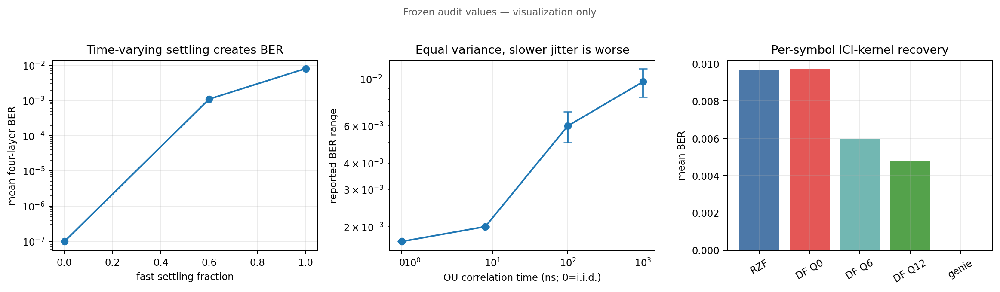

### 分析与结论

算法只在抖动具有可估结构的长相关区间放宽规格；不能给一个与 tauC 无关的统一倍率。这个包络后来没有迁移到高基线 TDL 场景，因此不得把 1.3× 写成全系统器件保证。

## 实验 18：R7 全损伤栈 L0--L3 预注册集成——no-go

### 实验介绍

实验 15--17 在平坦、条件良好的场景中证明 ICI-DF 机制，但真实接收机还同时面对 TDL 深衰、逐用户 CFO、定时、相噪、泄漏和信道估计误差。算法可能在简化场景消掉一半 ICI，进入完整系统后却因第一次判决太差、信道估计不准或同步失败而没有净收益。为了避免只展示最好场景，必须做所有因素同时存在的集成门。

四级 L0--L3 对应健康基线、加入目标损伤、实际治疗和理想治疗。若只移除快抖的 L3 不能回到无快抖 L0，说明实验没有只控制一个变量，或者 genie 路径有实现问题。

### 实验目的

检查 flat 中漂亮的 ICI-DF，加入独立用户 CFO、相噪、泄漏、建立、OU 快抖和 TDL-A 后是否仍能恢复。

### 详细设计

四级同 seed 阶梯：

- L0：全栈但无快抖；
- L1：加快抖，无 DF；
- L2：加快抖和 CFO-aware soft DF；
- L3：已知 beta genie，只移除新增 settling 损伤。

主指标为 gap closure；自检要求 L3≈L0。预注册门：L2<L1、95% 区间分离、gap closure≥30%。

gap closure 的分母是 L1 与 L3 的 BER 差，即快抖理论上可恢复的部分；分子是 L1 与 L2 的实际改善。这样不会把 TDL/CFO 造成、原本不属于 DF 目标的栈地板算进算法失败。门槛在看数据前写定，未通过就停在 pilot。

### 计算过程与量级判断

gap closure 定义为 $(BER_{L1}-BER_{L2})/(BER_{L1}-BER_{L3})$。冻结中位数 L0/L1/L2/L3 为 25.544%/30.021%/30.183%/25.544%，所以分母约 4.477 pp，而 L2 比 L1 还高约 0.162 pp，得到负 gap closure；按逐 seed 计算后的中位是 -4.88%。L3 与 L0 完全一致是本实验最关键的自检：genie 只撤销 L1 新增的快抖，若 L3 仍高于 L0，说明两个分支还混入了不同 CFO、相噪、噪声或索引。负结果不能解释成“所有 ICI 都不可恢复”，因为此时 L0 自身已经约 25.5% BER，第一遍判决和信道估计远离实验 15 的工作区。

### 实验结果

- L3==L0 不变量成立；
- 3 个有效 seed 中位 gap closure 为 `-0.0488`，CI 不分离，go/no-go=0；
- seed 20261002 窗口不完整；seed 20261008 在 200 dB 洁净孪生中也因远端假 PSS 峰失败；
- 真信道条件数中位约 31--57，部分子载波 >100；估计 $\mathrm{cond}(\hat H)$ 还被膨胀约 1.9×。

### 分析与结论

第一次全栈 no-go 同时包含两个瓶颈：信道本身过于病态，以及分数定时破坏 DM-RS 插值后造成估计伪影。项目没有筛掉坏 seed，也没有为了过门直接跑 paper；这是后续可信归因的基础。

## 实验 19：两段式逐用户定时估计和全栈基线修复

### 实验介绍

实验 18 的 no-go 可能来自真实 TDL 信道很病态，也可能来自接收机没有正确处理每用户定时差。纯定时偏移在频域表现为该用户信道列随子载波旋转相位；乘单位模复数不会改变真实矩阵条件数。如果 $\mathrm{cond}(\hat H)$ 因定时显著增大，增加的是导频插值伪影，不是物理信道真的变坏。

因此先做“初次估计—测每用户相位斜率—去斜坡—重新估计”的两段式修复。只有把可避免的估计问题修好，再重跑 L0--L3，才能判断 DF 的迁移失败是否仍成立。本实验修的是基线，不是 ICI 核本身。

### 实验目的

先修复 $\mathrm{cond}(\hat H)$ 中可避免的估计伪影，再判断 ICI-DF 失败是否只是坏基线造成。

### 详细设计

首次估计 $\hat H$，从每用户信道列跨频相位斜率估计聚合定时，去斜坡后重估信道；采用温和主场景和显式 outage 协议。头条用中位/P95，不用容易被单个深衰支配的 max。

第一次 $\hat H$ 的跨频斜率包含配置定时、TDL 群延迟和 PSS 采样量化，所以估计值不要求逐字等于配置偏移；真正有意义的是去斜后 BER 和条件数中位是否改善。L0 BER>10% 或 acquisition 失败记为 outage，避免错误 PSS 峰产生约 0.5 BER 后混入有效 seed 的 gap 统计。

### 计算过程与量级判断

seed 20261001 的条件数中位从 106.40 降至 58.97，下降 44.6%；BER 从 25.74% 降至 3.21%，约改善 8.0 倍，说明两段式定时处理修复的是一个真实的大基线错误，不是只让图更平滑。修复后 5-seed 中位 L1-L2=1.845%-1.777%=0.068 pp，而可恢复 gap 是 1.845%-0.516%=1.329 pp，简单中位比约 5.1%，逐 seed 中位 gap closure 为 3.54%，仍远低于 30% 门。max cond 从 1143 升到 2599 并不否定中位改善：最大值通常由一个深衰子载波控制，说明重估在尾部可能更不稳定，所以报告必须同时给中位、P95 和 max，不能只挑其中一个。

### 实验结果

- seed 20261001：$\mathrm{cond}(\hat H)$ 中位 `106.40→58.97`，命中真值约 57 的目标；
- 四层聚合 BER `25.74%→3.21%`；
- 5 个有效 seed 中位 L0/L1/L2/L3=`0.516/1.845/1.777/0.516%`；
- L2 全部略优于 L1，但 gap closure 中位仅 3.54%，CI 不分离，仍 no-go；
- max cond 反而 `1143→2599`，显示个别深衰处重估会恶化；
- 3/8 seed 为 falsePssPeak outage；20261002 加长窗口后恢复，L0=0.041%。

### 分析与结论

定时修复确实改善了基线，却没有救活 DF。估计器输出是配置定时、TDL 群延迟和 PSS 量化的聚合斜率，不能逐字对照配置偏移。EVM 分解发现 ICI 占 L1 残差功率 51%/63%，说明“ICI 太少所以无增益”不成立；主嫌转为核模型失配。

## 实验 20：真值四支分解、双 bank 和 PSS 四链合并

### 实验介绍

定时修复后，L1 中 51%--63% 残差功率确实来自新增 ICI，但 L2 几乎没有下降，说明问题不是“ICI 太少”。一阶开关扰动实际取决于当前天线输入与上一开关相位留下的状态之差。flat 信道中不同天线频谱相似，用当前链一个 bank 勉强可近似；TDL 中相邻天线频谱去相关，遗漏上一相位链会使模型结构不完整。

但是更符合物理的双 bank 几乎翻倍未知系数，有限数据下估计噪声可能增大。本实验先在知道发送符号和真实信道的残差上测模型天花板，再放进实际接收机，从而区分“模型结构更正确”和“参数能被可靠估出来”。

### 实验目的

区分四个可能原因：单 bank 核模型缺项、判决错误、信道估计错误、误码集中在深衰子载波。

### 详细设计

在真值残差上比较单 bank 和“当前链+前一开关相位链”双 bank；分别替换真值判决、真值信道；统计最低 $|H|$ 十分位上的误码占比；只有 H2 门通过才允许反功率加权 LS。

四支含义是：模型上限支只比较单/双 bank 能解释多少真值残差；genie 判决支把 $\hat x$ 换成真实发送符号； genie 信道支把 $\hat H$ 换成真实等效信道；joint 支同时替换两者。误差定位支检查错误是否主要落在最低信道增益十分位。每支的通过规则预先写定，避免看完数据后只保留支持原猜测的分解。

### 计算过程与量级判断

双 bank 相对单 bank 的真值捕获从 0.2617→0.4746 和 0.3527→0.5134，分别增加 21.29 pp 和 16.07 pp，直接支持“上一开关相位状态缺失”的 H1。可是无约束双 bank 需要同时估计两套 Q=12 复核，约 100 个实自由度；有限数据中的方差使实际 BER 分别相对恶化 12.7% 和 15.7%。genieDecision 只比 current 多关闭约 1.3--1.7 pp，而 genieChannel 多关闭约 46.8--49.7 pp，因此主要瓶颈是回归量使用的信道不准，不是初次 QPSK 判决错误。H2 门要求两个 seed 的最低信道十分位误码占比都≥0.30，实际一个只有 0.264，所以反功率加权不能只凭另一个 seed=0.406 放行。

### 实验结果

- 真值捕获单 bank `[0.2617,0.3527]`，双 bank `[0.4746,0.5134]`，H1 成立；
- current/genieDecision/genieChannel/jointGenie gap：seed1 `[0.006,0.019,0.474,0.483]`， seed2 `[0.035,0.052,0.532,0.529]`，信道支主导；
- 无约束双 bank 实际 BER反而 `3.022→3.405%`、`1.481→1.714%`，gapGain 为负；
- 原因是实自由度过多，估计方差吞掉结构增益；
- H2 两 seed 为 0.264/0.406，未达到双 seed≥0.30，weighted 分支按门禁拒绝；
- PSS 四链合并成功 5/8，但 20261004 被坏链拖败，单链 3/4 各自成功。

### 分析与结论

“真值模型更能解释残差”不等于“用有限数据估计更多参数就更好”。该实验促成物理约束降维和峰位投票，也拒绝了一个看似合理但未过门的加权分支。

## 实验 21：DDCE、物理约束核、组合接收机和 PSS 投票

### 实验介绍

实验 20 表明信道估计支能关闭约一半 gap，真值双 bank 也比单 bank 多捕获约 16--21 pp。于是有两条修复：用初次判决的数据增加“导频”数量来重估信道；利用开关扰动是实标量过程这一物理事实约束双 bank，减少未知数。两者单独达到预注册门后，才有理由组合。

PSS 方面，简单把四链相关能量相加会被一条坏链的远端强峰拖走。投票先看各链峰位置：至少两条链在容差内同意某位置才采用，否则回退原合并。它不改变 PSS 序列，只改变多链证据的合并规则。

### 实验目的

沿实验 20 的信道支主导结论，分别修信道、压缩核自由度，再测试组合是否产生稳定收益。

### 详细设计

- DDCE：把 13 个已判数据符号当作附加导频重估每子载波信道；
- 约束核：利用扰动为实标量和共轭对称，将 Q=12 双 bank 从 100 个实自由度降为 25；
- 组合：DDCE+物理核；
- PSS vote：至少两链在容差内给出一致峰时选该峰，否则回退合并。

DDCE 中 13 个数据符号提供每子载波 13 个方程来估 4 个用户系数，但判错会变成错误“导频”，所以要求双 seed BER 都下降且 gap 至少增 15 pp。约束核要求真值 capture 相对无约束下降不超过 5 pp；组合还要带来 10 pp。三道门独立判断，不因模块代码写完就自动通过。

### 计算过程与量级判断

DDCE 在每个子载波上用 13 个数据符号形成 13 个复方程估计 4 个用户系数，表面上方程/未知数比为 3.25；但这些“导频”来自当前硬判决，深衰处若判错，会把错误符号当成已知输入。物理约束核利用标量实值扰动带来的 $B(-u)=B^*(u)$，把 Q=12 双 bank 从 100 个实自由度压到 $1+2Q=25$，每自由度可用信息量约提高四倍。真值 capture 的变化只有 +0.13 pp/-0.49 pp，说明降维基本没有牺牲模型上限；然而 DDCE gap 只增 1.56/4.51 pp，未达到双 seed 15 pp，组合为负，说明“模型结构可压缩”和“实际接收机能稳定估计”是两个不同判断门。

### 实验结果

- DDCE BER 两 seed 均略降，但 gap 只增 `1.56/4.51 pp`，低于 15 pp 门；
- 真值捕获无约束 `[0.6359,0.6501]`，约束 `[0.6372,0.6452]`，损失<0.5 pp，降维通过；
- 使用 $\hat H\hat x$ 代理模拟 drive 的 physicalB gap `-56.2/-63.6%`，组合也为负；
- 真值 drive 依赖静态 IIR 状态，简单 $v_q-v_{q-1}$ 代理缺少所需结构；
- PSS vote 将 5/8 提至 6/8，但样本太少，保持非默认。

### 分析与结论

物理约束降维是可靠正结果；DDCE 和组合接收机未达到预注册收益。项目连续拒绝了自己刚实现的两个功能，避免把“代码存在”误写成“算法有效”。

## 实验 22：received-drive 最后一次有界尝试

### 实验介绍

实验 21 的约束核在真值 drive 上有效，但用 $\hat H\hat x$ 构造代理 drive 时失败，因为它不知道模拟开关上一样点留下的静态 IIR 状态。唯一标量 ADC 流 $y[n]$ 本身包含这个状态，所以尝试直接用相邻样点差近似状态变化。该方法只读取实际接收机可观察的 stitched122 和名义建立时间，不读取 beta 或 TDL 真值。

为了避免算法研究无限延长，本轮在看数据前声明为最后一次有界尝试：真值 capture 门不过就不进入接收机；接收机双 seed 门不过就冻结整个 B 线。即使某个 seed 很好或只差一点，也不再修改阈值。

### 实验目的

从唯一 stitched ADC 流直接构造可观测 drive，避免依赖 $\hat H\hat x$ 代理：

$$
\hat d[n]=\frac{y[n]-y[n-1]}{\beta_0}.
$$

这是 B 线冻结前明确声明的最后一次尝试。

### 详细设计

固定实验 21 的 fast、Q、迭代、两个 TDL seed 和判断门，不再调参。先在真值残差上比较 received-drive 与 exact drive 的 capture；只有两 seed capture 都不低于 50% 才允许进入实际接收机。随后比较同 seed 的标准/received-drive BER，并要求两 seed 均改善且 gap 增量都至少 10 pp。额外用 200 dB 和 20 dB 两个 SNR 判断 capture 损失是否主要来自观测噪声。

### 计算过程与量级判断

$\beta_0=0.591005$ 来自名义 20 ns 的一阶建立递推；相邻 ADC 样点差除以它，近似恢复驱动状态变化。20 dB 与 200 dB 的 capture 分别为 0.6365/0.6435 和 0.6365/0.6434，差异低于 0.01 pp，说明观测噪声不是剩余约 36% 未捕获结构的主因，剩余更可能来自 Q=12 截断和一阶近似。接收机门要求每个 seed 相对 DDCE 的 gap 增量至少 0.10；第一 seed 是 0.1089-0.0211=0.0878，只差 0.0122，也就是 1.22 pp。预注册门是对跨 realization 稳定性的要求，因此第二 seed 的 32.60 pp 不能替第一 seed 补票。

### 实验结果

- 名义 `beta0=0.591005` 与解析值一致；
- 20 dB received capture `[0.6365,0.6435]`，几乎等于 exact drive；
- 200 dB 和 20 dB capture 基本相同，排除回归量噪声是剩余 36% 损失主因；
- 实际 BER `0.029951→0.028422`、`0.014285→0.010525`；
- gap 增量 `+8.78/+32.60 pp`；第一 seed 距 10 pp 门只差 1.22 pp，仍判 `receiverGatePassed=false`。

### 分析与结论

ADC 中确实能观察到约 64% 的一阶结构，但不同信道 realization 上不能稳定转化为 BER 收益。剩余限制来自 Q=12 截断、一阶近似、信道估计和深衰判决。因为预注册要求双 seed 过门，不能用“只差一点”改判。 ICI-DF 集成线至此冻结为论文的适用边界，不再无限调参。

## 实验 23：PSS 投票 30×3 扩样

### 实验介绍

实验 21 的 vote 在 8 个 seed 中只多救回 1 个样本。8 次观察太少，一次 rescue 可能只是偶然，无法判断默认接收机是否真的更可靠。扩到三个 SNR、每档 30 seed，是一个低成本统计检验力检查，不是最终获取曲线。

成对统计只关心同一 seed 上“vote 救回 combined”多少次，以及“vote 反而丢失”多少次。两种方法都成功或都失败的 seed 不提供方法差异信息。McNemar 精确检验据此判断这种不对称是否可能来自随机波动。

### 实验目的

检查 8 seed 中 vote 的 1 次救援是否可重复，并提前评估统计检验力。

### 详细设计

在三个冻结 SNR 档各使用 30 个同源 TDL seed，对 combined 和 vote 做成对成功/失败比较；逐档记录 vote 相对 combined 的 rescue 与 loss，并用精确双侧 McNemar 检验。该规模预先定位为“是否值得做正式 100-seed 曲线”的扩样，不冒充完整 acquisition waterfall。

### 计算过程与量级判断

当 loss=0 时，McNemar 精确双侧 p 值是 $2(1/2)^r$，其中 $r$ 是 rescue 数；r=1/2 时 p 被双侧检验截到 1/0.5，r=5 时仍为 0.0625，只有 r≥6 才低于 0.05。这就是“30 seed 中看到 1--2 次改善仍不能升默认”的定量原因。该实验只在三个离散 SNR 比较方法差异，既没有足够横轴点形成 waterfall，也没有 100 个 realization 稳定估计平台，因此它的功能是检验力预演，不是最终 acquisition 性能图。

### 实验结果

三个 SNR 档 rescues=`[1,2,2]`、losses=`[0,0,0]`，精确双侧 McNemar p=`[1,0.5,0.5]`。零损失情况下至少需要 6 次 rescue 才能 (p<0.05)，30 seed 明显没有足够检验力，因此不升默认。

### 分析与结论

“改善次数为正”不等于“统计显著”。该实验没有被包装成 acquisition 曲线，正式 100-seed 曲线在实验 25。

## 实验 24：公共单 RX-LO 与独立 4-LO

### 实验介绍

单 RF 链意味着物理下变频通常只有一个接收本振，所有虚拟链共享同一相位噪声；全数字四链可能每链有独立振荡器。直觉上，共同相位只需估一个角度，似乎一定更容易；但独立相噪经过多天线合并时可能互相平均，公共相噪不会平均。两种机制相反，不能只凭“参数更少”下结论。

旧 TX Wiener 模型描述终端自由振荡器的无界随机游走，不适合已锁定接收 PLL。本实验用稳态方差有限的 OU 过程描述 RX-PLL，并严格放在物理位置：独立 LO 作用于每条 30.72 MS/s 支路后再开关，公共 LO 作用于合成后 122.88 MS/s 标量流。

### 实验目的

检验预注册假设：公共 LO 只产生一个共同相位，是否必然比四个独立 LO 更容易处理。

### 详细设计

使用有界单极 OU/AR(1) RX-PLL：

$$
\phi[n+1]=\alpha\phi[n]+\sqrt{1-\alpha^2}\sigma_\phi w[n],\quad
\alpha=e^{-2\pi B_{PLL}/F_s}.
$$

公共 LO 在开关合成后 122.88 MS/s 注入；独立 LO 在四支路开关前 30.72 MS/s 注入。扫描 $\sigma_\phi=0.5, 1, 2, 4, 8$ 度和 $B=10\text{k}, 100\text{k}, 1\text{M}$ Hz，比较 blind 和每符号 CPE。

blind 表示不做符号相位跟踪；CPE 分支每个 OFDM 符号只估一个共同旋转。零相噪时两拓扑必须逐位等于 off 基线；公共模式四链同一时刻相位必须相同；Welch PSD 和 lag-1 必须匹配理论。LO 使用独立派生随机流，保证打开/关闭 LO 不会改变原有 AWGN 和 TDL realization。

### 计算过程与量级判断

OU 系数把 PLL 带宽换成相邻样点相关性。例如 30.72 MS/s、100 kHz 时 $\alpha=e^{-2\pi10^5/(30.72\times10^6)}\approx0.9798$；带宽越小，相位在一个 OFDM 符号内越接近缓慢共同旋转，带宽越大则更容易在符号内自平均。8°/10 kHz 点中 independent BER 5.153×10⁻⁵，比 common 的 3.142×10⁻³低约 61 倍，直接推翻“共同 LO 参数少所以必然更好”的假设。common+CPE 将其降到 8.761×10⁻⁴，说明单参数跟踪有效但仍受周跳支配；11/130 个周跳符号承载 99.957% 错误，错误高度集中而非均匀噪声。温和 TDL 中 independent 反而最差，说明病态信道会破坏独立相噪的空间平均并放大跨层失配，所以不存在不带信道条件的固定倍率结论。

### 实验结果

- 公共模式四链相位偏差 `2.9e-16`，独立链相关约 0，lag-1 与理论命中；
- 8°/10 kHz：common BER `3.142e-3`，common+CPE `8.761e-4`，independent `5.153e-5`；
- 原假设 H-LO1 在所有网格点均不成立；
- 独立+CPE 的增量 EVM 功率对 $\sigma_\phi^2$ 的 R²=`0.9913/0.9915/0.9901`；
- 11/130 个周跳符号承载 25487/25498，即 99.957% 错误；oracle CPE 恢复 0， $\pi/2$ 锚定后降到 8364；
- 温和 TDL 栈中 off/common/independent=`0.0129/0.0141/0.0168`，排序反转。


### 分析与结论

审议方原假设被数据证伪。独立振荡器相噪可在 MIMO 合并中空间平均，公共相位不能；但病态信道使合并权重偏斜，并使独立行相位失配产生跨层串扰，公共 LO 又可能占优。因此不存在普适“公共 LO 规格放宽 A 倍”，应报告 $(\sigma_\phi, B_{PLL}, \mathrm{cond}(\hat H))$ 条件拓扑。

## 实验 25：PSS 100-seed SNR 曲线、投票和多帧累积

### 实验介绍

同步失败有两种本质不同的原因。低 SNR 时，正确 PSS 峰被噪声淹没，随着 SNR 提高成功率应迅速上升，形成 waterfall；高 SNR 时若某些多径 realization 在错误位置产生更强相关峰，继续加功率也不会改善，而会形成平台。只有分开两者，才能知道应该增加积累能量，还是改进假峰判别。

多帧非相干累积不要求知道相邻帧的载波相位，只把相同候选位置的相关能量相加。2/4 帧累积可提高弱峰可见度； vote 则利用多链峰位一致性。100 个相同 TDL seed 让这些方法可以做有检验力的成对比较。

### 实验目的

把低 SNR 噪声失败和高 SNR 远端假峰分开，并用足够样本比较单帧、vote、2/4 帧非相干累积。

### 详细设计

100 个同源 TDL seed，只运行 acquisition，不做完整解码。成功定义为 timing error 在容差内且 NID2 正确；失败分为 falsePeak、miss 和 windowClip。报告 Wilson 95% CI 和配对 McNemar。

只运行 acquisition 路径是为了把计算集中在同步，不让完整 PBCH/数据解码拖慢 100 seed×多 SNR 网格。成功不仅要求相关器返回一个峰，还要求峰位置接近真值且 NID2 正确，否则远端假峰会被错误记成成功。

### 计算过程与量级判断

单帧 combined 在 -20/-16/-12/-8 dB 的成功数为 1/1/3/14，明显随 SNR 上升；到 8/14/20/26 dB 恒为 52，说明此后限制不再是噪声能量，而是不同 TDL realization 中错误峰与真峰的排序。accum4 在 -8 dB 达到 54，相当于单帧约在 8 dB 才达到的水平，故可描述为约 5 dB 左移，但高 SNR 仍停在 70，不能把它解释为纯 AWGN 曲线平移。20 dB 的 18 rescue/0 loss 给出 $2(1/2)^{18}=7.629\times10^{-6}$；vote@26 的 6/0 刚好是 0.03125，闭合实验 23 的检验力计算。52/100 在 20 dB 的 Wilson 95% CI 约 [0.423,0.615]，提醒 52% 不是无误差精确常数。

### 实验结果

- combined1 在 8--26 dB 恒为 `52/100`，形成高 SNR 平台；
- accum4 把 -8 dB 从 `14/100` 提至 `54/100`，waterfall 左移约 5 dB；
- accum4 高 SNR 平台提高到 `70/100`；
- 高 SNR 48 个 combined 失败全部是 falsePeak，miss=0、clip=0；
- accum4@20 dB 相对 combined 为 18 rescue/0 loss，`p=7.629e-6`；
- vote@26 dB 为 6/0，`p=0.03125`，刚达到实验 23 预估的显著性门。


### 分析与结论

低 SNR 是相关峰被噪声淹没的 waterfall；高 SNR 仍失败则是某些 TDL realization 的远端假峰。多帧累积同时提高低 SNR 能量和平台，但不能消除所有假峰。vote 有统计正结果，但幅度小，仍未升默认。

## 实验 26：开关 acquisition 代价的结构/损伤归因

### 实验介绍

实验 25 看到 switch-on 比 switch-off 少约 23 个百分点成功率，但“打开开关”同时做了两件事：一是把四路样点按相位交织成单链结构，二是加入有限隔离、建立时间和抖动。若不拆开，就不知道损失是单链时间交织本身不可避免，还是器件质量可改善。

因此增加 ideal-interleaving 中间臂：它执行相同四相取样和去交织，但没有泄漏、过渡和抖动。off→ideal 测结构代价，ideal→impaired 测器件损伤代价，三支共享同一信道和噪声。

### 实验目的

把 20 dB 下 switch off/on 的 23 pp 成功率差拆成“理想四相交织结构本身”与“有限隔离/建立/抖动损伤”。

### 详细设计

同 100 seed 比较：switch-off、ideal-interleaving 和 impaired-on。三支共享底层信道和噪声。

### 计算过程与量级判断

三支成功率是 75%、76%、52%。结构臂 ideal 相对 off 只有 1 个 loss、没有 rescue，McNemar 双侧 p=1，不能宣称 1 pp 差异；损伤臂中 ideal 相对 impaired 有 25 rescue/1 loss，双侧精确 p=$8.047\times10^{-7}$，差异明确。总差 off-impaired=23 pp，而 `(off-ideal)+(ideal-impaired)=(-1)+24=23 pp`，加法恒等说明三支使用同一成功定义且没有漏计。结论只适用于仿真的 25 dB/20 ns/20 ps/100 ps 联合模型，不能把 24 pp 再拆给某一个未单独扫描的器件参数。

### 实验结果

- 成功数 `75/76/52`；
- 结构差：0 rescue/1 loss，McNemar `p=1`；
- 损伤差：25 rescue/1 loss，`p=8.047e-7`；
- 总差 23 pp，分解为结构约 0 pp、损伤约 24 pp，配对加法恒等成立。


### 分析与结论

当前配置下，四相交织并没有造成可测 acquisition 代价；23 pp 几乎全由联合模拟损伤造成。这是对损伤模型的系统归因，不代表物理开关 PCB 已被测量。

## 实验 27：最终 TDL 多 realization ICI-DF 曲线

### 实验介绍

前面已经知道 ICI-DF 在 flat 场景能降低约一半 BER，在少量全栈 seed 上收益不稳定。论文最终不能只引用最好单点，也不能只引用最坏 no-go，需要在多个独立 TDL realization 上按统一停止规则回答“平均还剩多少”。

TDL 中不同子载波强弱差异很大。扩大 Q 会捕获更宽 ICI，也会把更多深衰处噪声和判决错误带入核估计，因此 flat 中 Q 越大越好的局部趋势可能反转。本实验同时比较 Q、迭代和 SNR，并把 acquisition outage 与成功帧条件 BER 分开。

### 实验目的

把 flat 隔离场景的 38%--58% 收益放入真实频选 TDL、信道估计和 acquisition 后，给出论文最终迁移结果。

### 详细设计

使用 10 个独立静态 TDL-A realization 和同 seed 成对 standard/soft-DF，固定 20 dB、20 ns、fast=0.6、 tauC=1 µs；比较 Q=6/12/24 和 1--3 次迭代，并扫 11 个 SNR 点。每点沿用 paper 错误数/最大 bit 停止规则， acquisition outage 单独计数。器件包络只在 TDL 基线满足目标 BER 时才允许迁移 flat 的容限倍率。

### 计算过程与量级判断

Q=12、3 次时绝对 BER 只从 0.16567 降到 0.16046，差 0.00521，也就是相对 3.15%；虽然 9/10 seed 方向为正，但远小于 flat 的约 50%。Q=24 只改善 1.30%，说明 TDL 深衰和错误判决使新增核系数带来的估计方差超过额外频谱捕获。fast=0 时基线已经 5.652%，高于器件包络目标 1%，所以逻辑上不存在“还能容忍多少 fast 才达到 1%”的正区间；这就是拒绝迁移 flat 1.3× 的原因，而不是算法倍率在 TDL 中被重新算成 0。

### 实验结果

- 10 个 TDL realization，20 dB、fast=0.6、tauC=1 µs；
- Q=12、3 次 soft DF：聚合 BER `0.16567→0.16046`，相对降低 3.15%，9/10 seed 改善；
- Q=24 仅降低 1.30%，比 Q=12 更差；
- 11 个 SNR 点 outage=0，paper 停止门完成；
- fast=0 基线 BER 5.652%，genie 1.006%；i.i.d. 点可能反噬；
- flat 包络的 1.3× 规格倍率因 TDL 基线已高于 1e-2，被明确拒绝迁移。


### 分析与结论

Q=24 在脏残差下增加更多估计自由度，噪声—捕获折中使最优 Q 左移。最终结论不是“ICI-DF 无效”，而是：机制上有可恢复结构，flat 中收益显著，但在 TDL 全栈默认接收机中只稳定保留约 3%。

## 实验 28：R15 十五段真实 OTA 高 SNR 配对与离线对照

### 实验介绍

实验 11 只有一段 OTA，能证明桥接器可运行，却不能判断结果是否依赖一次偶然信道。R15 原计划用三个 RX gain 形成不同 SNR，每档采 5 段，再把真实 OTA 的损伤增量与相同 SNR 的 TDL 仿真比较。这里比较新增误差功率，所以在看数据前选定 EVM² 增量，而不是普通 RMS-EVM 幅度差。

调 RX gain 可能同时放大信号和接收机噪声，不保证空口 SNR 按 5 dB 移动。因此除了看三组标签，还必须从每段 IQ 实际估计 SNR。若三组重叠，就只能称为一个高 SNR 数据簇，不能因为文件夹有三个 gain 名字就宣称多 SNR 校准。

### 实验目的

从 Phase 1 单点扩展到多个真实 capture，并预注册一个定量门：OTA 和 matched-SNR 离线的新增 EVM² 功率方向一致，且中位增量倍率不超过 2。

### 详细设计

rxGain 25/30/35 各采 5 段，每段 20 ms。每段必须 PSS/PBCH/EVM gate 通过。对同一 raw IQ 注入 ideal 和 25 dB 隔离、20 ns 建立、20 ps 转换抖动、100 ps 边界抖动；离线侧用匹配估计 SNR 的 TDL-A。

主指标为

$$
\Delta_{EVM^2}=\frac{EVM_{imp}^2-EVM_{ideal}^2}{EVM_{ideal}^2}.
$$

这个比值表示开关损伤新增误差功率相对于原有误差功率有多大。EVM² 在功率域可以直接相加；RMS-EVM 先开平方，对大增量具有凹压缩，会把 OTA 侧更大的退化压得更多。门槛“OTA/离线中位增量倍率≤2”在采集前冻结，不能在结果 2.112 略超门后改用恰好得到 1.957 的 RMS 口径。

### 计算过程与量级判断

每段先算 $EVM^2$，再用 `(impaired-ideal)/ideal` 得到新增误差功率相对原误差功率的比例。15 段 OTA 中位 0.83035 表示新增误差功率约为原误差功率的 83.0%；matched-SNR 离线中位 0.39315 表示约 39.3%，两者比值 2.1120，比预注册上限 2.0 高 5.6%。若对 RMS EVM 做同样形式的比值，平方根的凹函数会更强地压缩较大的 OTA 增量，于是比值变成 1.9571；这不是第二个同等合理的主指标，而是为什么不能事后换指标的数学原因。三组实测 SNR 范围 35.1--42.0、32.9--43.4、40.0--40.8 dB 大量重叠，组间均值只差约 1 dB，远小于组内 7--10 dB 展宽，因此 RX gain 标签不能当成三个独立 SNR 横坐标。

### 实验结果

- 15/15 capture gate 通过；两支均无有限样本 bit errors；
- 损伤方向 15/15 一致；
- OTA 中位增量 0.83035，离线 0.39315，功率域倍率 **2.112**；
- RMS-EVM 换算倍率 1.957，但这是看数后的凹压缩指标，不用于改判；
- 三档 gain 实际 SNR 全落在 33--43 dB，均值约 38.2/39.1/40.5 dB，未形成三个 SNR 区间。

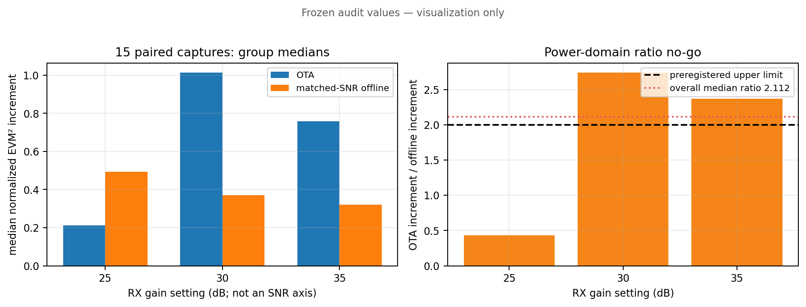

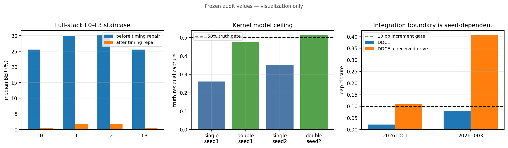

### 分析与结论

预注册要求≤2，因此正式 no-go；并且即使 RMS 指标勉强过门，三档 SNR 重叠也不支持“多 SNR 定量校准”。可支持的主张是：高 SNR 单簇上，真实 OTA 和离线损伤同方向、同量级，离线模型对新增误差功率偏乐观约 2 倍。若要真正多 SNR OTA，应使用 TX 功率步进或外部衰减器，而不是只调 RX gain。

---

## 6. Phase 3：从四端口到 $M>N$ 端口选择

Phase 0--2 始终是 4 个物理端口形成 4 条虚拟观测，即 $M=N=4$。Phase 3 增加候选端口数，但同时活动用户仍为 4 个。目标不是把 8/12/16 路都数字化，而是先观察或扫描候选端口，再选择哪些端口在各开关码相接入唯一标量流。端口选择可能改善信道条件数，也会增加求和噪声、开关损伤和扫描开销，所以必须逐层扣除成本。

## 实验 29：$M>N$ 单链平台的六项代数回归

### 实验介绍

把候选端口从 4 扩到 8/12/16 时，最危险的实现错误是软件先生成多列并行接收信号，再在数字域相加。那样实际已经使用多条 RF 链，只是最后把数组求和，得到的增益不能归因于单链开关。第二个风险是新矩阵定义在 $M=N=4$ 时不能还原旧系统，使 Phase 2 与 Phase 3 的差异同时包含平台改写误差。

因此本实验只检查无法靠“跑出低 BER”证明的结构约束：物理输出是否始终一列、同一码相是否非法复制端口、有效信道是否确为端口组合后的 $S^TH$，以及单位矩阵调度是否逐位还原旧系统。

### 实验目的

在讨论选择增益前，证明新平台没有偷偷恢复多 RF 链，也能在 $M=N=4, S=I$ 时退化回旧系统。

### 详细设计与结果

独立审查六项全部通过：

1. M=N、S=I 与旧系统逐位一致；
2. M=8 理想去交织等于对应天线和，相对误差 0；
3. 有效信道等于 $S^TH$，相对误差约 `1.69e-16`；
4. `sum(A,2)≤1`，同码相不能把一个端口复制给多个链；
5. 非法扇出被明确拒绝；
6. 无论 M 多大，物理输出始终只有一列标量流。

第 3 条中的 $S^TH$ 表示：每条虚拟链的有效信道等于被分配到该链的物理端口信道之和。它不仅合并信号，也会合并各端口噪声，所以后续检测必须使用 $R_n=\sigma^2S^TS$，不能继续假设每链噪声始终为 $\sigma^2$。

### 计算过程与量级判断

物理模型先把 M 路天线样点按调度系数压成唯一标量 $y[t]=\sum_m c_m[t]r_m[t]$，之后数字端才能按码相恢复 N 条虚拟链；因此“标量输出恒为一列”是单 RF 链约束，不是数组排版偏好。若每条虚拟链分配的端口集合不同，$S^TS$ 的对角元素等于各链合并端口数，非对角元素表示端口复用造成的噪声相关；继续使用单位噪声协方差会把多端口求和的信号增益算进去，却漏掉同步增加的噪声。M=N=4、S=I 时 $S^TH=H$ 且 $S^TS=I$，所以它必须逐位还原旧链路，这就是退化回归的具体数学含义。

### 结论

该实验只证明平台物理和代数地基，不证明 SINR、速率或能效有增益。

## 实验 30：M=8、2520 个受约束调度穷举 Gate 1

### 实验介绍

平台正确后，第一个科学问题是：多出 4 个候选端口是否真的提供选择余量。M=8 时若规定每条虚拟链恰好分配 2 个端口、每端口只能属于一条链，所有不重复划分只有 2520 个，可以全部计算。穷举能给后续贪婪算法一个明确标尺；若连穷举都不能优于 M4，就不应继续开发近似在线算法。

简单把两根天线相加不保证更好：信道相位可能相消，噪声功率却一定增加；某个组合还可能让四用户有效信道更接近线性相关，RZF 严重放大噪声。因此目标选“所有用户中最差的 SINR”，而不是只让总功率最大。

### 实验目的

先用可穷举的小规模问题建立算法标尺，回答理想开关下 $M>N$ 是否确实有选择 headroom。

### 详细设计

M=8、N=4，每链恰 2 个端口，每端口只属于一条链，共 2520 个唯一划分。20 个成对 TDL seed，目标为全 612 子载波的最小用户 SINR。噪声协方差使用 $R_n=\sigma^2S^TS$，避免多端口求和却不增加噪声的虚假增益。

20 个 TDL seed 中，M4 与全部 M8 调度共享同一信道 realization。对每个候选 S，先计算 $S^TH$ 和合并后的噪声协方差，再在 612 个子载波上求 LMMSE/RZF SINR，最后取最差用户作为目标。2520 个全算完后选择最大者。

### 计算过程与量级判断

四条虚拟链带标签，每链恰取 2 个端口，因此候选数为 $8!/(2!^4)=2520$；没有再除以 $4!$，因为交换链编号会改变用户/码相对应关系。中位 +2.420 dB 对应最差用户线性 SINR 乘约 $10^{2.42/10}=1.746$，而固定相邻配对 -1.030 dB 对应只剩 0.789 倍。19/20 为正的符号检验在零中位假设下得到约 $2\times(\binom{20}{19}+\binom{20}{20})/2^{20}\approx4.0\times10^{-5}$；报告保存的精确单侧/预注册口径为 `p=2e-5`。两者都说明方向不是由少数极端 seed 支撑，但唯一负 seed 仍证明强制用满端口不是安全约束。

### 实验结果

- 穷举引擎与独立 MMSE 误差 `5.86e-14`；
- 19/20 seed 优于 M4；
- 中位最小用户 SINR 增益 `+2.420 dB`；
- bootstrap 95% CI `[+1.863,+3.613] dB`，符号检验 `p=2e-5`；
- 固定相邻配对中位 `-1.030 dB`；一个强制用满 8 端口 seed 仍 `-0.050 dB`。


### 分析与结论

增益来自按信道选对组合，不是“天线越多、固定相加越好”。反例直接要求下一实验允许关停有害端口。

## 实验 31：F1 关停、贪婪/松弛和 F2 码叠加 Gate 2

### 实验介绍

实验 30 有一个负 seed，因为规则强迫 8 个端口全部使用。现实选择器应允许关闭有害端口，所以 F1 把每端口选择扩为“关停或只加入一条链”，同时要求每条链至少有一个端口。这个集合包含 M4 基线，因此理论穷优不应比 M4 差；若更差，说明枚举或目标实现有错。

穷举 166824 个 F1 候选仍只适合 M=8 标尺，M=12/16 不可能实时全算，所以还要测试逐步增加/移动端口的贪婪算法和连续松弛后量化。F2 进一步允许同一物理端口在不同码相服务两条虚拟链，代表更复杂的码叠加；它增加灵活性，也可能增加串扰和搜索自由度，不能预设必然更好。

### 实验目的

修复强制用满端口的反例，检验可在线贪婪能保留多少穷优增益，并判断 GreenMO 式跨码相码叠加是否额外有用。

### 详细设计

- F1：每端口可关停或只加入一条链，每链至少一端口，共 166824 候选，可穷举；
- F2：每端口最多加入两条链，空间太大，只做贪婪/局部松弛量化；
- 20 个同 seed TDL，另有 flat 对照；
- 预注册门：F1 穷优全 seed≥M4，贪婪保留增益中位≥80%。

“保留率”以 `(贪婪增益)/(F1 穷优增益)` 计算，比较的是相对 M4 的增量，不是两个绝对 SINR 相除。flat 和 TDL 两套对照用于检查码叠加是否只在容易的平坦信道看起来有效；F2 没有可行规模的全局穷举，因此它的贪婪结果不能称为 F2 最优上界。

### 计算过程与量级判断

F1 中每个端口有“关闭、链1、链2、链3、链4”五种选择，再用容斥排除任一链为空，候选数为 $5^8-\binom41 4^8+\binom42 3^8-\binom43 2^8+\binom44=166824$。F1 包含 M4 形式的可行解，因此穷优若低于 M4 就一定是枚举或指标 bug；20/20≥M4 是结构门。贪婪中位增益 3.238 dB 与穷优中位 3.693 dB 直接相除约 87.7%，而正式 92.4% 是先对每个 seed 计算增益保留率再取中位，两种“中位数运算顺序”不能混用。F2 的 TDL 中位 -0.203 dB 对应约 4.6% 线性 SINR 损失，且仅 5/20 为正，足以支持“当前搜索和约束下无稳定增值”，但因没有 F2 全局穷举，不能证明所有码叠加算法都不可能有效。

### 实验结果

- F1 穷优 20/20≥M4，修复 R17 反例；
- 贪婪 20/20 胜 M4，中位保留率 92.4%；
- F1 穷优/贪婪中位增益 `+3.693/+3.238 dB`；
- 传统每链单端口 FAS 参考 `+0.378 dB`，随机 `-0.973 dB`；
- F2 相对 F1：flat 7/20 为正、中位 0；TDL 5/20 为正、中位 `-0.203 dB`；
- 局部松弛量化中位仅 `+0.053 dB`，不是全局上界。


### 分析与结论

简单 Dmax=1 端口划分已经获得主要收益；允许同一端口跨码相服务多链没有稳定增值。这是可发表的架构简化负结果，不能因它与最初 GreenMO 叙事不一致而删除。

## 实验 32：R19 带损伤全栈、固定 QPSK Gate 3——SINR 正而 goodput 负

### 实验介绍

实验 30--31 的目标仍基于理想开关频域信道。真实部署中，选出的端口组合必须经过 122.88 MS/s 标量开关，并承受隔离、建立、OU 抖动、PSS 获取失败和扫描时间。即使成功帧的 SINR 提高，扫描期间不传 payload、偶发同步失败和固定 QPSK 的速率上限也可能让最终有效吞吐下降。

QPSK 每个成功符号最多承载 2 bit。当 M4 已经接近正确解码时，再增加 2 dB SINR只能少改少量错误，不能提高每个正确符号的比特数；但 10 ms 扫描开销会直接损失 10% 的 100 ms 周期。这就是“链路质量收益”和“系统 goodput 收益”可能符号相反的原因。

### 实验目的

把理想选择送入真实单标量开关路径，加入 TDL、25 dB 隔离、20 ns 建立、fast=0.2、1 µs OU、同步和扫描，检验扣除所有成本后是否仍正。

### 详细设计

对 M4、M8 F1 穷优和贪婪调度使用同一 TDL/噪声 realization。所选 S 真正经过 122.88 MS/s 标量开关和完整 acquisition/DM-RS/RZF/QPSK 解码。质量域把选择、开关损伤、同步和扫描分别换算为 dB；系统域则按 100 ms 更新中占用一个 10 ms 扫描帧、获取成功率和成功帧 BER 计算固定 QPSK goodput。两个指标在看数前同时冻结，任何一个正都不能覆盖另一个负。

质量域的 dB 分解依次比较理想选择、加入开关损伤、加入同步成功概率和扫描折算；系统域使用实际解码 BER、成功率与 payload 占空比相乘。这样可以定位负收益来自信号质量丢失，还是来自时间开销和调制饱和。

### 计算过程与量级判断

质量域按 dB 可加性得到 4.28-1.46-0.22-0.46=+2.14 dB，所以器件级选择收益仍为正。系统域则直接相乘：M4 近似为 $1\times(1-0.0320)\times1=0.968$，M8 在冻结样本中约为 $0.95\times(1-0.0103)\times0.90=0.846$；两者差约 -0.122。这里 0.95 是 acquisition 成功项，0.90 是 100 ms 周期中 10 ms 扫描后的 payload 比例。QPSK 的谱效率上限固定为 2 bit/symbol，BER 从 3.20% 降到 1.03% 最多只释放约 2.2% 有效符号，无法抵消约 15% 同步和扫描成本，因此 SINR 正、goodput 负并不矛盾。

### 实验结果

- 成功帧平均 BER：M4 3.20%，F1 穷优/贪婪 1.03%/1.15%；
- SINR-quality 分解：选择 `+4.28 dB`，损伤 `-1.46 dB`，同步 `-0.22 dB`，扫描 `-0.46 dB`，净 `+2.14 dB`；
- 但固定 QPSK 已接近每符号 2 bit 饱和，100 ms 更新中扫描 10 ms，再乘 acquisition 成功率后， M8 goodput 相对 M4 为 `-0.122`；
- 预注册固定-QPSK 吞吐门判 no-go。


### 分析与结论

这不是选择失效，而是 +2.14 dB 没有更高调制可兑换，同时 10% 扫描和一次同步损失超过约 2.2% BER 收益。也不能因为 SINR 指标通过就事后宣布吞吐门通过。该三态矛盾促成 AMC 和扫描周期重测。

## 实验 33：R20 AMC、M=12/16、扫描周期和 acquisition-aware 重测

### 实验介绍

实验 32 证明 M8 的净 SINR 为正，但固定 QPSK 无法把它兑换成更多 bit。AMC 允许信道更好时使用更高调制/编码等级，因此同样的 2 dB 可以跨过一个 MCS 门限并提高每个资源元素的有效比特数。另一方面，扫描成本取决于多久更新一次端口选择：每 50 ms 扫一次很昂贵，每 1 s 扫一次则可由更多数据帧共同分摊。

扩大到 M=12/16 会提供更多选择分集，也需要更多扫描帧。acquisition-aware oracle 在目标函数中同时考虑数据质量和 PSS 得分，用于检查“选择时兼顾同步”是否带来独立收益；它读取仿真真值，因此只能当上界，不能称为当前在线实现。

### 实验目的

让 SINR 增益在非饱和工作点通过调制编码自适应兑现，并检查更大候选端口和扫描摊薄是否改变结论。

### 详细设计

50 个成对 TDL seed，M=4/8/12/16；冻结 CQI-style AMC 门限；扫描周期 50 ms--10 s；比较数据目标和 acquisition-aware oracle。代码第一次完整运行因尾段峰位 bug 被发布门拒绝，整轮作废并重跑，没有挑选保留部分数据。

冻结 CQI-style 表把 EVM/SINR 区间映射到离散频谱效率。扫描周期从 50 ms 到 10 s，扫描帧数随 M 增加；所有 M 使用同源 50 个 TDL seed。第一次运行的尾段峰 bug 会让部分 acquisition 结果依赖窗口末端，发布门在看最终曲线前将整轮作废，修复后从头重跑，避免保留未受 bug 影响的“好看部分”。

### 计算过程与量级判断

AMC 把连续 SINR 映射到离散 MCS，所以 +2 dB 只有在跨过某个门限时才会增加 bit/s/Hz；这也解释了 AMC 门限整体平移 ±2 dB 后必须做稳健性复查。扫描成本近似为 `扫描帧数×10 ms/更新周期`，更新周期从 50 ms 增到 1 s 时，同样扫描工作被更多 payload 帧摊薄约 20 倍。1 s 时 M8/M12/M16 的净增益 0.449/0.614/0.710 bit/s/Hz 随 M 增长，而 50 ms 的 M12/M16 为负，说明“更多端口”同时增加选择余量和扫描成本，结论必须带更新周期。acquisition-aware 只有 1 rescue/0 loss，样本差异数为 1，McNemar p=1，因此最终正收益不能归功于同步感知 oracle。

### 实验结果

- 四帧 acquisition 成功数 M4/M8-data/M8-aware/M12/M16=`46/47/48/48/47`；
- 前 20 个完整解码 seed：M4/M12/M16 成功帧 BER=`3.84/0.83/0.61%`；
- 1 s 更新净 AMC 增益：M8/M12/M16=`+0.449/+0.614/+0.710 bit/s/Hz`；
- AMC 门限整体 ±2 dB 后 M12/M16 仍为正；
- 50 ms 时 M12/M16=`-0.012/-0.295`，约 100 ms 后转正；
- acquisition-aware 相对 data 只有 1 rescue/0 loss，McNemar `p=1`，无显著同步增益；
- 固定 QPSK 在 1 s 的增益仍很小，闭合了 R19 的工作点解释。


### 分析与结论

Phase 3 核心问题在冻结模型内回答为“有条件的 YES”：需要 AMC、准静态信道和足够长扫描摊薄。净收益来自端口选择、更大 M 和 AMC，不来自 acquisition-aware oracle。M>8 没有穷举标尺，当前贪婪与全局最优的差距未知。

## 实验 34：闭式 LMMSE SINR、速率上下界和几何边界

### 实验介绍

R20 的 SINR 来自数值程序。为了让论文读者理解增益从哪里来，需要把同一个计算写成标准矩阵公式，并给出可检查的上界和下界。如果闭式表达与数值引擎不一致，后续器件预算和速率解释都没有可靠基础。

还要区分“固定阵列增益”和“选择分集”。前者是固定一组端口相干相加自然增加信号功率；后者是看过信道后避开差组合、改善条件数。若固定端口增益为负而选择后为正，说明收益来自选择，不应宣传成更多天线天然增益。

### 实验目的

把 R20 数值引擎写成可审计数学表征，并区分选择分集、固定阵列增益和理论上界。

### 详细设计与结果

- 用相同 (S,H,R_n) 重算标准 LMMSE SINR，最大 objective 差 `8.88e-15 dB`；
- M4/M8/M12/M16 中位最差用户速率=`3.093/4.226/4.847/5.263 bit/s/Hz`；
- 联合 log-det 始终≥LMMSE sum-rate，残余谱界≤数值结果；
- 固定所选端口集的中位 min-chain array gain=`[0,-0.33,-0.52,-0.55] dB`；
- J0 几何中 M=24、0.125λ 为 `-1.78 dB`，0.25λ 为 `+2.59 dB`。

闭式计算直接读取 R20 保存的同一 S、H 和噪声协方差，不重新生成信道。LMMSE 各用户 SINR 相加得到当前线性接收机的速率表征；log-det 假设联合高斯最优接收，作为上界；残余谱范数给保守下界。几何扫描改变端口间距，通过 J0 相关矩阵观察空间相关如何改变选择余量。

### 计算过程与量级判断

对用户 p，LMMSE 权重从 $(H^HR_n^{-1}H+I)^{-1}$ 或等价形式得到，再把目标流功率除以其余流、噪声和残余项得到 SINR；R21 与 R20 的最大差 8.88×10⁻¹⁵ dB 已接近双精度舍入，说明理论脚本和数值引擎是同一代数表达的两种实现，不是两个独立实验互相验证。联合 log-det 允许最优高斯联合解码，所以只能作为当前逐流线性接收机的上界。固定端口集的 min-chain gain 对 M8/M12/M16 为负，而观察信道后选择的最差用户速率从 3.093 升到 4.226/4.847/5.263 bit/s/Hz，这把收益明确归因到选择分集和条件数改善，而不是固定相干求和。


### 分析与结论

R20 收益来自观察信道后的选择和条件数改善，不是固定端口天然相干阵列增益。所谓“闭式”是标准 LMMSE SINR 的严谨表征与上下界，不是新容量定理；log-det 是联合高斯接收上界，不能冒充当前线性接收机吞吐。

## 实验 35：统一能效、扫描能量和能量正比性

### 实验介绍

单链架构的动机是减少 RF 链和 ADC 功耗，但只写“1 条 RF 链比 16 条少”并不公平。单链还需要高速开关、更高采样率、端口扫描和基带处理；HBF 需要移相器网络；DBF 虽然功耗高，却同时观察所有端口、无需额外扫描。如果只计有利组件，任何架构都能得到想要的能效结论。

因此先冻结一张所有架构共用的组件表和分子口径，再计算 bits/Joule。理想 LMMSE sum-rate 用于跨架构公平比较；本文另外给 full-stack AMC 锚点，用来展示理想模型到真实解码之间的损失，但不能拿不同分子混在一张排名表。

### 实验目的

比较本文、GreenMO-like、DBF、部分连接 HBF 和全连接 HBF 时，不能只数 RF 链而忽略 ADC、开关、移相器、基带和端口扫描。

### 详细设计

所有架构使用同一组件口径；LO 已包含在 RFIC，不重复计费；本文、GreenMO-like 和 HBF 计入扫描，DBF 因同时观察全部端口不额外扫描。跨架构分子统一用理想 LMMSE sum-rate；本文另报 full-stack AMC 锚点但不混排。

平均功耗包含稳态接收功率与每个更新周期的扫描能量除以周期；因此更新越频繁，扫描摊到每秒的功耗越高。 low/nominal/high 三组组件参数用于检查正结论是否只依赖某一个乐观器件数字。N=1--4 的活动流扫描用于观察功耗能否随业务负载降低，而不是所有电路无论用户多少都常开。

### 计算过程与量级判断

能效计算为 `占用带宽×sum-rate×payload fraction/平均功耗`。本系统占用 51×12×30 kHz=18.36 MHz；扫描后的 payload fraction 使 M16 本文口径得到约 200.1 Mbit/J。相对 DBF，理想速率比 21.634/30.411=71.1%，功耗比 1.925/12.260=15.7%，两者结合得到约 4.39× 能效。50 ms 更新时扫描频繁，能效只有 82.5 Mbit/J；1 s 达 200.1，10 s 仅再升到 205.7，说明 1 s 后已接近稳态上限。full-stack AMC 锚点 65.2 Mbit/J 只有理想参考约 32.6%，直接提醒理想 LMMSE 分子不能冒充已实测系统吞吐，功耗数字也仍是组件模型而非功率计读数。

### 实验结果

M=16、N=4、1 s 更新：

| 架构 | 理想 sum-rate | 功耗 | 理想参考能效 |
|---|---:|---:|---:|
| 本文 Dmax=1 | 21.634 bit/s/Hz | 1.925 W | 200.1 Mbit/J |
| GreenMO-like | 22.294 | 1.925 W | 206.2 Mbit/J |
| DBF | 30.411 | 12.260 W | 45.5 Mbit/J |
| 部分连接 HBF | 16.603 | 3.347 W | 88.3 Mbit/J |
| 全连接 HBF | 23.311 | 3.827 W | 108.5 Mbit/J |

- 本文相对 DBF low/nominal/high 参数能效比 `5.22/4.39/4.06`；
- 未扣扫描理想速率为 DBF 的 71.1%，扣扫描 payload 后约 69%，功耗约 15%；
- 更新 50 ms/100 ms/1 s/10 s 时本文能效=`82.5/144.4/200.1/205.7 Mbit/J`；
- R20 full-stack AMC M16 锚点仅 `65.2 Mbit/J`，约为理想参考三分之一；
- 活动流 N=1→4，本文功耗 `0.721→1.925 W`，DBF `12.099→12.260 W`。


### 分析与结论

本文在模型中以约 69% 的扫描后有效理想速率和约 15% 的功耗获得约 4.39× 理想参考能效，但这不是功率计实测。65.2 Mbit/J 不能直接与 DBF/HBF 的理想分子排名，因为对方没有同等 full-stack 解码结果。

---

## 7. 投稿补充实验 E1--E3

R22 完成后，专家指出论文还缺三项容易被审稿人追问的证据：端口选择不能永远读取真值信道；FAS 定位需要一个经典单用户模式；100 ms 扫描条件需要换算成实际移动速度。E1--E3 只补这三处，不重新打开已经冻结的 Phase 2/3。

## 实验 36：E1 用 DM-RS 估计 CSI 的非 oracle 端口选择

### 实验介绍

R17--R20 的选择器知道仿真产生的真实 H，这在实际设备中不可获得。现实中必须先让候选端口接收已知 DM-RS，从有噪声、泄漏和建立残余的扫描帧估计信道，再据此选端口。估计误差可能让算法选错组合，而且 M 越大，需要拼接的扫描组越多，错误可能累积。

本实验保留一条 truth-CSI 贪婪参考和一条 estimated-CSI 贪婪分支。两者使用同一算法，区别只在输入 H 是真值还是 DM-RS 估计；最终性能都回到真实 H 和完整损伤链评价。这样可测“现实信道信息损失了多少选择收益”。

### 实验目的

回答最直接的审稿质疑：Phase 3 选择器读取真实仿真信道，现实中只有估计信道；收益还剩多少？

### 详细设计

20 个预注册 TDL seed，20 dB、25 dB 隔离、20 ns 建立、fast=0.2、tauC=1 µs。M=8/12/16 分别用 2/3/4 个扫描帧覆盖全部端口；每帧最多观察 4 端口。Type-1 DM-RS 估计后对名义泄漏矩阵做 LS 反演。选择器不读取 TDL taps，也不使用 beta 真值。truth-CSI 和 estimated 使用同一贪婪算法，最终都在真实 H 和完整损伤链评价。

第一次 smoke 发现 reference 对四层做了已知峰值缩放，未去嵌时 H NMSE 约 +9--10 dB；该次作废。修复只从共享 TX 波形读取已知比例，不使用真值 H，随后 H NMSE 约 -4 dB。

M=8/12/16 分别需要 2/3/4 个扫描帧，每帧只让 4 个端口映射到 4 个码相。名义泄漏矩阵说明某扫描观测由哪些端口混合，LS 反演再恢复 M 个端口信道。第一次 smoke 的错误是 DM-RS 估计包含 TX 为控制峰值而施加的已知逐层缩放；若不除掉，估计 H 与模型 H 量纲不同。修复使用发送 reference 中已知比例，不偷看真实信道。

### 计算过程与量级判断

H NMSE 约 -4 dB 表示信道估计误差功率仍约为真实信道功率的 $10^{-4/10}=39.8%$，并不是“几乎完美 CSI”；选择收益仍为正才是这个实验有价值的地方。M8/M12/M16 的 objective 中位保留率 90.2%/78.8%/85.5% 是逐 seed 先求 estimated/truth 增益比例再取中位，不能由两行中位 dB 简单相除。AMC 是离散门限，因此 M16 objective 仍保留 85.5%，但净吞吐只保留 0.352/0.646=54.5%；小的 SINR 选错可能让若干 seed 落到低一档 MCS，产生非线性放大。扫描帧数 2/3/4 随 M 增加，也是 M12 可能比 M16 更现实的原因。

### 实验结果

| 指标 | M8 | M12 | M16 |
|---|---:|---:|---:|
| truth-CSI 中位增益 | 3.945 dB | 5.939 dB | 6.665 dB |
| estimated 中位增益 | 3.373 dB | 4.358 dB | 5.864 dB |
| SINR objective 中位保留率 | 90.2% | 78.8% | 85.5% |
| estimated 正增益 seed | 19/20 | 20/20 | 20/20 |
| H NMSE | -3.94 dB | -4.09 dB | -4.07 dB |
| 1 s AMC truth/estimated | 0.219/0.186 | 0.406/0.394 | 0.646/0.352 bit/s/Hz |


### 分析与结论

估计信道下三种 M 的中位净增益仍为正，堵住了“所有结果只靠真值”的最大缺口。但吞吐增益 estimated/oracle 保留率为 M8/M12/M16=`85.0/97.0/54.5%`；MCS 门限放大了 M16 的估计误差，使 M12 成为现实甜点。 truth-CSI 臂只是读取真值的同一贪婪参考，不是全局穷举 oracle；estimated 偶尔超过它是局部搜索路径差异。该实验仍是静态 TDL 离线控制器，不是已部署 direct RX 的在线硬件选择器。

## 实验 37：E2 单用户 FAS 最强端口分集

### 实验介绍

Phase 3 研究四用户和多端口组合，概念上比经典 FAS 更复杂。经典单用户 FAS 问题是：一个用户在多个空间位置中只选瞬时最强端口，能把深衰 outage 降低多少。加入这个实验可以把本项目放回读者熟悉的基准，说明“单端口选择分集”和“多用户码域端口组合”不是同一指标。

端口间距决定信道相关性。非常靠近的端口看到相似衰落，同时变好或变坏，选择收益有限；间距增大后衰落更独立，至少一个端口较好的概率上升。这里不做相干求和，也不加入开关动态，只隔离纯 FAS 选择分集。

### 实验目的

补齐从经典单用户 FAS 到四用户 M>N 选择的模式阶梯，避免把多用户选择增益误称为传统 FAS 分集。

### 详细设计

单位平均功率 flat Rayleigh/J0 相关端口，M=`1/4/8/12/16`，间距=`0.125/0.25/0.5λ`， 100000 realization。每次只选瞬时功率最强的一个端口，不做相干多端口求和。同一间距不同 M 使用 M16 随机向量前缀，保证嵌套成对。

M=1 有解析 Rayleigh outage，可检查 Monte Carlo 是否正确；同一 realization 中，M=4 使用 M16 向量前 4 个端口、 M=8 使用前 8 个，因此增加候选端口后最强值不应变差。100000 次 realization 用来稳定估计 10% outage 所需 SNR。

### 计算过程与量级判断

单端口 Rayleigh 功率 $g=|h|^2$ 的 outage 是 $P(g<\gamma)=1-e^{-\gamma}$，10% 分位为 $-\ln0.9=0.10536$。若 16 个端口独立，最大值的 CDF 是 $(1-e^{-\gamma})^{16}$，其 10% 分位可解析反解；相对单端口的所需平均 SNR 改善约 12.8 dB。0.5λ 的 Monte Carlo 得 12.576 dB，接近独立极限；0.125λ 只有 10.599 dB，差约 2.0 dB，正是端口相关性减少有效独立候选数的代价。100000 realization 下 M=1 曲线与解析最大差 0.0013--0.0029，给出了随机仿真实现没有明显偏置的独立检查。

### 实验结果

M=16 在 10% outage 相对 M=1 的所需 SNR 改善：

- 0.125λ：10.599 dB；
- 0.25λ：12.040 dB；
- 0.5λ：12.576 dB。

M=1 Monte Carlo 与解析 Rayleigh outage 最大差约 0.0013--0.0029；outage 随 M 不增门通过。


### 分析与结论

端口间距越小，相关越强，可选分集越少；0.5λ 结果接近 i.i.d. 最优 16 端口约 12.8 dB 理论极限。这是单用户平坦衰落结果，不能与四用户 TDL、开关损伤和 AMC 的净吞吐数值直接比较。

## 实验 38：E3 扫描更新周期到移动速度的解析映射

### 实验介绍

R20 发现扫描周期至少约 100 ms 才容易获得正净收益，但端口选择只能在信道没有明显变化期间有效。用户移动会引入 Doppler，使信道过一段时间失去相关；扫描太慢，选择结果过期，扫描太快，开销又吞掉收益。因此 100 ms 不是孤立的软件参数，它隐含了可支持的移动速度范围。

本实验不再跑新无线波形，而是使用经典 Clarke/Jakes 相干时间近似，把载频、更新周期和速度联系起来。它给出工程适用边界，不代表已经在移动小车或动态 OTA 上实测。

### 实验目的

把 R20“扫描至少约 100 ms 才转正”转换成可理解的移动性边界。若信道在一次扫描后很快变化，所选端口会失效。

### 详细设计

采用 Clarke/Jakes 近似

$$
T_c=\frac{0.423}{f_d},\qquad f_d=\frac{v}{\lambda},
$$

载频 3.2 GHz，波长约 9.375 cm；令更新周期不超过相干时间，反解最大名义速度。

条件“更新周期≤相干时间”表示一次端口选择在下一次扫描前仍大致有效。系数 0.423 是采用特定相关阈值时的经典近似；不同相干时间定义会改变数字，所以结果应理解为名义边界，而不是标准规定的绝对速度上限。

### 计算过程与量级判断

3.2 GHz 载频对应波长 $\lambda=c/f_c\approx0.09375$ m。令更新周期 $T_u$ 等于相干时间，速度上限为 $v_{max}=0.423\lambda/T_u$；例如 $T_u=0.1$ s 时得到 $v=0.3966$ m/s，乘 3.6 后是 1.428 km/h。周期减半到 50 ms，速度上限加倍为 2.855 km/h；周期增到 1 s，速度上限降为 0.143 km/h。该反比关系解释了系统折中：更慢扫描能摊薄开销，却要求用户更静止。这里没有模拟 Doppler、波束过期或重新获取，所以数字是采用 0.423 定义的解析适用边界，不是移动 OTA 验证结果。

### 实验结果

| 更新周期 | 最大速度 m/s | 最大速度 km/h |
|---:|---:|---:|
| 50 ms | 0.793 | 2.855 |
| 100 ms | 0.397 | 1.428 |
| 200 ms | 0.198 | 0.714 |
| 500 ms | 0.0793 | 0.286 |
| 1 s | 0.0397 | 0.143 |


### 分析与结论

100 ms 转正点已经把适用范围限制到固定、准静态或缓慢游牧用户，而不是高速移动。这是解析近似，尚未在移动 OTA 或带 Doppler TDL 闭环中实测。

---

## 8. 将全部实验串成一条因果链

### 8.1 为什么静态损伤没有 BER，后来却又研究动态损伤

实验 8 发现固定泄漏和固定建立被 DM-RS 吸收到 $\hat H$，所以继续单纯加大固定参数不会形成有说服力的算法问题。实验 12--14 改为帧内时变 beta，并证明同 RMS 下相关时间能让 BER 相差约 10 倍。这不是换题，而是由前一实验的负结果推出真正不可由导频静态校准的对象。

### 8.2 为什么 ICI-DF 先成功、后来又 no-go

实验 15--17 在 flat 隔离场景证明了核结构和捕获律；实验 18--22 再把它移入 TDL 全栈。真值层约 64% capture 仍在，但 $\hat H$ 误差、深衰判决和模拟 drive 不完全可观测，使跨 realization 收益不稳定；实验 27 的最终平均只剩 3.15%。所以正确结论是“机制成立、默认全栈迁移受双门控”，而不是只选最好或最差一端。

### 8.3 为什么 M=8 固定 QPSK 先失败，Phase 3 最后仍通过

实验 30--31 证明器件质量上有 2--4 dB 选择 headroom；实验 32 在固定 QPSK 饱和区扣除扫描后 goodput 为负。实验 33 并未改变损伤或删掉开销，而是换到能够利用 SINR 的 AMC 工作点，并把扫描摊薄到≥100 ms，最终得到 M8/M12/M16 正净收益。它是有适用条件的系统结果，不是无条件优于 DBF。

### 8.4 为什么还需要 OTA，为什么又不能全部只做 OTA

OTA 实验 3--5、11 和 28 验证真实板卡、实时链路、真实传播数据和离线模型趋势；仿真实验提供大量独立信道、精确真值、严格成对反事实和 M=8/12/16 端口。当前 OTA 只有四个并行物理端口，而且没有真实高速开关 PCB，无法替代 Phase 3。最可靠证据是“标准化仿真主结果 + OTA 现实锚点”，而不是只选其中一种。

---

## 9. 最终结论：已经证明、尚未证明和应用场景

### 9.1 已经由数据支持

1. C/MEX 持久数据面可在约 9.38 ms 内处理一个 10 ms 帧，并与 MATLAB 保持约 -115 dB 数值等价；
2. 两阶段启动能把 PSS 冷启动队列高水位从约 558 降到约 103 个 1 ms block；
3. 四用户独立 CFO 是基础链路主要损伤之一，逐用户补偿可把 Layer 3 从 0.273 降至 $9.49\times10^{-4}$；
4. 静态开关损伤常被 DM-RS 吸收，动态损伤的相关时间/PSD 比单一 RMS 更能决定 BER；
5. ICI-DF 在 flat 机制场景可降低 38%--58%，但在最终 TDL 全栈只稳定保留约 3.15%；
6. 公共与独立 RX-LO 谁更好取决于相噪带宽、RMS 和信道条件数，不存在普适单倍率；
7. PSS 获取同时存在噪声 waterfall 和高 SNR 假峰平台，4 帧累积可把 -8 dB 成功率从 14% 提至 54%；
8. 真实 OTA 15 段上损伤方向一致，但离线新增 EVM² 功率偏乐观约 2.112 倍；
9. $M>N$ 端口选择的理想和全栈净增益都存在，但需要 AMC、估计 CSI、准静态信道和扫描摊薄；
10. M16 模型能效可显著优于 DBF，但当前数字是统一组件模型，不是实物功率计结果。

### 9.2 尚未由当前工程证明

- 尚未制造并测试真实单 RF 链高速开关 PCB；
- 尚未在 OTA 上实现 M=8/12/16 真实候选端口；
- Phase 2/3 研究算法尚未下放到实时 direct C consumer；
- R15 不是 5--25 dB 多 SNR OTA 定量校准；
- 当前 TDL 主实验 Doppler=0，E3 只是移动性解析边界；
- M>8 贪婪没有穷举全局最优标尺；
- 能效没有功率计测量；
- E1 是离线估计 CSI 控制器，不是板卡实时在线扫描器。

### 9.3 最适合的应用场景

当前证据最支持：

- 固定或缓慢移动的专用网络、小型接入点和室内热点；
- 候选端口多、同时活动用户少，并允许约 100 ms 或更长更新周期；
- 功耗和硬件复杂度比达到全数字最大吞吐更重要；
- 能使用 AMC，把约 2--6 dB 的选择质量增益兑换成更高 MCS；
- 可以通过真实器件标定进一步收紧隔离、建立、抖动 PSD 和 PLL 规格。

不适合直接外推到高速移动、严格低时延频繁扫描、没有 AMC 的固定 QPSK 饱和工作点，或要求与 DBF 同等峰值速率的场景。

---

## 10. 复现、图像和审计入口

### 10.1 运行命令

所有命令以 `RUN_COMMANDS.md` 为唯一权威入口。实验 1--11 对应开头实时/Phase 0--1 章节；实验 12--28 对应 R2--R15；实验 29--35 对应 R16--R22；实验 36--38 对应“投稿前 E1--E3”。不要把 smoke 目录的数据引用成 paper 结果，也不要从本报告四舍五入数字反推 MAT。

### 10.2 审议记录

- `EXPERT_REVIEW.md`：项目方每次实现、预注册、结果和结论留痕；
- `REVIEW_VERDICTS.md`：独立审议方 R1--R23 的代码审查、远端复现和裁决；
- `HANDOFF.md`：新会话环境、远端、冻结点和禁止踩坑；
- `IMPAIRMENT_MODELS.md`：所有损伤公式及适用边界；
- `PHASE3_ENERGY_MODEL.md`：功耗组件口径、来源和公平比较规则。

### 10.3 图像来源

本报告引用的 `docs/images/*.png` 均由对应 MATLAB 结果或确定性绘图脚本生成。实验 8 的两张图由 `type1_plot_phase1_sweeps.m` 读取本次 3 帧/点 pilot MAT 重绘；实验 3/4、6、9/11、12--15、18--23 和 28 的六张补充图由 `tools/plot_experiment_report_figures.py` 将已经冻结在审议记录中的数字可视化，图标题明确标注“Frozen audit values”，没有冒充重新仿真。图像是 MAT 或审计数据的可视化，不是独立证据。出现图与表不一致时，以正式 MAT、冻结 seed 和审议记录为准。

---

## 11. 最短总结

项目先把 4 用户 NR 风格波形在真实板卡和 C/MEX 中跑到实时，再用离线可重复链路研究开关、同步、本振和多径。实验发现：静态开关损伤常被导频吸收，真正危险的是带相关时间的动态损伤；ICI-DF 在简化场景有效，但进入 TDL 全栈只剩约 3% 改善。随后把系统扩到 $M=8/12/16 > N=4$，证明端口选择在真实损伤和同步成本存在时仍可通过 AMC 获得 `+0.449/+0.614/+0.710 bit/s/Hz`，但要求准静态信道和扫描摊薄。真实 OTA 提供了实时性和高 SNR 趋势锚点，同时诚实暴露离线模型约 2 倍乐观、当前无真实开关 PCB、多 SNR 和大端口 OTA 的边界。

---

## 12. 实验脚本覆盖清单

下面的清单用于回答“是否有脚本对应的实验被正文漏掉”。多个脚本可能属于同一个科学实验：例如主运行器、代数验证器、绘图器和真值诊断并不是四个独立科学结论。正文实验编号是结论单位，本表是代码资产单位。

### 12.1 正式运行入口

| 脚本 | 对应实验 | 作用 |
|---|---:|---|
| `type1_run_offline_baseline.m` | 6 | Phase 0 完整基线 |
| `type1_run_offline_experiment.m` | 6--11 | 通用离线单场景入口 |
| `type1_run_offline_multiuser.m` | 9 | 独立用户压力与 CFO 补偿 |
| `type1_run_offline_switch_case.m` | 7--8、11 | 单个开关参数或配对场景 |
| `type1_run_phase1_sweeps.m` | 8 | 六条一维与四张二维扫描 |
| `type1_plot_phase1_sweeps.m` | 8 | 从保存的 Phase 1 MAT 重绘带物理轴名的六条曲线和四张热图，不重跑链路 |
| `type1_run_phase2_timevarying_switch.m` | 12--13 | 时变建立、边界位移和白化基线 |
| `type1_run_phase2_genie_bound.m` | 14 | 已知 beta 上界单点 |
| `type1_run_phase2_tau_correlation.m` | 14 | 相关时间和频域相关诊断 |
| `type1_run_phase2_ici_decision_feedback.m` | 15 | 首个逐符号 ICI-DF |
| `type1_run_phase2_ici_df_statistics.m` | 16 | Q、迭代和 SNR 正式统计 |
| `type1_run_phase2_ici_df_feedback_ablation.m` | 17 | hard/soft 消融 |
| `type1_run_phase2_device_envelope.m` | 17 | fast×tauC 器件包络 |
| `type1_run_phase2_full_stack_pilot.m` | 18--19 | 全栈 L0--L3 阶梯 |
| `type1_run_phase2_r10_decomposition.m` | 20 | 四支真值分解 |
| `type1_run_phase2_r10_double_bank.m` | 20 | 无约束双 bank 接收机 |
| `type1_run_phase2_r10_pss_diversity.m` | 20、23 | 四链 PSS 分集初测 |
| `type1_run_phase2_r11_ddce.m` | 21 | 判决引导信道重估 |
| `type1_run_phase2_r11_constrained_model.m` | 21 | 约束核真值门 |
| `type1_run_phase2_r11_combined.m` | 21 | DDCE 与物理核组合门 |
| `type1_run_phase2_received_drive.m` | 22 | stitched ADC drive 收束 |
| `type1_run_phase2_pss_vote_statistics.m` | 23 | 30×3 投票扩样 |
| `type1_run_phase2_rx_lo_pilot.m` | 24 | RX-LO 单点打样 |
| `type1_run_phase2_rx_lo_statistics.m` | 24 | LO 拓扑 paper 网格 |
| `type1_run_phase2_rx_lo_full_stack.m` | 24 | 温和 TDL 栈排序检查 |
| `type1_run_phase2_pss_acquisition_statistics.m` | 25 | 100-seed 获取曲线 |
| `type1_run_phase2_r14_switch_attribution.m` | 26 | off/ideal/impaired 归因 |
| `type1_run_phase2_r14_final_curves.m` | 27 | TDL 最终 ICI-DF 曲线 |
| `type1_run_phase2_r15_capture_campaign.m` | 28 | OTA 合格 capture 采集 |
| `type1_run_phase2_r15_ota_cross_validation.m` | 28 | OTA/离线 EVM² 审计 |
| `type1_run_phase3_part_a.m` | 29 | M>N 平台回归 |
| `type1_run_phase3_r17_exhaustive.m` | 30 | 2520 调度穷举 |
| `type1_run_phase3_r18_gate2.m` | 31 | F1/F2 和算法 Gate 2 |
| `type1_run_phase3_r19_gate3.m` | 32 | 固定 QPSK 全栈 Gate 3 |
| `type1_run_phase3_r20.m` | 33 | AMC、扫描和 M12/16 |
| `type1_run_phase3_r21_theory.m` | 34 | 理论表征与几何边界 |
| `type1_run_phase3_r22_energy.m` | 35 | 统一能效 |
| `type1_run_paper_e1_online_selection.m` | 36 | 估计 CSI 选择 |
| `type1_run_paper_e2_fas_diversity.m` | 37 | 单用户 FAS Monte Carlo |
| `type1_run_paper_e3_mobility_mapping.m` | 38 | 移动性解析映射 |
| `tools/plot_experiment_report_figures.py` | 3--4、6、9--15、18--23、28 | 把冻结审计数字重绘成报告补充图，不生成新实验数据 |

### 12.2 回归、诊断和性能审计入口

| 脚本组 | 对应实验 | 审计内容 |
|---|---:|---|
| `type1_validate_direct_phy_maps/native_ring_grid/ofdmgrid_mex/dmrs_mex/rzf_mex/frame_batch` | 1--3 | maps、FFT、DM-RS、RZF 和批处理等价 |
| `type1_compare_direct_stages.m`、`type1_rx_direct_bench.m`、`type1_profile_frame_batch.m` | 2--4 | C/MATLAB 分段差异与实时性能 |
| `type1_validate_switch_impairments.m` | 7、12、14 | 理想退化、IIR、抖动和 OU 不变量 |
| `type1_validate_channel_models.m`、`type1_phase_noise_anchor.m` | 10 | TDL 和相噪解析锚定 |
| `type1_validate_ota_switch_model.m` | 11 | OTA 配对质量门 |
| `type1_validate_whitened_rzf.m` | 13 | 白化 RZF 理想退化和正定性 |
| `type1_measure_data_residual_frequency_correlation.m` | 13--14 | data-RE lag 相关与噪声底 |
| `type1_validate_ici_decision_feedback.m` | 15--17 | 交叉拟合、迭代和理想链路 |
| `type1_validate_ici_user_cfo.m` | 9、18 | CFO-aware 回归量和混叠告警 |
| `type1_validate_timing_precompensation.m`、`type1_diagnose_phase2_full_stack.m` | 18--20 | 两段式定时和全栈残差分解 |
| `type1_validate_phase2_truth_replay.m` | 20--22 | TDL/开关轨迹真值重放 |
| `type1_validate_pss_vote.m`、`type1_validate_pss_acquisition.m` | 23、25--26 | 投票、累积和成功分类 |
| `type1_validate_rx_lo_phase_noise.m`、`type1_diagnose_rx_lo_cpe_slip.m` | 24 | PLL、拓扑和周跳 |
| `type1_validate_phase3_part_a/exhaustive/gate2/gate3/r20/theory/energy.m` | 29--35 | Phase 3 各门及闭式/能效回归 |
| `type1_validate_paper_e1_online_selection.m` | 36 | 扫描矩阵、无噪声恢复和真值禁用 |
| `type1_selftest.m` | 1--7 | 公共配置、reference 和基础接收机总回归 |

`type1_profile_fast.m` 和 MATLAB profiler 资产只用于定位性能热点；它们不产生独立通信结论，故没有另立实验编号。
