# Type-A 4T4R C/MEX 实时链路与非理想性研究平台

本仓库同时维护两条共享同一 Type-A reference 的通信链路：

1. **实时 OTA 链路**：YunSDR 4T4R 收发，C/MEX 持久消费者承担连续数据面，MATLAB
   只保留低频同步、控制和可视化；
2. **离线研究链路**：从 reference 到 BER 的纯 MATLAB 可重复主干，用于多用户、
   TDL-A、开关瞬态、RX-LO、ICI-DF 和 acquisition 统计。

当前开发分支为 `cmex`。Phase 2 已在 tag `phase2-freeze-2026-07-15` 冻结：tag 表示
实验和审计资产完成，并不表示所有预注册门都通过。R15 的正式 EVM² OTA/离线倍率为
`2.112 > 2`，按预注册判定 **no-go**；最终 OTA 主张限定为“33--43 dB 高 SNR
单簇功能+趋势验证，离线模型对新增误差功率偏乐观约 2×”。Phase 3 Part A 已通过
R16；R17/R18 已证明 M=8 理想开关下存在选择头room且在线贪婪可保留其中位 92.4%。
R19 加入 TDL、25 dB/20 ns/OU 开关损伤、acquisition 和扫描后，M=8 有效吞吐量门
出现双重结论：原始 SINR-quality NetGain 为 `+2.14 dB`、通过；固定 QPSK 有效吞吐量
为 no-go，因为一次同步失效和扫描占空比吞掉了接近饱和工作点上的 BER 收益。R20 在
50 个成对 TDL seed 上扩到 M=12/16，并用冻结 AMC 抽象和扫描周期曲线重测：1 s 更新时
M12/M16 净增益为 `+0.614/+0.710 bit/s/Hz`，Gate 3 重测通过；同步感知选择的独立增益
尚不显著。R21 已用闭式 LMMSE SINR/速率把 R20 的 50-seed 数值目标闭合到
`8.88e-15 dB` 误差。R22 已按统一组件表把 RF 链、ADC、开关、LO、基带和端口扫描
全部计入能量账本：M=16、1 s 更新的理想参考能效为本文 `200.1 Mbit/J`、DBF
`45.5 Mbit/J`；R20 全栈 AMC 锚点则只有 `65.2 Mbit/J`。R22 两次 50-seed 运行已逐字段
一致。R22 专家审议已通过，Phase 3 核心实验和 Part C/D 均完成，并冻结于 tag
`phase3-freeze-2026-07-16`。该 tag 表示 R16--R22 代码、正式资产索引、负结果和边界均
已闭环，不表示 oracle 选择器已经成为在线实现或能效已经过实物功率计验证。

Phase 3 freeze 后的投稿补充 E1--E3 已由 R23 审议通过但尚未形成新 tag：20-seed DM-RS 扫描估计
选择保留 truth-CSI 贪婪参考中位增益的 M8/M12/M16=`90.2%/78.8%/85.5%`，1 s AMC
净增益仍为 `+0.186/+0.394/+0.352 bit/s/Hz`；单用户 FAS 在 M=16、10% outage 处获得
`10.60--12.58 dB` SNR 收益；3.2 GHz 下 100 ms 更新只对应约 `1.43 km/h`，把甜区
定量限定为准静态/缓慢游牧。E1 是离线非 oracle 控制器仿真，尚未部署到实时 direct RX。
R23 进一步指出吞吐域 estimated/oracle 保留率为 M8/M12/M16=`85.0%/97.0%/54.5%`，
因此估计 CSI 下 M12 成为甜点，不能只报告 SINR-objective 域 79%--90% 的保留率。

> **物理实现边界**：当前 OTA 硬件采集是四路并行 RX 原始 IQ；单链四相切换行为在
> raw122 数据上受控模拟。它是开关接收机算法和实时化平台，不应描述成已经完成的
> 物理单 RF 链开关板原型。

首次了解本工程、但不熟悉快速开关单链 MIMO 的读者，可先读较短的
[`SYSTEM_EXPLAINER.md`](SYSTEM_EXPLAINER.md)；需要从论文角度系统理解背景、术语、数学
模型、理论推导、R1--R23 实验设计、具体数据和应用场景时，阅读
[`TECHNICAL_MANUAL.md`](TECHNICAL_MANUAL.md)。本文 README 更偏向代码、架构和结果索引。

## 工程概览

| 项目 | 当前实现 |
|---|---|
| 空口波形 | 30 kHz SCS、51 RB、NFFT=1024、10 ms NR 帧、4 layer QPSK、Type-1 DM-RS ports 1000--1003 |
| 默认载荷 | slot 0 为 SSB/PBCH；slot 1--10 为四层 payload；slot 11--19 静默 |
| 采样率 | TX 30.72 MS/s；RX 4 路 122.88 MS/s；四相去交织后 30.72 MS/s virtual RX |
| 实时数据面 | YunSDR DMA → native ring → 四相抽取/CFO/FFT → C DM-RS/RZF/QPSK/BER |
| MATLAB 控制面 | PSS/PBCH 获取、CP-CFO、帧 timestamp、两阶段启动、低频健康检查、绘图 |
| 离线主干 | reference → 用户损伤 → flat/TDL-A 信道 → 开关/RX-LO → MATLAB/ICI-DF → BER/EVM/outage |
| 当前研究状态 | Phase 0--2、Phase 3 R16--R22 已冻结；E1--E3 已由 R23 通过，R1--R23 实验关闭，转入论文写作；R23 资产已本地提交、未 push/tag |
| 完整运行命令 | [`RUN_COMMANDS.md`](RUN_COMMANDS.md) |
| 模型公式与边界 | [`IMPAIRMENT_MODELS.md`](IMPAIRMENT_MODELS.md) |
| 全部实验与裁决 | [`EXPERT_REVIEW.md`](EXPERT_REVIEW.md)、[`REVIEW_VERDICTS.md`](REVIEW_VERDICTS.md) |

## 整体架构

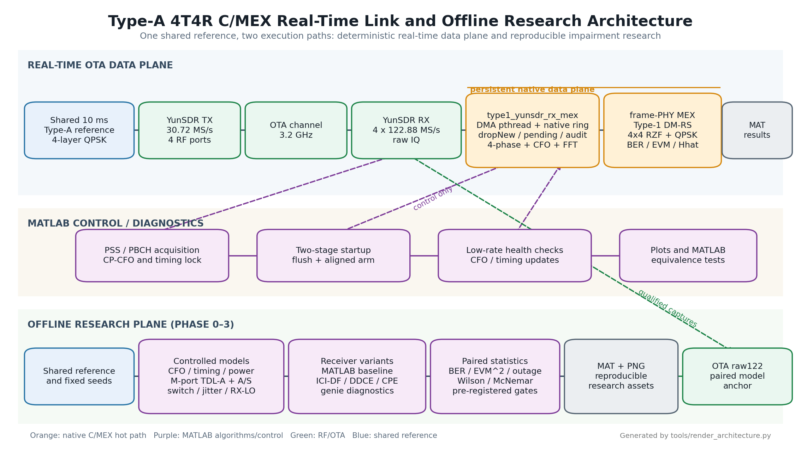

架构图由 [`tools/render_architecture.py`](tools/render_architecture.py) 确定性生成。图中：

- 橙色区域是逐帧 C/MEX 热路径；
- 紫色区域是 MATLAB 控制、诊断和离线算法；
- 实时与离线两条路径共享 `nr4_type1_reference.mat`、帧结构和 BER 真值；
- OTA raw122 只在通过 PSS/PBCH/EVM gate 后进入离线配对验证。

### 实时启动与队列语义

实时 RX 采用两阶段启动：MATLAB 先完成 PSS/粗 CFO，再丢弃软件 ring 中的冷启动
历史；持久 maps 和窄窗跟踪就绪后再次对齐并 arm direct consumer。这样 PSS 冷启动
不会自动变成必须追赶的历史帧。

MEX 队列以 **1 ms raw DMA block** 为单位，因此 `pending=10` 表示约 10 ms 数据待消费；
`highWater=517` 表示历史峰值曾达到约 517 ms，不等于单帧解码耗时 517 ms。
`dropNew>0`、硬件 overflow/timeout、timestamp invariant 失败或 pending 持续正斜率时，
该轮连续 BER 不具备有效性。

## 已下放到 MEX 的功能

### 持久实时数据面

| 组件 | 已下放功能 | 调用方式 |
|---|---|---|
| `type1_yunsdr_rx_mex.c` | 四路 DMA pthread、native IQ ring、producer/consumer sequence、事件计数、drop-new、高水位、timestamp 审计 | RX 打开后持续运行 |
| `direct_make_grid`（上述 C 文件内部） | 固定 switch-phase 映射、四相抽取、连续 CFO 复旋、154×4 个 1024 点 radix-2 FFT、612 子载波抽取 | 每个 10 ms 帧 |
| `directphysetup` | 持久保存 DM-RS indices/symbols、data indices、QPSK reference、coded-bit reference 和 RZF λ | 启动一次 |
| `type1_decode_frame_grid_mex.c` | Type-1 DM-RS 信道估计、DM-RS 残差噪声、4×4 RZF、QPSK 硬判决、EVM、raw bit errors、频域 `Hhat` | `directpoll` 每帧调用 |
| `directsetcfo` / `directsettiming` | 接受 MATLAB 低频控制面更新，并记录跨 block timestamp/sequence 审计 | 健康检查触发 |
| `directstatus` | frames、pending、dropNew、highWater、各层 errors/bits、extract/FFT/PHY/total 时延 | 遥测轮询 |

`type1_yunsdr_rx_mex` 通过 MEX API 调用已经验证的 `type1_decode_frame_grid_mex`；PHY
算法本身是 C，但 grid 仍以内部 `mxArray` 传递，因此当前实现不是完全融合的单一纯 C
函数库。

### 其他 MEX 加速器

| 文件 | 用途 |
|---|---|
| `type1_dmrs_type1_mex.c` | 实时可视化/fast path 的 Type-1 DM-RS 估计 |
| `type1_rzf_qpsk_mex.c` | fast path 的 4×4 RZF、QPSK、EVM/bit errors |
| `type1_decode_frame_grid_mex.c` | 批量 frame-grid PHY，也是 direct consumer 的正式内核 |
| `type1_phase3_iir_mex.c` | R20 离线大规模扫描中的多臂因果开关建立递推；仅作研究加速，不在实时 direct RX 路径 |

仍保留在 MATLAB 的部分包括：PSS/PBCH 获取、控制面 CFO/timing、完整标准函数对照、
所有 Phase 1--3 非理想性注入、ICI-DF/DDCE/CPE 研究接收机、端口选择、统计停止规则
和绘图。**Phase 2/3 算法尚未下放到实时 MEX；R20 的 IIR MEX 仅是离线批量加速器。**

## 快速运行

### 离线基线（不访问板卡）

```bash
cd /path/to/c_demo
TYPE1_OFFLINE_OUTPUT_ROOT=/tmp/type1_offline \
  matlab -batch "type1_run_offline_baseline"
```

Phase 1 结构扫描：

```bash
TYPE1_SWEEP_PROFILE=smoke TYPE1_OFFLINE_OUTPUT_ROOT=/tmp/type1_offline \
  matlab -batch "type1_validate_switch_impairments; type1_run_phase1_sweeps"
```

### 实时 OTA

板卡服务器需要用 `sudo` 启动 MATLAB。先在 TX 循环发送共享 reference，再在 RX
启动 direct consumer：

```bash
# TX
sudo env TYPE1_TX_DURATION_SEC=75 matlab -batch "type1_tx"

# RX
sudo env TYPE1_DIRECT_DURATION_SEC=60 TYPE1_FIFO_RING_BLOCKS=2048 \
  TYPE1_DIRECT_STARTUP_MODE=two_stage matlab -batch "type1_rx_direct"
```

TX/RX 主机、SSH 跳板、可视化命令、R1--R23 精确复现命令和正式 MAT 路径见
[`RUN_COMMANDS.md`](RUN_COMMANDS.md)。

## 目录与关键脚本

| 类别 | 入口 | 作用 |
|---|---|---|
| 公共配置 | `type1_config.m` | 波形、RF、帧结构、参考文件、实时 ring 和控制周期的唯一配置源 |
| 公共 reference | `type1_generate_reference.m`、`nr4_type1_reference.mat` | 生成/保存 TX 波形、DM-RS/data/QPSK/bit 真值 |
| 实时 TX/RX | `type1_tx.m`、`type1_rx_direct.m`、`type1_rx_live.m` | 循环 TX、无图 direct RX、可视化 RX |
| MEX 构建 | `type1_build_rx_mex.m`、`type1_build_frame_mex.m`、`type1_build_dmrs_mex.m`、`type1_build_decode_mex.m` | 编译 YunSDR、frame-PHY、DM-RS 和 RZF MEX |
| MEX 等价验证 | `type1_validate_direct_phy_maps.m`、`type1_validate_native_ring_grid.m`、`type1_compare_direct_stages.m` | maps、grid、H/EVM/raw errors 的 MATLAB/C 对照 |
| Phase 0 | `type1_run_offline_baseline.m`、`type1_offline_link.m`、`type1_analyze.m` | reference 到 BER 的完整硬件无关主干 |
| Phase 1 | `type1_offline_multiuser_config.m`、`type1_apply_switch_impairments.m`、`type1_run_phase1_sweeps.m` | 独立用户、静态开关、TDL-A 和扫描基础设施 |
| Phase 2 损伤 | `type1_run_phase2_timevarying_switch.m`、`type1_run_phase2_tau_correlation.m`、`type1_apply_rx_lo_phase_noise.m` | 时变建立、AR(1)/OU 抖动、边界位移、RX-PLL |
| Phase 2 接收机 | `type1_analyze_ici_decision_feedback.m`、`type1_run_phase2_ici_df_statistics.m` | ICI 核估计、hard/soft 判决反馈、Q/迭代/SNR 统计 |
| Phase 2 集成 | `type1_run_phase2_r10_*`、`type1_run_phase2_r11_*`、`type1_run_phase2_r14_*` | 真值分解、DDCE、约束核、received-drive、TDL 最终曲线 |
| Phase 2 acquisition | `type1_run_phase2_pss_acquisition_statistics.m` | 100-seed PSS waterfall、平台、投票和 2/4 帧累积 |
| Phase 2 OTA | `type1_run_phase2_r15_capture_campaign.m`、`type1_run_phase2_r15_ota_cross_validation.m` | 合格 raw122 采集、同段损伤配对、matched-SNR EVM² 审计 |
| Phase 3 Part A | `type1_phase3_config.m`、`type1_phase3_make_schedule.m`、`type1_phase3_single_chain.m`、`type1_phase3_make_tdl_a_channel.m` | M>N 端口几何、A/S 约束、标量单链坍缩和 M 端口 TDL-A |
| Phase 3 R16 回归 | `type1_validate_phase3_part_a.m`、`type1_run_phase3_part_a.m` | M=N 逐位退化、理想开关、占空比和非法扇出四门 |
| Phase 3 R17 穷举 | `type1_phase3_enumerate_pair_partitions.m`、`type1_phase3_wideband_metrics.m`、`type1_run_phase3_r17_exhaustive.m` | 2520 个受约束 M=8 调度、噪声感知 MMSE、20-seed TDL Gate 1 |
| Phase 3 R18 选择 | `type1_phase3_enumerate_f1.m`、`type1_phase3_batch_f1_objective.m`、`type1_phase3_greedy_schedule.m`、`type1_phase3_relax_quantize.m`、`type1_run_phase3_r18_gate2.m` | F1 166824 精确穷举、F1/F2 贪婪与局部松弛量化、flat/TDL Gate 2 |
| Phase 3 R19 净增益 | `type1_phase3_switch_beta.m`、`type1_phase3_apply_switch_impairments.m`、`type1_run_phase3_r19_gate3.m` | M 端口单标量损伤开关、全波形 acquisition/BER/EVM、扫描后有效吞吐量 Gate 3 |
| Phase 3 R20 系统兑现 | `type1_phase3_acquisition_aware_schedule.m`、`type1_phase3_amc_table.m`、`type1_phase3_iir_mex.c`、`type1_run_phase3_r20.m` | 50-seed 同步统计、冻结 AMC 抽象、扫描周期、M=12/16 与 Gate 3 重测 |
| Phase 3 R21 理论 | `type1_phase3_theory_metrics.m`、`type1_phase3_correlation_gain.m`、`type1_validate_phase3_theory.m`、`type1_run_phase3_r21_theory.m` | 闭式 LMMSE SINR、MMSE/log-det 速率、残余谱界和 J0 孔径/相关边界 |
| Phase 3 R22 能效 | `type1_phase3_power_parameters.m`、`type1_phase3_power_breakdown.m`、`type1_phase3_frontend_metrics.m`、`type1_phase3_hbf_combiner.m`、`type1_phase3_greenmo_like_schedule.m`、`type1_validate_phase3_energy.m`、`type1_run_phase3_r22_energy.m` | 统一组件表、DBF/HBF/GreenMO-like 理想速率、扫描能量、bits/Joule 与负载能量正比曲线 |
| 投稿 E1 在线信息选择 | `type1_phase3_scan_matrix.m`、`type1_phase3_estimate_scan_csi.m`、`type1_run_paper_e1_online_selection.m` | DM-RS 扫描、名义泄漏反演、truth-CSI/estimated 成对选择与 full-stack AMC |
| 投稿 E2/E3 | `type1_run_paper_e2_fas_diversity.m`、`type1_run_paper_e3_mobility_mapping.m` | 单用户最强端口 FAS outage/SNR gain；扫描周期到移动速度解析映射 |

## Phase 0：基础链路与回归锚点

Phase 0 建立不依赖 YunSDR/MEX 的 `reference → channel/AWGN → switch → full receiver
→ BER` 主干。默认 flat 4×4 确定性信道用于稳定回归，也可切换到 TDL-A。

主要作用：

- 复用完整 PSS、PBCH、Type-1 DM-RS、RZF、QPSK/BER 接收机；
- 固定 reference、seed 和每层 bit 真值；
- 为后续所有损伤点提供同 realization 的 ideal/impaired 配对；
- 在模型关闭时保证退化回理想基线。

默认 3 帧相干锚点四层经验 BER 均为 0，平均 EVM 约
`[2.718, 2.775, 2.714, 2.738]%`。这里的“0”只表示该有限样本无错误；正式零错点必须
报告二项分布上界。

## Phase 1：独立用户、静态开关与模型分类

### 已实现模型

- 每用户独立 CFO、分数 timing、功率和 TX 侧 Wiener 相噪；
- 25 dB 等隔离度对应的相干复泄漏矩阵；
- 10--90% 建立时间对应的一阶因果开关状态；
- 3GPP TDL-A 抽头、Tx/Rx 指数空间相关和可选 Doppler；
- 六条单变量扫描与四张双变量 heatmap；smoke 为 3×3 结构门，pilot 至少 5×5；
- 基于跨 slot DM-RS 相位的逐用户残余 CFO 估计，以及 RZF 信道列的相位斜坡补偿。

### 核心结论与边界

| 要素 | 结论 |
|---|---|
| 静态隔离度/固定建立 | 四相去交织后属于周期多相 LTI MIMO 变换，Type-1 DM-RS 可吸收；不能把它直接写成 ICI 来源 |
| 独立用户 CFO | 未补偿压力点 BER 为 `[0,0.01365,0.27307,0.25869]`；基础补偿后为 `[0,5.87e-5,9.49e-4,0]` |
| CFO 估计边界 | 0.5 ms 跨 slot 相位差的无模糊范围为 ±1 kHz；750 Hz 告警、±800 Hz 压力门不会解决真正的相位解缠 |
| `cond(Hhat)` | 是估计信道条件数，包含插值/估计器伪影，不能称为真实复合信道条件数 |
| Wiener 相噪 | 正确锚定为 `L(f)=sigma² Fs/(4π²f²)`；它对应自由振荡器，锁定 RX-PLL 在 Phase 2 单独建模 |
| Phase 1 图 | smoke 图仅验证维度和物理趋势，不承担论文统计结论 |

Phase 1 最重要的物理结论是：**真正需要算法处理的是 DM-RS 不能吸收的时变残余，
而不是静态器件参数本身。** 这直接定义了 Phase 2 的研究对象。

## Phase 2：时变损伤、恢复算法与集成边界

Phase 2 已完成并冻结。其逻辑闭环是：时变损伤使 BER 退化 → 测量可恢复结构 →
ICI-DF/信道修复尝试恢复 → 在 flat、TDL、full-stack 和 OTA 上分别报告成功与 no-go。

### 1. 时变开关与相关时间

建立时间扩展为 `tau(t)=tau0 × [1 + slow(t) + fast(t)]`；fast 项支持 i.i.d. 或
AR(1)/OU 相关时间，另有独立亚样点 sampling-boundary jitter。`tau_c` 的实测 lag-1
与 `exp(-Ts/tau_c)` 命中 3--4 位。

在相同边缘方差下，标准 BER 随 `tau_c` 从近 i.i.d. 的约 `1.7e-3` 上升到
1 µs 的约 `8e-3--1.1e-2`。因此器件约束必须包含抖动 PSD/相关时间，不能只给 RMS。

### 2. ICI-DF 与器件包络

隔离 flat anchor 上，Q=6/12/24 的 soft ICI-DF 相对 BER 降低约
36.9/47.9/53.2%；Q=12 的 1/2/3 次迭代降低 47.9/52.1/57.9%，对应
`eta=0.658/0.716/0.795`。soft 相对 hard 额外降低约 8.5%。

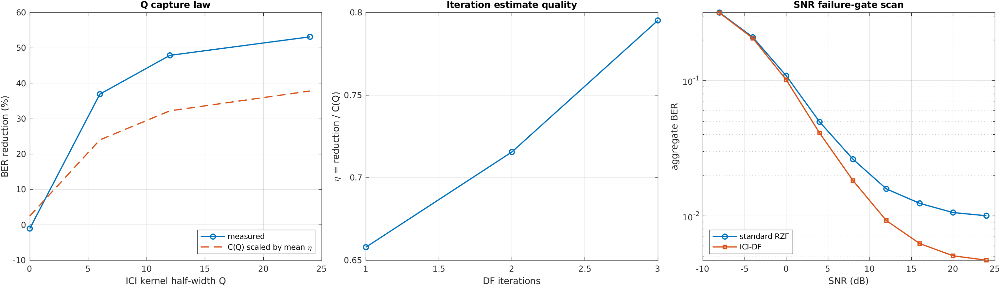

图由 `type1_run_phase2_ici_df_statistics.m` 生成，表示隔离机制锚点，不能直接外推到
TDL/full-stack。

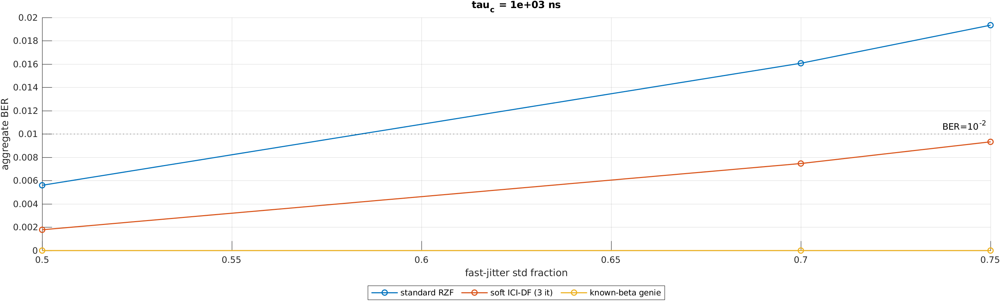

flat anchor 的 `BER<=1e-2` 下，soft-DF 对 `tau_c=1 µs` 快抖容限的保证放宽
`>1.25×`，插值点估计约 1.3×；该倍率没有迁移到 R14 TDL 高基线场景。

### 3. TDL 与 full-stack 集成边界

在最终 10-realization TDL 平均中，Q=12、3 次 soft DF 将条件 BER
`0.16567 → 0.16046`，相对降低 3.15%，9/10 seed 改善。Q=24 回落到 1.30%，表明
频选深衰下估计噪声与捕获带宽存在偏差/方差折中。

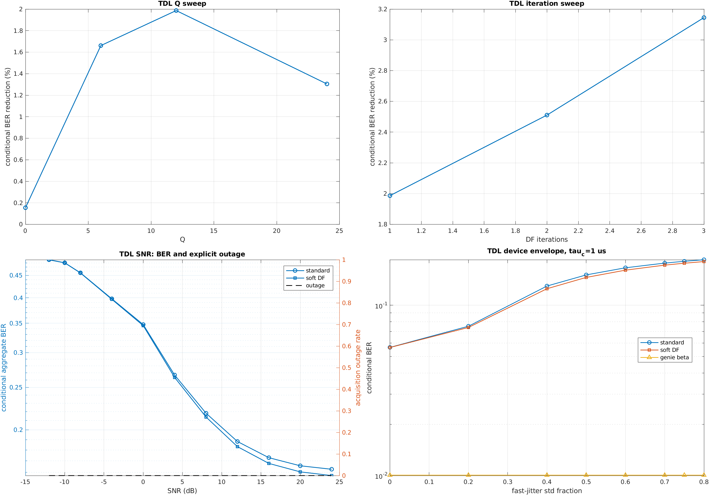

full-stack 的三次预注册集成门均未通过。真值层约 64% ICI capture 证明信息可恢复，
但实际兑现同时受 `Hhat` 质量和模拟状态可观测性限制；received-drive 两个 seed 的
gap closure 为 10.89%/40.65%，跨 realization 不稳定。因此 B 线冻结为集成边界，
没有把单 seed 正结果升级为默认实时接收机。

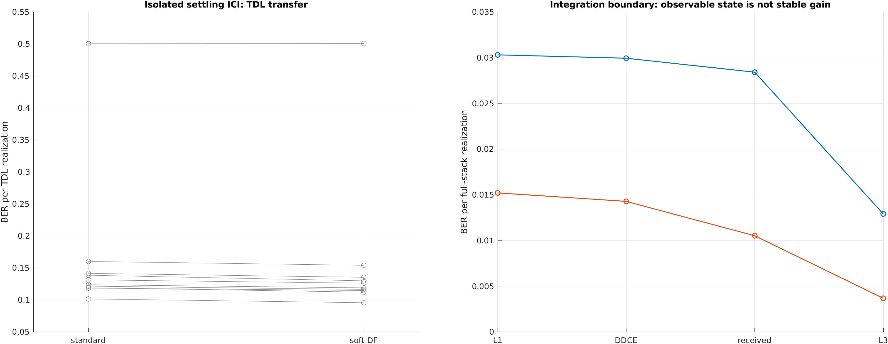

### 4. RX-LO 拓扑与 CPE

RX 相噪采用有界 OU/单极 PLL 模型，比较开关后公共单 LO 与开关前独立 4-LO。
预注册的“公共 LO 必然更好”被数据否定：慢 PLL 下独立 LO 可通过 phase-noise
averaging 获益，病态信道中排序又可能反转；一个标量 CPE 只能部分修复公共分量，
不能给出统一规格倍率。

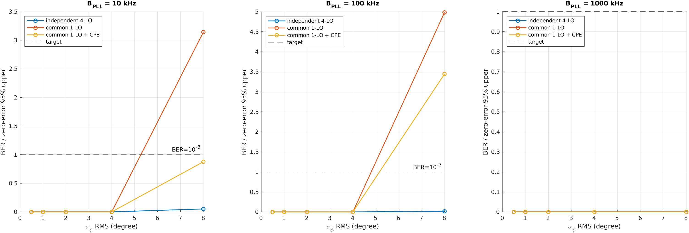

### 5. PSS acquisition 与开关成本归因

100-seed acquisition-only 扫描把噪声 waterfall 与高 SNR realization 平台分开。
单帧 combined 在 8--26 dB 维持 52% 成功率；4 帧非相干累积在 20/26 dB 提升到
70%，但仍留下 false-peak 平台。

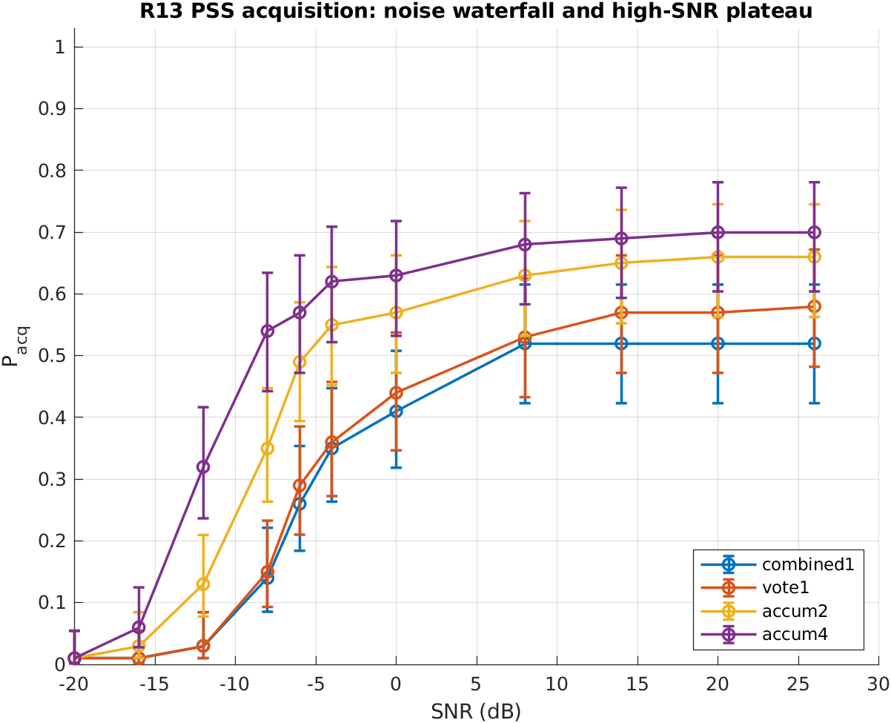

20 dB 的 switch-off / ideal-interleaving / impaired-on 成功数为 75/76/52：交织结构
净差 `-1 pp` 不显著，而联合模拟损伤贡献 `24 pp`，McNemar `p=8.05e-7`。

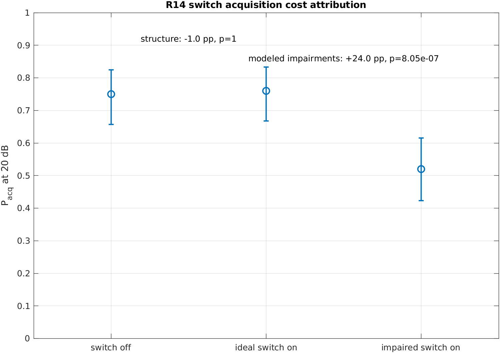

### 6. R15 OTA 收官

R15 采集 25/30/35 dB gain 各 5 段合格 20 ms raw122；15/15 段 PSS/PBCH/EVM gate
通过，同 raw122 的 ideal/impaired 两支均无 bit errors，EVM² 增量方向与 matched-SNR
离线预测 15/15 一致。

正式功率域中位增量为 OTA `0.83035`、离线 `0.39315`，倍率 2.112，超过预注册
2× 门，因此 ratio no-go。三档实测 SNR 全部重叠在 33--43 dB，不能称为多 SNR
标定。最终只保留：**高 SNR 单簇功能+趋势验证，且离线模型偏乐观约 2×。**

## Phase 3：M>N 单链端口选择平台

Phase 3 的最终目标是把 `M=N=4,S=I` 扩为受物理约束的 `M>N` 二值 BABF/端口选择。
Part A 已通过 R16，Part B 的第一道穷举标尺已完成：

- 单链在代码中严格坍缩为一列标量流
  `y[k]=sum_m S[m,q(k)]r_m[k]`，随后才按 N 相去交织；
- `S∈{0,1}^{M×N}` 负责 `Htilde=S^T H` 的信道数学；规范的
  `A[m,n,q]=S[m,n]1[q=n]` 负责码周期、覆盖、占空比、相位归属和因果切换审计；
- 同一物理端口可以在不同码相进入多条虚拟链，但同一码相把一个端口扇出给多个链标签
  会以稳定标识 `type1:Phase3IllegalFanout` 拒绝；
- M 端口 TDL-A 的 RX 相关矩阵由半波长 ULA 位置和
  `J0(2*pi*d/lambda)` 生成，不允许用与孔径无关的任意相关系数。

R16 seed `20260716` 的正式回归结果：旧/新 stitched 和 virtual 均逐位一致；M=8 理想
标量链路相对误差为 0，`S^T H` 相对误差 `1.69e-16`；占空比守恒/超限拒绝和非法同相
扇出拒绝均通过。

R17 把门 1 可行集冻结为 M=8、N=4、每链恰好 2 端口、每端口只属于 1 条链，共
2520 个调度。20 个成对 TDL-A seed 中 19 个优于 `M=4,S=I`，全 612-tone 的 min-user
SINR 中位增益 `+2.420 dB`，bootstrap 95% 区间 `[+1.863,+3.613] dB`，单侧符号检验
`p=2.00e-5`，因此门 1 通过。固定相邻配对的中位增益反而为 `-1.030 dB`，说明收益来自
端口选择而非简单增加端口；seed `20261718` 仍有 `-0.050 dB` 反例，证明强制使用全部
8 端口不保证逐 realization 获益。

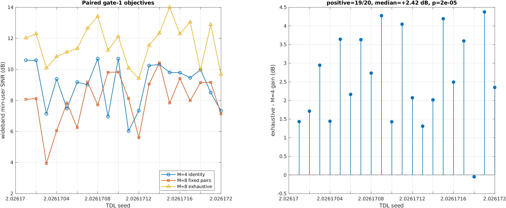

R18 允许端口关闭并令每链端口数可变。F1（`Dmax=1`）共有 166824 个精确候选，包含
M4 原解和 R17 全部 2520 个配对。20 个成对 TDL seed 上，F1 穷优 20/20 不低于 M4，
贪婪 20/20 胜 M4并保留穷优增益的中位 **92.4%**，Gate 2 通过；全 612-tone 的 F1
穷优/贪婪中位增益分别为 `+3.693/+3.238 dB`。固定相邻、FAS 单端口和随机基线的
51-tone 中位增益分别为 `−1.033/+0.378/−0.973 dB`。

F2 允许一根端口进入两条不同码相的链，但没有形成稳定额外收益：贪婪相对 F1 穷优
仅 5/20 为正、中位 `−0.203 dB`；flat 中位为 0 dB。局部松弛量化给出很小的
`+0.053 dB` 中位增量且仅 10/20 为正，它不是经证明的全局上界。因此当前头条是
“端口关停 + 在线贪婪有效”，不是“码叠加稳定获益”。

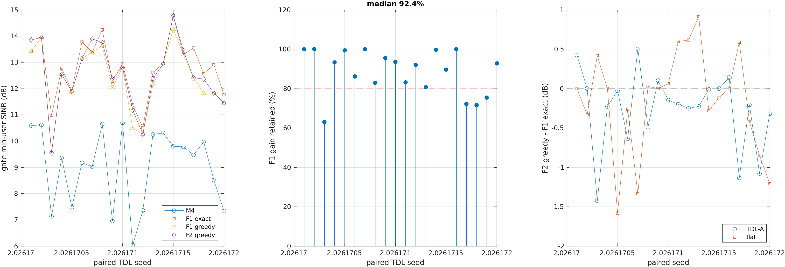

R19 把同一批 M=8 调度送入完整 122.88 MS/s 标量开关和接收机，冻结 25 dB 隔离、
20 ns 建立、`fast=0.2`、OU 相关时间 1 us，并把 acquisition failure 和扫描写入
`P_acq*(1-scanFraction)*(1-BER)`。损伤后 M4/F1穷优/F1贪婪/F2贪婪的 acquisition
为 `[20,19,19,19]/20`；成功帧平均 decoded BER 为 `[3.20,1.03,1.15,1.20]%`，说明
数据链选择收益仍在。但按每 100 ms 多扫一个 10 ms 帧，三种 M8 臂相对 M4 的有效
吞吐量分别为 `−0.1218/−0.1229/−0.1233`，1 s 更新敏感性仍为负，故当前 M=8、纯
min-SINR 选择器在固定 QPSK 吞吐域 **no-go**。但原始 §7.4 的 SINR-quality 分解为
`4.28−1.46−0.22−0.46=+2.14 dB`，因此 SINR Gate 3 实际通过；这两个裁决必须并列。

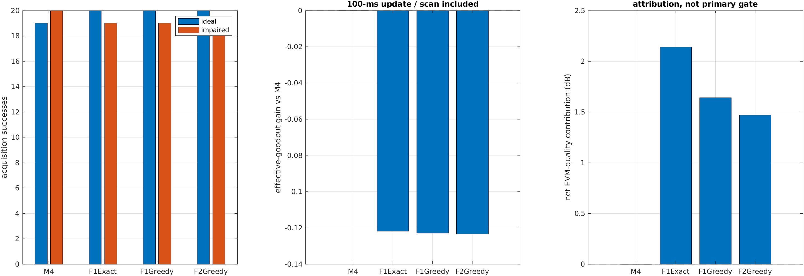

固定 QPSK no-go 不能外推成“端口选择无效”或“M=12/16 也必然失败”：它准确定位出下一个
算法缺口——选择目标必须同时约束 PSS/acquisition 风险，而不能只优化数据 RE 的
min-SINR。

R20 用同一 M16 TDL realization 的前 4/8/12/16 个端口做严格成对比较。50 个 seed 的
四帧 acquisition 为 `[46,47,48,48,47]/50`；前 20 个完整解码中，M4/M12/M16 的
EVM-quality 中位数为 `5.44/9.58/9.99 dB`，成功帧平均 decoded BER 为
`3.84/0.83/0.61%`。冻结 CQI-style AMC 链路抽象后，1 s 更新的 M8-aware/M12/M16
净增益为 `+0.449/+0.614/+0.710 bit/s/Hz`，AMC 门限整体移动 ±2 dB 时 M12/M16 仍为
正，因此 Gate 3 重测通过。50 ms 过快更新时 M12/M16 因扫描开销回落到
`−0.012/−0.295`，100 ms 才转正，说明端口规模收益必须与信道更新周期联合设计。

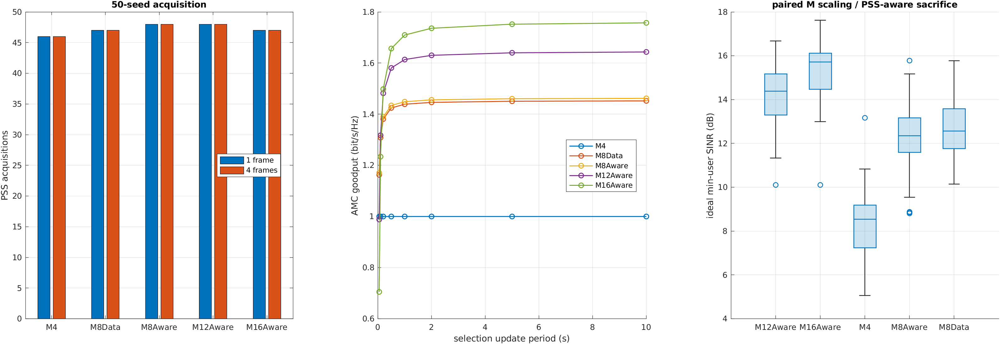

同步结果必须单独看：M8-aware 相对 M8-data 只有 1 次 rescue、0 loss，McNemar `p=1`；
一帧与四帧 PSS 计数完全相同。故当前不声称同步感知选择显著有效，也不声称重复同一高
SNR realization 能消除假峰。AMC 是冻结的链路抽象而非真实 16/64QAM 解码；选择器读取
oracle TDL 信道，也尚不是在线扫描实现。

R21 给出二值 S 下的闭式理论：`G=S^T H`、`Rn=sigma^2 S^T S`，逐流 LMMSE SINR 为
`1/[(I+G^H Rz^-1 G)^-1]uu-1`，联合高斯上界为 `log2det(I+G^H Rz^-1 G)`。它对 R20
冻结目标的最大误差为 `8.88e-15 dB`。M4/M8/M12/M16 的 50-seed 中位 min-user 理论
rate 为 `3.093/4.226/4.847/5.263 bit/s/Hz`，相对 M4 分别在 49/49/50 个 seed 胜出。
该 rate 不含实际全波形开关残差，不能替代 R20 AMC goodput。

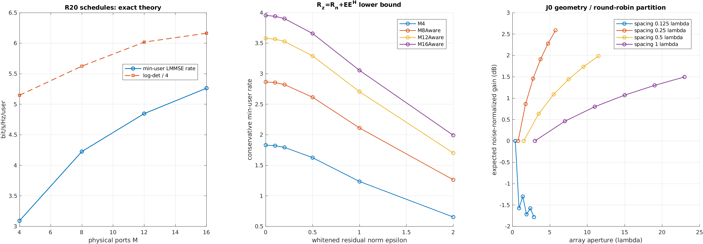

理论也揭示边界：J0 几何下正权二值合并随间距/孔径非单调；固定 round-robin 在 M=24、
0.125-lambda 间距时为 `-1.78 dB`，0.25-lambda 时为 `+2.59 dB`。R20 所选 S 的无条件
几何平均增益约 0 dB，说明收益来自观察信道后的端口选择和条件数改善，而不是固定集合
天然有阵列增益。该理论是标准 LMMSE 的严谨表征和上下界，不包装成新容量定理；R20
选择器继续明确标为读取真实 TDL 信道的 oracle 上界，不声称已经完成在线扫描实现。

R22 用 GreenMO 原论文的 RFIC/ADC/开关锚点和同一派生基带口径，对本文、GreenMO-like、
DBF、部分连接 HBF 和全连接 HBF 建立统一能量账本。M=16、N=4、1 s 更新时，五者平均
RX 功耗为 `1.925/1.925/12.260/3.347/3.827 W`；同一理想高斯 LMMSE sum-rate 分子下，
能效为 `200.1/206.2/45.5/88.3/108.5 Mbit/J`。本文相对 DBF 的 low/nominal/high
组件敏感性能效比分别为 `5.22×/4.39×/4.06×`，正号不依赖单一标称档。

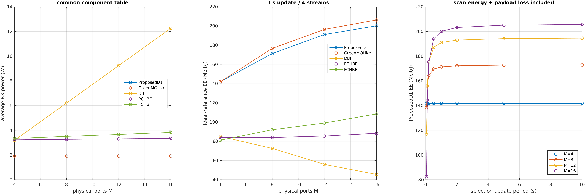

扫描没有免单：本文 M=16 的更新周期从 50 ms 放宽到 100 ms/1 s/10 s 时，能效由
`82.5` 增至 `144.4/200.1/205.7 Mbit/J`。固定 M=16、活动流 N=1→4 时，本文功耗从
`0.721→1.925 W`，DBF 从 `12.099→12.260 W`；但本文扫描能量为 `0.108→0.058 J/次`，
说明低负载仍需为更多端口组扫描付费。

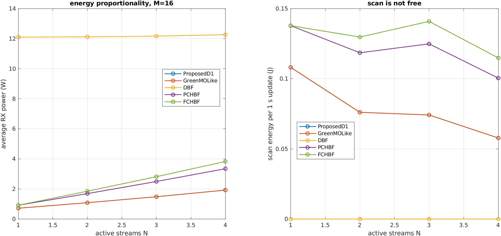

这不是硬件功率计测量。跨架构结果统一使用理想速率；本文另外给出的 R20 四流全栈
AMC 能效仅为 M4/M8/M12/M16 的 `38.4/55.5/61.7/65.2 Mbit/J`，不能和缺少同等全栈
解码的 DBF/HBF 理想值直接排名。GreenMO-like 是相同电路包络上的局部贪婪参考，不是
GreenMO 算法/原型复现；完整参数、来源和口径见
[`PHASE3_ENERGY_MODEL.md`](PHASE3_ENERGY_MODEL.md)。

## 投稿前补充 E1--E3

E1 不再让选择器读取 TDL 真值：M=8/12/16 分别用 2/3/4 个 10 ms 扫描帧，经同一
20 dB AWGN、25 dB 隔离、20 ns 建立和 OU 抖动后，用 Type-1 DM-RS 估计各端口信道。
20 个成对 TDL seed 的中位 objective 保留率为 `0.902/0.788/0.855`，估计版 1 s AMC
相对 M4 的净增益仍为 `+0.186/+0.394/+0.352 bit/s/Hz`。它关闭了“正结果只存在于
truth-CSI”的缺口，但还是离线控制器，不能称为硬件实时选择。

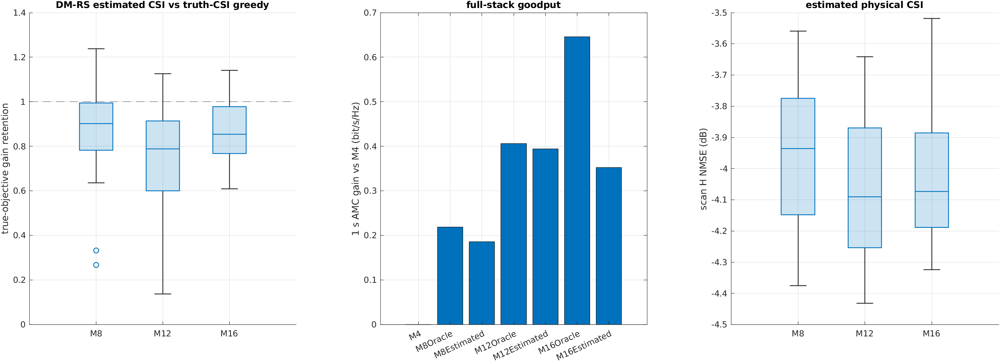

E2 用 100000 个单位功率 Rayleigh/J0 realization 做单用户最强单端口选择；M=16 在
10% outage 处相对 M=1 的 SNR gain 随间距 0.125/0.25/0.5 lambda 为
`10.599/12.040/12.576 dB`。E3 则把 R20 扫描周期映射到移动性：3.2 GHz 下 100 ms
约为 `0.397 m/s=1.428 km/h`，说明当前适用条件是准静态/缓慢游牧。

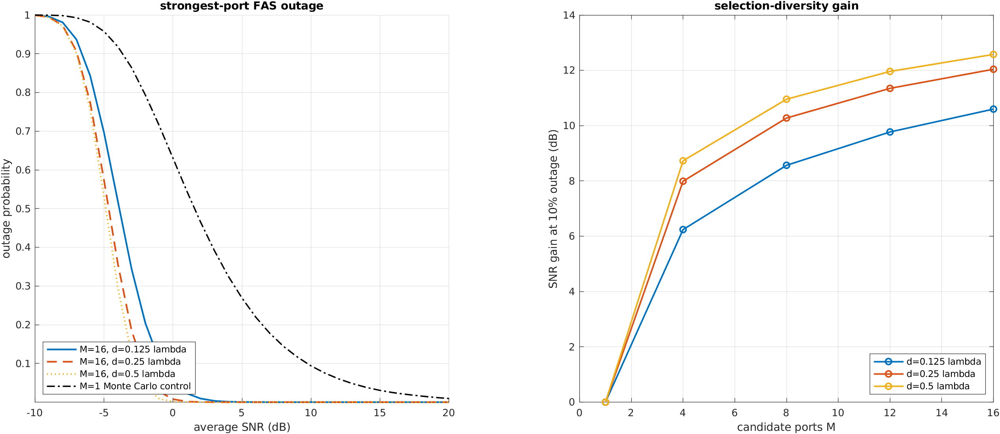

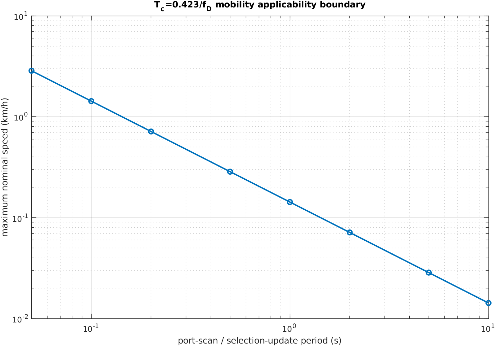

三项的远端命令、正式 MAT/SHA 和作废 smoke 说明见 `RUN_COMMANDS.md` 与
`EXPERT_REVIEW.md` §47。E4 子带选择、TX/TMA、ISAC、RIS、多 SNR OTA 和真实开关 PCB
均未开启。

## 统计与表述纪律

- 零错误只报告 `-log(0.05)/Nbits` 等 95% 上界，不写成已证明 BER=0；
- paper 点使用预先冻结的错误数/最大 bits 停止规则；
- standard/DF 只在同 seed、同信号/信道/噪声 realization 上配对；
- acquisition failure 必须进入 outage 分母，条件 BER 与 outage 分开报告；
- `cond(Hhat)`、genie、truth replay、capture fraction 都不能冒充实际接收机 BER；
- 任何未过预注册门的算法不进入默认实时路径。

## 结果资产与文档

| 资产 | 内容 |
|---|---|
| `captures/type1_direct_*/type1_direct_results.mat` | 实时 pending/dropNew/BER/时延/硬件事件/timestamp 审计 |
| `type1_phase1_*/phase1_sweeps.mat` | Phase 1 单变量与二维结构扫描 |
| `type1_phase2_*/phase2_*.mat` | Phase 2 paired seed、BER/EVM/outage、门禁和 checkpoint |
| `type1_phase3_part_a_*/phase3_part_a_r16.mat` | Phase 3 Part A 四条代数回归、几何相关与稳定拒绝标识 |
| `type1_phase3_r17_*/phase3_r17_exhaustive.mat` | M=8 2520 候选、逐 seed 选优矩阵、全带 SINR/速率与 Gate 1 统计 |
| `type1_phase3_r18_*/phase3_r18_gate2.mat` | F1 精确穷优、F1/F2 在线算法、flat/TDL 配对与 Gate 2 统计 |
| `type1_phase3_r19_*/phase3_r19_gate3.mat` | M=8 理想/损伤全波形、acquisition/BER/EVM、SINR Gate 通过与固定-QPSK no-go 双重裁决 |
| `type1_phase3_r20_*/phase3_r20.mat` | 50-seed PSS、M=4/8/12/16、AMC/扫描周期、固定-QPSK敏感性与 Gate 3 重测 |
| `type1_phase3_r21_*/phase3_r21_theory.mat` | R20 50-seed 闭式复现、MMSE/log-det 速率、残余谱界和 J0 几何扫描 |
| `type1_phase3_r22_*/phase3_r22_energy.mat` | 50-seed 统一理想速率、组件功耗、扫描能量、full-stack AMC 锚点、敏感性与能量正比曲线 |
| `data/type1_r15_ota_*/` | R15 raw122、capture meta、paired report 与 EVM² 审计；原始 IQ 不进入 Git |
| [`docs/images/`](docs/images/) | 本 README 内嵌的冻结实验图和架构图 |
| [`HANDOFF.md`](HANDOFF.md) | 远端环境、实时状态和交接边界 |
| [`PHASE2_MIDTERM_REPORT.md`](PHASE2_MIDTERM_REPORT.md) | Phase 2 中期定位与收官附录 |
| [`PHASE3_PLAN.md`](PHASE3_PLAN.md) | Phase 3 冻结信号模型、物理约束、三门和执行顺序 |
| [`PHASE3_ENERGY_MODEL.md`](PHASE3_ENERGY_MODEL.md) | R22 统一功耗组件表、扫描能量公式、公平比较口径、来源和不可外推边界 |
| [`SYSTEM_EXPLAINER.md`](SYSTEM_EXPLAINER.md) | 面向通信同行的系统原理、非理想性影响、结果边界与后续工作说明 |
| [`TECHNICAL_MANUAL.md`](TECHNICAL_MANUAL.md) | 论文式技术手册：前置术语表、统一数学模型、理论推导、R1--R23 实验证据、应用场景与限制 |
| [`EXPERIMENT_REPORT.md`](EXPERIMENT_REPORT.md) | 面向新读者的完整实验报告：按 38 个实验逐项说明目的、设计、数据、图像、分析、no-go 与外推边界 |

## 提交变更记录

每次代码或文档修改都在本节追加一行。历史细节折叠保存，避免遮挡工程首页。

<details>
<summary>展开完整变更记录</summary>

- `cmex-2026.07.13.1` -- 新增两阶段启动 ring 丢弃、timestamp/sequence 审计和 pending 对比；星座图始终绘制均衡结果。
- `cmex-2026.07.13.2` -- 修复 frame-PHY 噪声输出；CFO 改为帧内连续相位；固定 switch-phase 映射并完成 C/MATLAB 等价验证。
- `cmex-2026.07.13.3` -- 新增 `RUN_COMMANDS.md`，集中维护实时 TX/RX 与离线复现命令。
- `cmex-2026.07.13.4` -- 新增硬件无关 Phase 0 reference-to-BER 主干。
- `cmex-2026.07.13.5` -- 增加独立用户损伤、相干泄漏、因果建立时间和通用离线入口。
- `cmex-2026.07.14.1` -- 增加 Phase 1 六条单变量、四张二维扫描和零错上界绘图。
- `cmex-2026.07.14.2` -- 新增 `EXPERT_REVIEW.md` 作为统一实验与审议留痕。
- `cmex-2026.07.14.3` -- 二维网格提升到 smoke 3×3 / pilot 5×5；新增逐用户 CFO 基础补偿。
- `cmex-2026.07.14.4` -- 新增 TDL-A、空间相关和 Wiener 相噪锚定。
- `cmex-2026.07.14.5` -- 新增同 raw122 的 ideal/impaired OTA 配对桥接器。
- `cmex-2026.07.14.6` -- 新增 PSS/PBCH/EVM-gated 后稳定期 raw122 采集器。
- `cmex-2026.07.14.7` -- 修正相噪锚定 3 dB 系数、CFO 混叠门和 `cond(Hhat)` 表述。
- `cmex-2026.07.14.8` -- Phase 2 加入时变 tau、快慢抖动和采样边界位移。
- `cmex-2026.07.14.9` -- 新增白化 RZF 负基线与理想退化回归。
- `cmex-2026.07.14.10` -- 快抖扩展为 AR(1)/OU 相关时间，加入 tau-floor 和 beta-genie。
- `cmex-2026.07.14.11` -- 新增逐符号 ICI 核交叉拟合判决反馈接收机。
- `cmex-2026.07.14.12` -- 新增 Q/迭代/SNR 成对统计；确认 flat anchor 的 36.9--57.9% 恢复。
- `cmex-2026.07.14.13` -- 完成 hard/soft 消融和器件包络，容限保证放宽 >1.25×。
- `cmex-2026.07.14.14` -- 实现 CFO 感知 full-stack L0--L3 阶梯并按门判 no-go。
- `cmex-2026.07.14.15` -- 加入 timing 去斜、重估信道和完整中断审计。
- `cmex-2026.07.14.16` -- 完成 R10 真值分解、双 bank 上限和 H2 拒绝门。
- `cmex-2026.07.14.17` -- 实现 DDCE、约束核、组合门和可选 PSS 峰位投票。
- `cmex-2026.07.15.18` -- 完成 received-drive 收束和 30-seed PSS 投票扩样，B 线冻结。
- `cmex-2026.07.15.19` -- 新增有界 RX-PLL、公共/独立 LO、CPE 和周跳审计。
- `cmex-2026.07.15.20` -- 完成 100-seed PSS acquisition、2/4 帧累积和开关成本初测。
- `cmex-2026.07.15.21` -- 完成 R14 理想交织归因、TDL paper-stop 曲线和集成边界图。
- `cmex-2026.07.15.22` -- 完成 R15 三档 gain、15 段 OTA 配对和 EVM²/RMS 双口径审计。
- `phase2-theme-1` -- 提交时变开关模型与 genie/truth-replay 基础设施。
- `phase2-theme-2` -- 提交 ICI-DF 接收机族与统计。
- `phase2-theme-3` -- 提交 full-stack 集成、R10--R14 分解与 TDL 边界。
- `phase2-theme-4` -- 提交 RX-LO 与 CPE。
- `phase2-theme-5` -- 提交 PSS acquisition 统计。
- `phase2-theme-6` -- 提交 OTA 收官代码与审议文档。
- `cmex-2026.07.15.23` -- EVM² 2.112× ratio no-go；Phase 2 按高 SNR 单簇缩放主张关闭并打 freeze tag。
- `cmex-2026.07.15.24` -- 重构 README 为独立工程首页；新增可复现正式架构图、MEX 下放边界、Phase 0/1/2 递进说明及仓库内嵌的冻结实验图，删除过时的单轮 OTA/精度流水账。
- `cmex-2026.07.15.25` -- 完成 Phase 3 Part A：M>N 几何相关 TDL、A/S 物理调度、严格标量单链和 R16 四条代数回归；尚未启动端口选择扫描。
- `cmex-2026.07.15.26` -- 新增面向通信大同行的独立系统说明，按信号链和非理想性来源重组现有成果，并补齐缩写、结果边界和后续工作解释。
- `cmex-2026.07.16.27` -- R16 通过后完成 R17：M=8/Dmax=1 的 2520 候选 TDL 穷举标尺以 19/20、+2.420 dB 中位增益通过 Gate 1；保留单 seed 负例并冻结 Gate 2/3。
- `cmex-2026.07.16.28` -- 完成 R18/R19：F1 166824 穷举与贪婪以 92.4% 中位保留通过 Gate 2；F2 码叠加无稳定额外收益；M=8 的 SINR-quality Gate 3 通过而固定-QPSK goodput no-go，并保留两次逐位复现资产。
- `cmex-2026.07.16.29` -- 完成 R20：新增同步感知 oracle 选择、冻结 AMC 抽象、扫描周期和 M=12/16；50-seed 正式重测以 M12/M16 `+0.614/+0.710 bit/s/Hz` 通过 Gate 3，同时保留同步增益不显著与一次噪声口径作废运行的审计。
- `cmex-2026.07.16.30` -- 完成 R21 Part D：新增闭式 LMMSE SINR/MMSE与log-det速率、残余谱范数下界和 J0 几何增益；以 `8.88e-15 dB` 误差逐位闭合 R20，并保留孔径非单调和理论 rate 不含全波形残差的边界。
- `cmex-2026.07.16.31` -- 完成 R22 Part C：冻结 GreenMO 锚定统一功耗表并计入端口扫描；完成本文/GreenMO-like/DBF/PC-HBF/FC-HBF 的 50-seed bits/Joule 与能量正比对照，保留理想/full-stack 双口径和非硬件实测边界。
- `cmex-2026.07.16.32` -- R22 专家审议通过；按平台/选择/全栈/理论/能效/文档六个主题整理提交，关闭 Phase 3 并打 `phase3-freeze-2026-07-16`，后续转入论文写作。
- `cmex-2026.07.16.33` -- 新增独立论文式技术手册：在正文前统一解释全部术语和符号，按背景—系统—建模—理论—实验—应用重组 Phase 0--3，并嵌入冻结数据、正/负结果和硬件边界；不新增或重跑实验。
- `cmex-2026.07.16.34` -- 按论文裁决为技术手册加入执行摘要、GreenMO/FAS 对照和 PLL 公式修正；完成 E1 DM-RS 非 oracle 选择、E2 单用户 FAS 分集、E3 扫描周期—移动速度映射及正式审计，尚未提交。
- `cmex-2026.07.16.35` -- 重写会话交接文档：汇总 Phase 0--3 与 R23 已通过的 E1--E3、全量复现地图、文件逻辑分类、脏工作树归属、已知边界、禁止重踩项和论文写作计划；不移动文件、不提交。
- `cmex-2026.07.16.36` -- 按用户授权以 `94c91ed` 提交 R23 已验收的 E1--E3 代码/正式图、技术手册、论文大纲、审议与完整交接文档；排除本地 `.claude` 和旧 pending 临时图，尚未 push/tag。
- `cmex-2026.07.20.37` -- 新增独立 `EXPERIMENT_REPORT.md`：把实时工程、Phase 0--3、R1--R23 和 E1--E3 拆为 38 个实验，逐项解释输入、对照、指标、数据、正/负结果、图像与复现边界；不改实验代码、不重跑或改写冻结数据。
- `cmex-2026.07.20.38` -- 按初学者反馈重写完整实验报告：38 个实验全部增加“实验介绍”，从问题如何发生、前序实验为何不足讲到本轮解决方案；重点展开实验 6 之后的 baseline/off/随机数序列/索引/处理路径、ICI-DF、TDL、端口选择和系统开销，不使用反斜杠圆括号数学定界符。
- `cmex-2026.07.20.39` -- 再次扩写 `EXPERIMENT_REPORT.md`：38 个实验全部增加可核算的“计算过程与量级判断”，详细解释共同/逐用户 CFO、误差来源、统计门和正负结果边界；远端补跑 Phase 1 pilot 生成六条 5 点单变量曲线与四张 5×5 热图，新增可复现 MATLAB/Python 绘图代码和 8 张报告图，并清除正文人工软换行；未提交。

</details>
